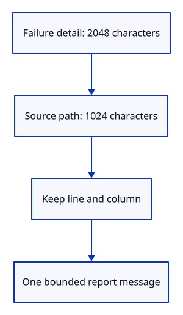

# 34gc · Bound browser failure messages

**Typing: 19–38 minutes.** [Estimate](typing-load.md).

Limit each failure detail to 2048 characters and its source path to 1024. Keep line and column numbers; remove source query strings and fragments.

## Type

Continue from [Refuse GPU results after final page exit](34gbca-startup.md). [Save or recover your work](recovery.md).

### 1. `src/error_message.rs`

Bound message and source lengths while preserving Unicode and excluding source query strings.

Create the file and type:

```rust
--8<-- "journey/code/34gc-messages-01.rs"
```

### 2. `src/error_message_tests.rs`

Check Unicode bounds, source positions, omitted query strings and missing-detail fallbacks.

Create the file and type:

```rust
--8<-- "journey/code/34gc-messages-02.rs"
```

### 3. `src/lib.rs`

Register diagnostic message formatting and its native checks.

<details>
<summary>Locate the existing block</summary>

```rust
pub mod startup;
```

</details>

Replace that block with:

```rust
--8<-- "journey/code/34gc-messages-03.rs"
```

## Run and check

In your project:

```sh
cd workspace/journey
REGEN_PROTO=0 cargo build --lib --locked --target wasm32-unknown-unknown -j4
REGEN_PROTO=0 CARGO_BUILD_JOBS=4 trunk serve --port 8780
```

Open `http://127.0.0.1:8780/`. Keep an existing Trunk server running; saving rebuilds it.

Run the state checks. Long Unicode messages remain below the report limit, source positions survive, and missing details have readable labels.

**Verified checkpoint in Chrome.**


[Verification scope](release.md).

Run the state checks on your computer from your project folder:

```sh
REGEN_PROTO=0 cargo test --lib --locked --target host-tuple -j4
```

<details>
<summary>Code explanation and diagram</summary>

Rust character iteration preserves valid Unicode. Empty details get a readable fallback. The next step connects these messages to browser events.

browser detail + source position → bounded Unicode text → diagnostic message.



Why limit the detail and source separately?

One long source path must not consume the whole failure message. Separate budgets retain useful detail and leave space for labels and positions.

Study estimate, including typing and experiments: 0.5–1 hours.

</details>

<details>
<summary>Optional experiment</summary>

Pass an emoji message and a source URL containing both a query and fragment. Predict the retained location, then run the checks.

</details>

<details>
<summary>Check and save your work</summary>

Restore experimental edits, then run from `session_viewer`:

```sh
npm --prefix ../session_tests run course -- check 34gc-messages
npm --prefix ../session_tests run course -- save 34gc-messages
```

Source comparison leaves your project untouched. [Save and recovery instructions](recovery.md).

</details>

<details>
<summary>Viewer coverage and verification</summary>

This prepares bounded browser error text. The following step observes actual Window errors and promise rejections without serializing arbitrary objects.

Native formatting checks cover Unicode bounds, source locations, queries/fragments and fallbacks. Chrome retains the previous startup and lifecycle route until browser observation is connected.

The preceding browser behavior remains unchanged; diagnostic message formatting is checked natively.

[Full validation scope](release.md).

To reproduce the scripted acceptance of the reference checkpoint, run from `session_viewer` with the [course bundle server](release.md#reproduce) running on port 8781:

```sh
npm --prefix ../session_tests run course -- capture 34gc-messages
```

This uses the verified reference bundle; it does not check or change your typed project.

</details>
