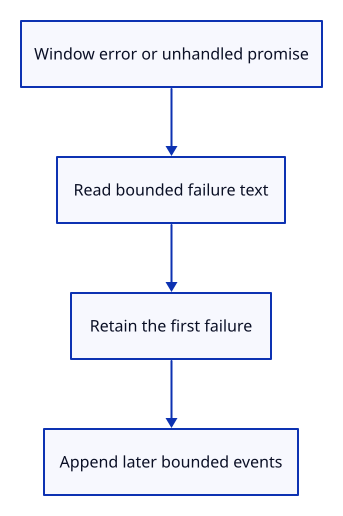

# 34gca · Observe uncaught browser failures

**Typing: 18–35 minutes.** [Estimate](typing-load.md).

Listen for Window error and unhandledrejection events in the metadata owner. Read an Error’s message safely; use a label for non-text promise reasons instead of serializing them.

## Type

Continue from [Bound browser failure messages](34gc-messages.md). [Save or recover your work](recovery.md).

### 1. `src/browser_errors.rs`

Read native error events and safe promise-reason values; avoid serializing objects and catch unavailable Error messages.

Create the file and type:

```rust
--8<-- "journey/code/34gca-errors-01.rs"
```

### 2. `Cargo.toml`

Enable the two browser event interfaces without changing dependency versions.

<details>
<summary>Locate the existing block</summary>

```toml
"PageTransitionEvent",
```

</details>

Replace that block with:

```toml
--8<-- "journey/code/34gca-errors-02.rs"
```

### 3. `src/lib.rs`

Register browser failure observation.

<details>
<summary>Locate the existing block</summary>

```rust
mod browser_startup;
```

</details>

Replace that block with:

```rust
--8<-- "journey/code/34gca-errors-03.rs"
```

### 4. `src/report_lifecycle.rs`

Record failures through the existing first-failure path; keep event defaults and heartbeat scheduling unchanged.

<details>
<summary>Locate the existing block</summary>

```rust
            _ => return,
```

</details>

Replace that block with:

```rust
--8<-- "journey/code/34gca-errors-04.rs"
```

### 5. `src/report_lifecycle.rs`

Own both Window failure bindings beside the five existing metadata bindings, including partial-registration cleanup.

<details>
<summary>Locate the existing block</summary>

```rust
    for name in ["visibilitychange", "freeze", "resume"] { listeners.listen(document.as_ref(), name)?; }
```

</details>

Replace that block with:

```rust
--8<-- "journey/code/34gca-errors-05.rs"
```

## Run and check

In your project:

```sh
cd workspace/journey
REGEN_PROTO=0 cargo build --lib --locked --target wasm32-unknown-unknown -j4
REGEN_PROTO=0 CARGO_BUILD_JOBS=4 trunk serve --port 8780
```

Open `http://127.0.0.1:8780/`. Keep an existing Trunk server running; saving rebuilds it.

In the browser console, run `Promise.reject(new Error("lesson check"))`. Type `Report`: its first failure reads “Unhandled rejection: lesson check”.

**Verified checkpoint in Chrome.**


[Verification scope](release.md).

Run the state checks on your computer from your project folder:

```sh
REGEN_PROTO=0 cargo test --lib --locked --target host-tuple -j4
```

<details>
<summary>Code explanation and diagram</summary>

Reuse the existing fatal-report path: retain the first failure and attempt its download once. Later failures remain in the bounded event history. The observers keep browser defaults and do not stop drawing.

Window failure → bounded message → first-failure report and bounded history.



Why does a browser failure not stop the GPU runtime here?

The event proves a script or promise failed, not that the drawing device was lost. Metadata records the failure; GPU loss still stops its own runtime.

Study estimate, including typing and experiments: 0.75–1.25 hours.

</details>

<details>
<summary>Optional experiment</summary>

In the debug console, run Promise.reject(new Error("lesson failure")), then type Report. A later failure must not replace the first one.

</details>

<details>
<summary>Check and save your work</summary>

Restore experimental edits, then run from `session_viewer`:

```sh
npm --prefix ../session_tests run course -- check 34gca-errors
npm --prefix ../session_tests run course -- save 34gca-errors
```

Source comparison leaves your project untouched. [Save and recovery instructions](recovery.md).

</details>

<details>
<summary>Viewer coverage and verification</summary>

Browser failure metadata now shares lifecycle ownership and survives device loss. Full loading phases, adapter/resource information and bounded GPU recovery follow.

Fresh native, WebAssembly, Trunk, GPU and Chrome checks are required. Actual browser failures are exercised in isolated browser contexts so deliberate exceptions cannot hide unexpected main-viewer errors.

Additional verification: Reload and type Report. Normal startup remains Ready. The checkpoint’s browser check produces real uncaught errors and rejected promises, then verifies retained failure evidence.

Actual uncaught errors and unhandled promises, bounded messages, first-failure retention, typed downloads and independent GPU ownership are checked.

[Full validation scope](release.md).

To reproduce the scripted acceptance of the reference checkpoint, run from `session_viewer` with the [course bundle server](release.md#reproduce) running on port 8781:

```sh
npm --prefix ../session_tests run course -- capture 34gca-errors
```

This uses the verified reference bundle; it does not check or change your typed project.

</details>
