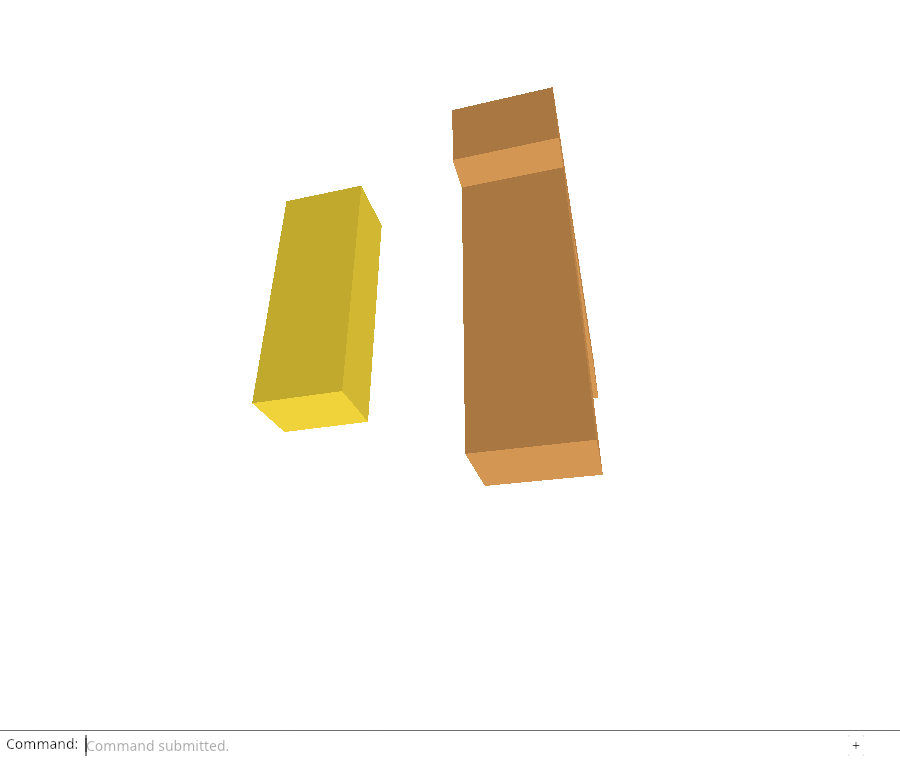
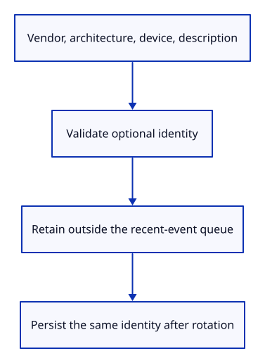

# 34gd · Retain adapter identity in the report

**Typing: 14–28 minutes.** [Estimate](typing-load.md).

Keep vendor, architecture, device and description in one optional report field. Later events can rotate out without losing the adapter identity.

## Type

Continue from [Observe uncaught browser failures](34gca-errors.md). [Save or recover your work](recovery.md).

### 1. `src/adapter_info.rs`

Keep four bounded adapter strings without retaining a GPU object.

Create the file and type:

```rust
--8<-- "journey/code/34gd-adapter-01.rs"
```

### 2. `src/diagnostic.rs`

Retain optional adapter identity separately from the recent-event queue.

<details>
<summary>Locate the existing block</summary>

```rust
    failure: Option<Event>,
```

</details>

Replace that block with:

```rust
--8<-- "journey/code/34gd-adapter-02.rs"
```

### 3. `src/diagnostic.rs`

Start without adapter identity; the browser will supply it after its request.

<details>
<summary>Locate the existing block</summary>

```rust
            context, events: Default::default(), failure: None }
```

</details>

Replace that block with:

```rust
--8<-- "journey/code/34gd-adapter-03.rs"
```

### 4. `src/diagnostic.rs`

Reject oversized adapter fields when validating a saved report.

<details>
<summary>Locate the existing block</summary>

```rust
            && self.events.len() <= 24 && self.events.iter().all(event)
```

</details>

Replace that block with:

```rust
--8<-- "journey/code/34gd-adapter-04.rs"
```

### 5. `src/diagnostic.rs`

Validate identity before changing the report.

<details>
<summary>Locate the existing block</summary>

```rust
    pub fn failure(&self) -> Option<&Event> { self.failure.as_ref() }
```

</details>

Replace that block with:

```rust
--8<-- "journey/code/34gd-adapter-05.rs"
```

### 6. `src/report_store.rs`

Admit the optional adapter field through the existing strict decoder.

<details>
<summary>Locate the existing block</summary>

```rust
        "webgpu", "viewport", "canvas", "devicePixelRatio", "events", "failure"];
```

</details>

Replace that block with:

```rust
--8<-- "journey/code/34gd-adapter-06.rs"
```

### 7. `src/adapter_info_tests.rs`

Copy the checks for retained identity, legacy decoding, strict fields, Unicode bounds and atomic refusal.

Copy this check file:

```rust
--8<-- "journey/code/34gd-adapter-07.rs"
```

### 8. `src/lib.rs`

Register adapter identity and its native checks.

<details>
<summary>Locate the existing block</summary>

```rust
pub mod diagnostic;
```

</details>

Replace that block with:

```rust
--8<-- "journey/code/34gd-adapter-08.rs"
```

## Run and check

In your project:

```sh
cd workspace/journey
REGEN_PROTO=0 cargo build --lib --locked --target wasm32-unknown-unknown -j4
REGEN_PROTO=0 CARGO_BUILD_JOBS=4 trunk serve --port 8780
```

Open `http://127.0.0.1:8780/`. Keep an existing Trunk server running; saving rebuilds it.

Run the state checks. Adapter identity survives event rotation, while reports saved before this lesson still decode.

**Verified checkpoint in Chrome.**



[Verification scope](release.md).

Run the state checks on your computer from your project folder:

```sh
REGEN_PROTO=0 cargo test --lib --locked --target host-tuple -j4
```

<details>
<summary>Code explanation and diagram</summary>

Browser vendors can leave identity strings empty. Accept those values, bound each string to 256 characters and reject unknown nested fields. Old reports omit the new field and still decode.

optional adapter strings → validated report field → saved identity survives event rotation.



Why is adapter identity outside the recent-event queue?

Loading, lifecycle and later errors can fill that queue. The same adapter identity must remain available in every subsequent report.

Study estimate, including typing and experiments: 0.75–1.25 hours.

</details>

<details>
<summary>Optional experiment</summary>

Give a vendor string 256 emoji characters, then 257. The first is valid; the second is refused without changing the report.

</details>

<details>
<summary>Check and save your work</summary>

Restore experimental edits, then run from `session_viewer`:

```sh
npm --prefix ../session_tests run course -- check 34gd-adapter
npm --prefix ../session_tests run course -- save 34gd-adapter
```

Source comparison leaves your project untouched. [Save and recovery instructions](recovery.md).

</details>

<details>
<summary>Viewer coverage and verification</summary>

This prepares retained adapter metadata. The next lesson observes the viewer’s actual native request; load timings and resource accounting follow.

Native checks cover event rotation, retained first failure, legacy reports, strict nested fields, Unicode limits and atomic refusal. Browser drawing/input retain the preceding complete route.

Native checks establish the new report field; browser commands and drawing retain the preceding behavior.

[Full validation scope](release.md).

To reproduce the scripted acceptance of the reference checkpoint, run from `session_viewer` with the [course bundle server](release.md#reproduce) running on port 8781:

```sh
npm --prefix ../session_tests run course -- capture 34gd-adapter
```

This uses the verified reference bundle; it does not check or change your typed project.

</details>
