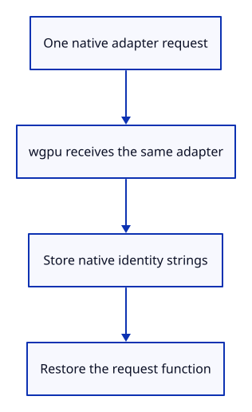

# 34gda · Read the viewer’s adapter identity

**Typing: 29–57 minutes.** [Estimate](typing-load.md).

Observe the viewer’s native adapter request, save its four identity strings, then release the observer before requesting a device. No extra adapter is requested.

## Type

Continue from [Retain adapter identity in the report](34gd-adapter.md). [Save or recover your work](recovery.md).

### 1. `src/adapter_info.js`

Observe the same native adapter request; retain only strings and restore the original property when released.

Create the file and type:

```javascript
--8<-- "journey/code/34gda-browser-01.js"
```

### 2. `src/browser_adapter.rs`

Own the JavaScript observation across one await and release it through Drop.

Create the file and type:

```rust
--8<-- "journey/code/34gda-browser-02.rs"
```

### 3. `src/browser_report.rs`

Persist validated adapter identity without changing the run outcome or event history.

<details>
<summary>Locate the existing block</summary>

```rust
pub fn fatal(message: &str) {
```

</details>

Replace that block with:

```rust
--8<-- "journey/code/34gda-browser-03.rs"
```

### 4. `src/browser.rs`

Install observation immediately before the viewer requests its adapter.

<details>
<summary>Locate the existing block</summary>

```rust
    let adapter = instance
```

</details>

Replace that block with:

```rust
--8<-- "journey/code/34gda-browser-04.rs"
```

### 5. `src/browser.rs`

Read identity only while startup remains authorized; detach observation before requesting a device.

<details>
<summary>Locate the existing block</summary>

```rust
    let adapter = adapter.map_err(|error| JsValue::from_str(&error.to_string()))?;
```

</details>

Replace that block with:

```rust
--8<-- "journey/code/34gda-browser-05.rs"
```

### 6. `src/lib.rs`

Register the browser adapter bridge.

<details>
<summary>Locate the existing block</summary>

```rust
mod browser_errors;
```

</details>

Replace that block with:

```rust
--8<-- "journey/code/34gda-browser-06.rs"
```

## Run and check

In your project:

```sh
cd workspace/journey
REGEN_PROTO=0 cargo build --lib --locked --target wasm32-unknown-unknown -j4
REGEN_PROTO=0 CARGO_BUILD_JOBS=4 trunk serve --port 8780
```

Open `http://127.0.0.1:8780/`. Keep an existing Trunk server running; saving rebuilds it.

Type `Diagnostic Report`. Its `adapter` field contains vendor, architecture, device and description; a browser may leave individual strings empty.

**Verified checkpoint in Chrome.**


[Verification scope](release.md).

Run the state checks on your computer from your project folder:

```sh
REGEN_PROTO=0 cargo test --lib --locked --target host-tuple -j4
```

<details>
<summary>Code explanation and diagram</summary>

The pinned wgpu browser backend exposes description but drops vendor and architecture. A small JavaScript module reads GPUAdapterInfo from that same native adapter. Rust owns the observer and report; unavailable metadata does not stop drawing.

viewer adapter request → native identity strings → retained report → observer released.



Why not request another adapter just to read its identity?

A second request might choose a different adapter. Observe the exact result used for this viewer, then restore the request function.

Study estimate, including typing and experiments: 0.75–1.25 hours.

</details>

<details>
<summary>Optional experiment</summary>

Download another report after several camera commands. The adapter identity stays unchanged while drawing continues.

</details>

<details>
<summary>Check and save your work</summary>

Restore experimental edits, then run from `session_viewer`:

```sh
npm --prefix ../session_tests run course -- check 34gda-browser
npm --prefix ../session_tests run course -- save 34gda-browser
```

Source comparison leaves your project untouched. [Save and recovery instructions](recovery.md).

</details>

<details>
<summary>Viewer coverage and verification</summary>

This teaches the production viewer’s same-request metadata capture with temporary ownership. Complete load phases, resource timings, live replacements and GPU recovery remain planned.

Verify actual native identity, one request, exact property restoration, bounded strings, unavailable metadata, later wrapper ownership and cancelled startup. Preserve the complete preceding command/error/lifecycle route.

Typed reports retain identity from the actual drawing adapter without another adapter request or retained GPU owner.

[Full validation scope](release.md).

To reproduce the scripted acceptance of the reference checkpoint, run from `session_viewer` with the [course bundle server](release.md#reproduce) running on port 8781:

```sh
npm --prefix ../session_tests run course -- capture 34gda-browser
```

This uses the verified reference bundle; it does not check or change your typed project.

</details>
