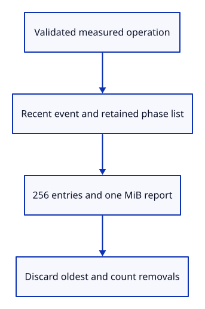

# 34gdb · Retain measured loading phases

**Typing: 27–54 minutes.** [Estimate](typing-load.md).

Keep loading durations, byte counts and source names in a separate report list. Retain up to 256 measurements while preserving the one MiB report budget.

## Type

Continue from [Read the viewer’s adapter identity](34gda-browser.md). [Save or recover your work](recovery.md).

### 1. `src/load_phase.rs`

Describe one completed load operation with duration, bytes, sanitized source and completion time.

Create the file and type:

```rust
--8<-- "journey/code/34gdb-phases-01.rs"
```

### 2. `src/diagnostic.rs`

Retain phases outside the recent events; old reports omit both optional fields.

<details>
<summary>Locate the existing block</summary>

```rust
    adapter: Option<crate::adapter_info::AdapterInfo>,
```

</details>

Replace that block with:

```rust
--8<-- "journey/code/34gdb-phases-02.rs"
```

### 3. `src/diagnostic.rs`

Start with no measured phases or discarded entries.

<details>
<summary>Locate the existing block</summary>

```rust
            context, events: Default::default(), failure: None, adapter: None }
```

</details>

Replace that block with:

```rust
--8<-- "journey/code/34gdb-phases-03.rs"
```

### 4. `src/diagnostic.rs`

Validate retained phases and the existing one MiB report limit.

<details>
<summary>Locate the existing block</summary>

```rust
            && self.adapter.as_ref().is_none_or(|info| info.valid())
```

</details>

Replace that block with:

```rust
--8<-- "journey/code/34gdb-phases-04.rs"
```

### 5. `src/diagnostic.rs`

Record validated phases and count entries discarded by either retention limit.

<details>
<summary>Locate the existing block</summary>

```rust
    pub fn record(&mut self, time: String, elapsed_ms: f64, kind: &str, message: &str) -> Result<(), &'static str> {
```

</details>

Replace that block with:

```rust
--8<-- "journey/code/34gdb-phases-05.rs"
```

### 6. `src/diagnostic.rs`

Keep phase retention within budget when later errors grow the event window.

<details>
<summary>Locate the existing block</summary>

```rust
        self.events.push_back(event);
        Ok(())
```

</details>

Replace that block with:

```rust
--8<-- "journey/code/34gdb-phases-06.rs"
```

### 7. `src/diagnostic.rs`

Account for adapter identity when retaining phase entries.

<details>
<summary>Locate the existing block</summary>

```rust
        self.adapter = Some(info); Ok(())
```

</details>

Replace that block with:

```rust
--8<-- "journey/code/34gdb-phases-07.rs"
```

### 8. `src/report_store.rs`

Admit only the two declared phase fields through saved-report decoding.

<details>
<summary>Locate the existing block</summary>

```rust
"events", "failure", "adapter"];
```

</details>

Replace that block with:

```rust
--8<-- "journey/code/34gdb-phases-08.rs"
```

### 9. `src/load_phase_tests.rs`

Copy checks for strict decoding, Unicode limits, event rotation and escaped JSON byte retention.

Copy this check file:

```rust
--8<-- "journey/code/34gdb-phases-09.rs"
```

### 10. `src/lib.rs`

Register load phase data and its native checks.

<details>
<summary>Locate the existing block</summary>

```rust
pub mod adapter_info;
```

</details>

Replace that block with:

```rust
--8<-- "journey/code/34gdb-phases-10.rs"
```

### 11. `src/diagnostic.rs`

Recheck phase retention when current browser context changes.

<details>
<summary>Locate the existing block</summary>

```rust
    pub fn phase(&mut self, time: String, phase: crate::load_phase::Phase) -> Result<(), &'static str> {
```

</details>

Replace that block with:

```rust
--8<-- "journey/code/34gdb-phases-11.rs"
```

### 12. `src/diagnostic.rs`

Retain the encoded budget after heartbeat timestamp changes.

<details>
<summary>Locate the existing block</summary>

```rust
        self.last_seen = time; Ok(())
```

</details>

Replace that block with:

```rust
--8<-- "journey/code/34gdb-phases-12.rs"
```

## Run and check

In your project:

```sh
cd workspace/journey
REGEN_PROTO=0 cargo build --lib --locked --target wasm32-unknown-unknown -j4
REGEN_PROTO=0 CARGO_BUILD_JOBS=4 trunk serve --port 8780
```

Open `http://127.0.0.1:8780/`. Keep an existing Trunk server running; saving rebuilds it.

Run the state checks. Loading phases survive event rotation, and oversized reports discard old measurements without losing the first failure.

**Verified checkpoint in Chrome.**


[Verification scope](release.md).

Run the state checks on your computer from your project folder:

```sh
REGEN_PROTO=0 cargo test --lib --locked --target host-tuple -j4
```

<details>
<summary>Code explanation and diagram</summary>

Count discarded entries so a downloaded report reveals incomplete retention. Old reports still decode. Validate durations and source names before mutation; escaped JSON bytes, rather than character counts, determine the final budget.

validated phase → recent event and retained list → count and byte limits → downloadable report.



Why check encoded bytes when strings already have character limits?

JSON escapes can use six bytes per character. The complete saved report must still fit its existing one MiB limit.

Study estimate, including typing and experiments: 0.75–1.25 hours.

</details>

<details>
<summary>Optional experiment</summary>

Use control characters in a source name. Their JSON escapes reach the byte limit before the 256-entry limit.

</details>

<details>
<summary>Check and save your work</summary>

Restore experimental edits, then run from `session_viewer`:

```sh
npm --prefix ../session_tests run course -- check 34gdb-phases
npm --prefix ../session_tests run course -- save 34gdb-phases
```

Source comparison leaves your project untouched. [Save and recovery instructions](recovery.md).

</details>

<details>
<summary>Viewer coverage and verification</summary>

This teaches retained phase data and its bounded report shape. The next lesson measures GPU startup; file read/decode/walk/upload, resources and live replacements follow.

Native checks prove strict nested fields, legacy decoding, count limits, atomic refusal, Unicode and escaped-byte bounds with retained failure and event history.

Drawing and input retain the preceding complete route; this lesson introduces the phase model.

[Full validation scope](release.md).

To reproduce the scripted acceptance of the reference checkpoint, run from `session_viewer` with the [course bundle server](release.md#reproduce) running on port 8781:

```sh
npm --prefix ../session_tests run course -- capture 34gdb-phases
```

This uses the verified reference bundle; it does not check or change your typed project.

</details>
