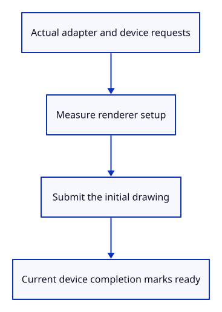

# 34gdc · Measure GPU startup and the first frame

**Typing: 23–46 minutes.** [Estimate](typing-load.md).

Measure the actual adapter request, device request and renderer setup. Mark the first frame ready after its submitted GPU work completes.

## Type

Continue from [Retain measured loading phases](34gdb-phases.md). [Save or recover your work](recovery.md).

### 1. `src/browser_phase.rs`

Measure completed operations with the browser clock and strip private URL suffixes.

Create the file and type:

```rust
--8<-- "journey/code/34gdc-startup-01.rs"
```

### 2. `src/browser_report.rs`

Persist measured phases without changing the run outcome.

<details>
<summary>Locate the existing block</summary>

```rust
pub fn adapter(info: crate::adapter_info::AdapterInfo) -> Result<(), JsValue> {
```

</details>

Replace that block with:

```rust
--8<-- "journey/code/34gdc-startup-02.rs"
```

### 3. `src/browser_runtime.rs`

Let deferred frame completion verify ownership of the current GPU runtime.

<details>
<summary>Locate the existing block</summary>

```rust
pub fn stop_if(fault: &crate::gpu_fault::Fault) -> bool {
```

</details>

Replace that block with:

```rust
--8<-- "journey/code/34gdc-startup-03.rs"
```

### 4. `src/browser.rs`

Start adapter timing before the actual request.

<details>
<summary>Locate the existing block</summary>

```rust
    let probe = crate::browser_adapter::Probe::new().ok();
```

</details>

Replace that block with:

```rust
--8<-- "journey/code/34gdc-startup-04.rs"
```

### 5. `src/browser.rs`

Retain adapter timing only after the existing startup guard permits adoption.

<details>
<summary>Locate the existing block</summary>

```rust
    let adapter = adapter.map_err(|error| JsValue::from_str(&error.to_string()))?;
```

</details>

Replace that block with:

```rust
--8<-- "journey/code/34gdc-startup-05.rs"
```

### 6. `src/browser.rs`

Time device creation separately from adapter selection.

<details>
<summary>Locate the existing block</summary>

```rust
    let device = adapter
```

</details>

Replace that block with:

```rust
--8<-- "journey/code/34gdc-startup-06.rs"
```

### 7. `src/browser.rs`

Retain active device timing, including a rejected request before its fatal report.

<details>
<summary>Locate the existing block</summary>

```rust
    let (device, queue) = device.map_err(|error| JsValue::from_str(&error.to_string()))?;
```

</details>

Replace that block with:

```rust
--8<-- "journey/code/34gdc-startup-07.rs"
```

### 8. `src/browser.rs`

Start timing construction of the initial renderer and its pipeline.

<details>
<summary>Locate the existing block</summary>

```rust
    let mut renderer = Renderer::new(
```

</details>

Replace that block with:

```rust
--8<-- "journey/code/34gdc-startup-08.rs"
```

### 9. `src/browser.rs`

Record CPU setup duration; GPU compilation latency remains part of first-frame completion.

<details>
<summary>Locate the existing block</summary>

```rust
    renderer.resize(Viewport { width, height });
```

</details>

Replace that block with:

```rust
--8<-- "journey/code/34gdc-startup-09.rs"
```

### 10. `src/browser.rs`

Start first-frame timing before encoding and submitting the real drawing.

<details>
<summary>Locate the existing block</summary>

```rust
        present(
            &surface,
```

</details>

Replace that block with:

```rust
--8<-- "journey/code/34gdc-startup-10.rs"
```

### 11. `src/browser.rs`

Mark readiness after submitted work completes, only while this GPU runtime still owns the page.

<details>
<summary>Locate the existing block</summary>

```rust
        crate::browser_report::observe("milestone", "geometry on screen")?;
```

</details>

Replace that block with:

```rust
--8<-- "journey/code/34gdc-startup-11.rs"
```

### 12. `src/lib.rs`

Register browser phase timing.

<details>
<summary>Locate the existing block</summary>

```rust
mod browser_adapter;
```

</details>

Replace that block with:

```rust
--8<-- "journey/code/34gdc-startup-12.rs"
```

### 13. `src/browser_report.rs`

Keep observed context and phase retention within the saved report budget.

<details>
<summary>Locate the existing block</summary>

```rust
        report.context = context;
        report.record
```

</details>

Replace that block with:

```rust
--8<-- "journey/code/34gdc-startup-13.rs"
```

### 14. `src/browser_report.rs`

Recheck the byte budget when a heartbeat updates browser dimensions.

<details>
<summary>Locate the existing block</summary>

```rust
report.heartbeat(time).map_err(JsValue::from_str)?; report.context = context;
```

</details>

Replace that block with:

```rust
--8<-- "journey/code/34gdc-startup-14.rs"
```

### 15. `src/browser_report.rs`

Keep final context and retained measurements within the same limit.

<details>
<summary>Locate the existing block</summary>

```rust
report.close(time).map_err(JsValue::from_str)?; report.context = context;
```

</details>

Replace that block with:

```rust
--8<-- "journey/code/34gdc-startup-15.rs"
```

### 16. `src/browser_report.rs`

Apply the report budget before downloading fresh context.

<details>
<summary>Locate the existing block</summary>

```rust
        report.context = context;
        serde_json::to_string_pretty(report)
```

</details>

Replace that block with:

```rust
--8<-- "journey/code/34gdc-startup-16.rs"
```

## Run and check

In your project:

```sh
cd workspace/journey
REGEN_PROTO=0 cargo build --lib --locked --target wasm32-unknown-unknown -j4
REGEN_PROTO=0 CARGO_BUILD_JOBS=4 trunk serve --port 8780
```

Open `http://127.0.0.1:8780/`. Keep an existing Trunk server running; saving rebuilds it.

Type `Diagnostic Report`. Its `phases` list contains adapter request, device request, renderer setup and first frame complete, each with a measured duration.

**Verified checkpoint in Chrome.**


[Verification scope](release.md).

Run the state checks on your computer from your project folder:

```sh
REGEN_PROTO=0 cargo test --lib --locked --target host-tuple -j4
```

<details>
<summary>Code explanation and diagram</summary>

Measure CPU renderer setup separately from first-frame GPU completion. A deferred completion must still belong to the active device; final exit, device loss or replacement cannot adopt its late result.

actual adapter → actual device → renderer setup → submitted frame completes → ready report.



Why is present() alone insufficient to time the completed GPU frame?

It submits work without waiting for the GPU. Queue completion includes that work and initial compilation, while ownership prevents a late callback from reviving an exited run.

Study estimate, including typing and experiments: 0.75–1.25 hours.

</details>

<details>
<summary>Optional experiment</summary>

Reload, then download another report. Timings change, while each run retains one first-frame completion measurement.

</details>

<details>
<summary>Check and save your work</summary>

Restore experimental edits, then run from `session_viewer`:

```sh
npm --prefix ../session_tests run course -- check 34gdc-startup
npm --prefix ../session_tests run course -- save 34gdc-startup
```

Source comparison leaves your project untouched. [Save and recovery instructions](recovery.md).

</details>

<details>
<summary>Viewer coverage and verification</summary>

This teaches actual GPU startup and completed first-frame diagnostics. File loading phases, resource timing, live replacements and bounded GPU recovery remain planned.

Chrome checks actual request and queue calls, held first-frame completion, typed report downloads, phase retention, rejected requests and stale completion after exit, loss or runtime replacement.

Typed diagnostics expose measured startup timings from the actual drawing device.

[Full validation scope](release.md).

To reproduce the scripted acceptance of the reference checkpoint, run from `session_viewer` with the [course bundle server](release.md#reproduce) running on port 8781:

```sh
npm --prefix ../session_tests run course -- capture 34gdc-startup
```

This uses the verified reference bundle; it does not check or change your typed project.

</details>
