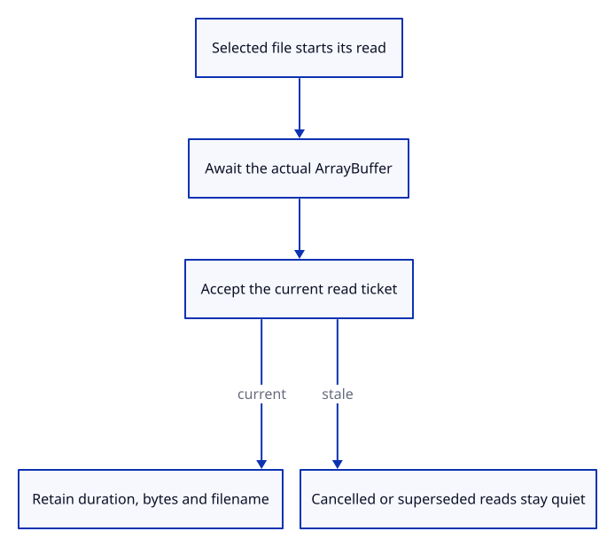

# 34gdd · Measure the selected file read

**Typing: 4–7 minutes.** [Estimate](typing-load.md).

Start the browser clock immediately before `File.array_buffer()`. After the await, accept the existing ticket before measuring or delivering anything.

## Type

Continue from [Measure GPU startup and the first frame](34gdc-startup.md). [Save or recover your work](recovery.md).

### 1. `src/file_input.rs`

Measure an actual completed read only after its ticket is accepted.

<details>
<summary>Locate the existing block</summary>

```rust
        let result = wasm_bindgen_futures::JsFuture::from(file.array_buffer()).await;
        let accepted = request.borrow_mut().finish(id);
        if !accepted { return; }
```

</details>

Replace that block with:

```rust
--8<-- "journey/code/34gdd-read-01.rs"
```

## Run and check

In your project:

```sh
cd workspace/journey
REGEN_PROTO=0 cargo build --lib --locked --target wasm32-unknown-unknown -j4
REGEN_PROTO=0 CARGO_BUILD_JOBS=4 trunk serve --port 8780
```

Open `http://127.0.0.1:8780/`. Keep an existing Trunk server running; saving rebuilds it.

Open a file, then type `Report`. Its phases list includes `file read`, the read duration, actual bytes and filename.

**Verified checkpoint in Chrome.**


[Verification scope](release.md).

Run the state checks on your computer from your project folder:

```sh
REGEN_PROTO=0 cargo test --lib --locked --target host-tuple -j4
```

<details>
<summary>Code explanation and diagram</summary>

Read the returned buffer’s length on success; rejected reads record zero bytes. The phase keeps a bounded filename with query and fragment suffixes removed. Recording diagnostics leaves the existing import transaction unchanged.

selected file → actual read promise → current ticket → retained phase → diagnostic download.



Why accept the read ticket before recording its duration?

Cancelled and superseded reads may still complete. Only the current ticket can append a measurement or deliver a file to this run.

Study estimate, including typing and experiments: 0.25–0.5 hours.

</details>

<details>
<summary>Optional experiment</summary>

Cancel a pending Open. Its late read must add neither a file nor a measurement.

</details>

<details>
<summary>Check and save your work</summary>

Restore experimental edits, then run from `session_viewer`:

```sh
npm --prefix ../session_tests run course -- check 34gdd-read
npm --prefix ../session_tests run course -- save 34gdd-read
```

Source comparison leaves your project untouched. [Save and recovery instructions](recovery.md).

</details>

<details>
<summary>Viewer coverage and verification</summary>

This measures actual selected-file reads, including current failures. Decode, display preparation, GPU upload, network resources and live replacement measurements follow.

Held actual File.arrayBuffer promises verify clock boundaries, actual byte counts, sanitized names, quiet late completions, rejected reads, downloaded JSON and unchanged Undo/Redo behavior.

Chrome holds actual file reads to verify measured success, failure, cancellation, replacement and final exit; typed reports expose the retained values.

[Full validation scope](release.md).

To reproduce the scripted acceptance of the reference checkpoint, run from `session_viewer` with the [course bundle server](release.md#reproduce) running on port 8781:

```sh
npm --prefix ../session_tests run course -- capture 34gdd-read
```

This uses the verified reference bundle; it does not check or change your typed project.

</details>
