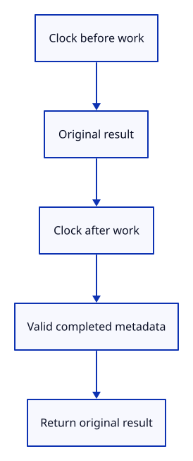

# 34gde · Measure a completed CPU operation

**Typing: 11–22 minutes.** [Estimate](typing-load.md).

Wrap one synchronous operation with two clock samples. Pass only completed metadata to an observer and return the original result.

## Type

Continue from [Measure the selected file read](34gdd-read.md). [Save or recover your work](recovery.md).

### 1. `src/load_measure.rs`

Keep timing metadata separate from the operation’s owned data and result.

Create the file and type:

```rust
--8<-- "journey/code/34gde-measure-01.rs"
```

### 2. `src/lib.rs`

Register the portable clock boundary and its tests.

<details>
<summary>Locate the existing block</summary>

```rust
pub mod report_recency;
```

</details>

Replace that block with:

```rust
--8<-- "journey/code/34gde-measure-02.rs"
```

### 3. `src/load_measure_tests.rs`

Copy deterministic checks for the clock boundary.

Copy this check file:

```rust
--8<-- "journey/code/34gde-measure-03.rs"
```

## Run and check

In your project:

```sh
cd workspace/journey
REGEN_PROTO=0 cargo build --lib --locked --target wasm32-unknown-unknown -j4
REGEN_PROTO=0 CARGO_BUILD_JOBS=4 trunk serve --port 8780
```

Open `http://127.0.0.1:8780/`. Keep an existing Trunk server running; saving rebuilds it.

Run the checks. Success and failure both keep their original result while valid clocks record one completed phase.

**Verified checkpoint in Chrome.**


[Verification scope](release.md).

Run the state checks on your computer from your project folder:

```sh
REGEN_PROTO=0 cargo test --lib --locked --target host-tuple -j4
```

<details>
<summary>Code explanation and diagram</summary>

The observer receives no document or source handle. Invalid clock values suppress diagnostics while the operation keeps its normal outcome. Native tests inject the clock; the browser uses its existing performance clock.

clock → operation result → valid duration → metadata observer → original result.



Why return the operation result even when its clock is invalid?

Timing is diagnostic. A backwards or unavailable clock must never turn a successful edit into a failure.

Study estimate, including typing and experiments: 0.5–0.75 hours.

</details>

<details>
<summary>Optional experiment</summary>

Give the test clock a backwards pair of samples. The result stays unchanged and the observer stays quiet.

</details>

<details>
<summary>Check and save your work</summary>

Restore experimental edits, then run from `session_viewer`:

```sh
npm --prefix ../session_tests run course -- check 34gde-measure
npm --prefix ../session_tests run course -- save 34gde-measure
```

Source comparison leaves your project untouched. [Save and recovery instructions](recovery.md).

</details>

<details>
<summary>Viewer coverage and verification</summary>

This portable measurement boundary prepares the document phases in the next lesson.

Native tests check success, failure, exact boundaries and invalid clocks. Chrome repeats the real selected-file read checks.

Chrome keeps the existing file-read and import behavior while the portable timing boundary is introduced.

[Full validation scope](release.md).

To reproduce the scripted acceptance of the reference checkpoint, run from `session_viewer` with the [course bundle server](release.md#reproduce) running on port 8781:

```sh
npm --prefix ../session_tests run course -- capture 34gde-measure
```

This uses the verified reference bundle; it does not check or change your typed project.

</details>
