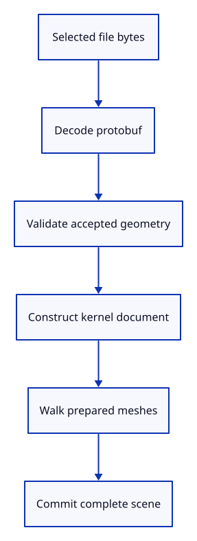

# 34gdea · Measure each document preparation phase

**Typing: 22–43 minutes.** [Estimate](typing-load.md).

Measure the four operations that turn bytes into a prepared document. A failed operation records its own phase and returns before later work starts.

## Type

Continue from [Measure a completed CPU operation](34gde-measure.md). [Save or recover your work](recovery.md).

### 1. `src/document.rs`

Measure real preparation before committing any document state.

<details>
<summary>Locate the existing block</summary>

```rust
pub fn load_at(bytes: &[u8], location: Option<Rc<crate::reload_url::ReloadUrl>>) -> Result<Loaded, &'static str> {
    let message = decode(bytes)?;
    let mut origin = crate::origin::Origin::new(&message, bytes); origin.location = location;
    let origin = Rc::new(origin);
    let document = Rc::new(Session::from_proto(message).map_err(|_| "Cannot construct session")?);
    let mut meshes = Vec::new();
    for mesh in document.objects.meshes.iter() {
        let mut prepared = PreparedMesh::from_shared(Rc::clone(mesh))?;
        prepared.model = document.xforms.get(mesh.guid()).cloned().unwrap_or_else(session_rust::Xform::identity);
        prepared.source = Some(Source {
            document: Rc::clone(&document), guid: mesh.guid().to_owned(), origin: Rc::clone(&origin),
        });
        meshes.push(prepared);
    }
    Ok(Loaded { document, meshes })
}

fn decode(bytes: &[u8]) -> Result<proto::Session, &'static str> {
    if bytes.len() > MAX_BYTES { return Err("This checkpoint accepts files up to 4 MiB"); }
    let message = proto::Session::decode(bytes).map_err(|_| "Invalid session protobuf")?;
    validate(&message)?;
    Ok(message)
}
```

</details>

Replace that block with:

```rust
--8<-- "journey/code/34gdea-import-01.rs"
```

### 2. `src/browser_phase.rs`

Store completed CPU samples without taking another end timestamp.

<details>
<summary>Locate the existing block</summary>

```rust
pub fn finish(name: &str, started: f64, bytes: u64, source: &str) {
```

</details>

Replace that block with:

```rust
--8<-- "journey/code/34gdea-import-02.rs"
```

### 3. `src/lib.rs`

Register document phase checks.

<details>
<summary>Locate the existing block</summary>

```rust
pub mod document;
```

</details>

Replace that block with:

```rust
--8<-- "journey/code/34gdea-import-03.rs"
```

### 4. `src/document_phase_tests.rs`

Copy checks for phase ordering, early failure and unchanged source precision.

Copy this check file:

```rust
--8<-- "journey/code/34gdea-import-04.rs"
```

## Run and check

In your project:

```sh
cd workspace/journey
REGEN_PROTO=0 cargo build --lib --locked --target wasm32-unknown-unknown -j4
REGEN_PROTO=0 CARGO_BUILD_JOBS=4 trunk serve --port 8780
```

Open `http://127.0.0.1:8780/`. Keep an existing Trunk server running; saving rebuilds it.

Open a file and type `Report`. Four CPU phases appear after its file-read phase, in their execution order.

**Verified checkpoint in Chrome.**


[Verification scope](release.md).

Run the state checks on your computer from your project folder:

```sh
REGEN_PROTO=0 cargo test --lib --locked --target host-tuple -j4
```

<details>
<summary>Code explanation and diagram</summary>

Keep scene adoption outside preparation. The existing editor transaction still commits only a fully prepared document. Input byte counts describe the file size; they are not resident memory measurements.

protobuf bytes → decode → validation → kernel → display walk → atomic scene adoption.



Why stop measuring after a failed phase?

The later work never ran. Recording it would invent a duration and hide where the import stopped.

Study estimate, including typing and experiments: 0.75–1.25 hours.

</details>

<details>
<summary>Optional experiment</summary>

Open a corrupt protobuf. Its report adds only `decode failed`; the drawing and Undo history remain unchanged.

</details>

<details>
<summary>Check and save your work</summary>

Restore experimental edits, then run from `session_viewer`:

```sh
npm --prefix ../session_tests run course -- check 34gdea-import
npm --prefix ../session_tests run course -- save 34gdea-import
```

Source comparison leaves your project untouched. [Save and recovery instructions](recovery.md).

</details>

<details>
<summary>Viewer coverage and verification</summary>

CPU preparation is measured here. Drawing-device uploads and completion are separate work in the next lesson.

Native checks verify phase order, early failure, precision and display conversion failures. Chrome checks real imports, report downloads, invalid bytes and Undo/Redo.

Chrome imports actual protobuf bytes, downloads the measured phases and rejects a corrupt file without changing the scene.

[Full validation scope](release.md).

To reproduce the scripted acceptance of the reference checkpoint, run from `session_viewer` with the [course bundle server](release.md#reproduce) running on port 8781:

```sh
npm --prefix ../session_tests run course -- capture 34gdea-import
```

This uses the verified reference bundle; it does not check or change your typed project.

</details>
