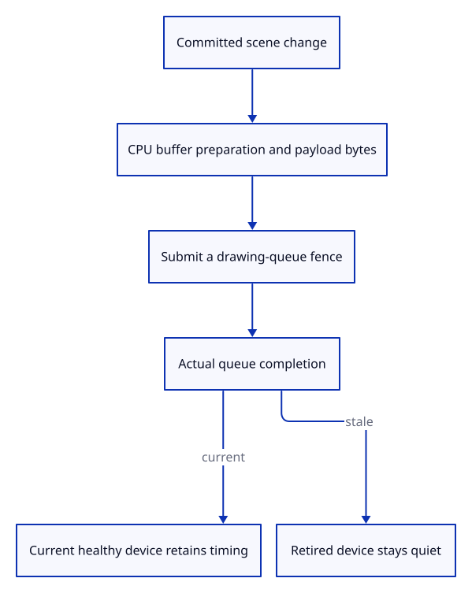

# 34gdf · Measure upload preparation and GPU completion

**Typing: 13–26 minutes.** [Estimate](typing-load.md).

Measure scene synchronization on the CPU, then fence the drawing queue. Append completion only while the same healthy device still owns the page.

## Type

Continue from [Measure each document preparation phase](34gdea-import.md). [Save or recover your work](recovery.md).

### 1. `src/geometry_cache.rs`

Count actual geometry payload, independently of resident buffer sizes.

<details>
<summary>Locate the existing block</summary>

```rust
    pub uploads: usize,
```

</details>

Replace that block with:

```rust
--8<-- "journey/code/34gdf-upload-01.rs"
```

### 2. `src/geometry_cache.rs`

Advance only when a new geometry buffer is initialized.

<details>
<summary>Locate the existing block</summary>

```rust
        self.uploads += 1;
```

</details>

Replace that block with:

```rust
--8<-- "journey/code/34gdf-upload-02.rs"
```

### 3. `src/renderer.rs`

Include initialized object settings and subsequent writes, excluding camera uniforms.

<details>
<summary>Locate the existing block</summary>

```rust
    pub fn stats(&self) -> [usize; 4] {
```

</details>

Replace that block with:

```rust
--8<-- "journey/code/34gdf-upload-03.rs"
```

### 4. `src/browser_upload.rs`

Fence the drawing queue and reject completion from a retired or failed device.

Create the file and type:

```rust
--8<-- "journey/code/34gdf-upload-04.rs"
```

### 5. `src/lib.rs`

Register the browser-only queue boundary.

<details>
<summary>Locate the existing block</summary>

```rust
#[cfg(target_arch = "wasm32")]
mod browser_phase;
```

</details>

Replace that block with:

```rust
--8<-- "journey/code/34gdf-upload-05.rs"
```

### 6. `src/browser.rs`

Measure successful scene synchronization after the editor transaction commits.

<details>
<summary>Locate the existing block</summary>

```rust
                Ok(Some(Change::Scene)) => {
                    renderer.set_scene(&editor.scene, editor.selected);
```

</details>

Replace that block with:

```rust
--8<-- "journey/code/34gdf-upload-06.rs"
```

## Run and check

In your project:

```sh
cd workspace/journey
REGEN_PROTO=0 cargo build --lib --locked --target wasm32-unknown-unknown -j4
REGEN_PROTO=0 CARGO_BUILD_JOBS=4 trunk serve --port 8780
```

Open `http://127.0.0.1:8780/`. Keep an existing Trunk server running; saving rebuilds it.

Open a file and type `Report`. The document phases are followed by `upload preparation` and `GPU upload ready`.

**Verified checkpoint in Chrome.**


[Verification scope](release.md).

Run the state checks on your computer from your project folder:

```sh
REGEN_PROTO=0 cargo test --lib --locked --target host-tuple -j4
```

<details>
<summary>Code explanation and diagram</summary>

Count initialized vertex, index and object-setting bytes, plus later settings writes. Exclude allocation padding and camera uniforms. Queue completion includes prior queued work; it is not an isolated upload benchmark.

scene change → uploaded payload counter → CPU preparation → queue fence → current-device completion.



Does queue completion measure only the upload?

No. It includes earlier queued work and callback delivery. Report it separately from CPU preparation rather than calling it an isolated transfer speed.

Study estimate, including typing and experiments: 0.5–1 hours.

</details>

<details>
<summary>Optional experiment</summary>

Undo and Redo the import. Reused geometry avoids another vertex upload; only changed object settings are counted.

</details>

<details>
<summary>Check and save your work</summary>

Restore experimental edits, then run from `session_viewer`:

```sh
npm --prefix ../session_tests run course -- check 34gdf-upload
npm --prefix ../session_tests run course -- save 34gdf-upload
```

Source comparison leaves your project untouched. [Save and recovery instructions](recovery.md).

</details>

<details>
<summary>Viewer coverage and verification</summary>

This measures scene buffer preparation and a completion fence on the actual drawing device. Camera frames are not scene uploads.

The native GPU fixture checks exact upload counters and reuse. Chrome checks real queue calls, delayed completion, typed reports, invalid imports and stale callbacks.

Chrome holds the actual drawing queue’s completion promise, checks measured bytes, and discards completion from exited, lost or replaced runtimes.

[Full validation scope](release.md).

To reproduce the scripted acceptance of the reference checkpoint, run from `session_viewer` with the [course bundle server](release.md#reproduce) running on port 8781:

```sh
npm --prefix ../session_tests run course -- capture 34gdf-upload
```

This uses the verified reference bundle; it does not check or change your typed project.

</details>
