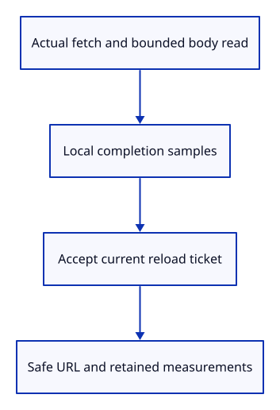

# 34gdg · Measure accepted source fetches

**Typing: 22–43 minutes.** [Estimate](typing-load.md).

Time each actual source fetch, including its bounded body read. Keep the samples in the task until the reload ticket is accepted.

## Type

Continue from [Measure upload preparation and GPU completion](34gdf-upload.md). [Save or recover your work](recovery.md).

### 1. `Cargo.toml`

Enable the browser’s native network timing entry.

<details>
<summary>Locate the existing block</summary>

```toml
"Performance", "Event"
```

</details>

Replace that block with:

```toml
--8<-- "journey/code/34gdg-network-01.rs"
```

### 2. `src/browser_network.rs`

Collect actual body and browser-network measurements without retaining source owners.

Create the file and type:

```rust
--8<-- "journey/code/34gdg-network-02.rs"
```

### 3. `src/lib.rs`

Register network measurement and safe URL handling.

<details>
<summary>Locate the existing block</summary>

```rust
#[cfg(target_arch = "wasm32")]
mod source_fetch;
```

</details>

Replace that block with:

```rust
--8<-- "journey/code/34gdg-network-03.rs"
```

### 4. `src/browser_reload.rs`

Retain measured fetch phases only after the existing ticket accepts the task.

<details>
<summary>Locate the existing block</summary>

```rust
        let result: Result<Vec<Vec<u8>>, String> = async {
            let mut values = Vec::new();
            for url in request.urls { values.push(crate::source_fetch::fetch(&url, &signal).await?); }
            Ok(values)
        }.await;
        let Some((keys, intent)) = shared.borrow_mut().finish(request.ticket, result.is_err()) else { return; };
```

</details>

Replace that block with:

```rust
--8<-- "journey/code/34gdg-network-04.rs"
```

## Run and check

In your project:

```sh
cd workspace/journey
REGEN_PROTO=0 cargo build --lib --locked --target wasm32-unknown-unknown -j4
REGEN_PROTO=0 CARGO_BUILD_JOBS=4 trunk serve --port 8780
```

Open `http://127.0.0.1:8780/`. Keep an existing Trunk server running; saving rebuilds it.

Open a file, type `Unload Sources`, then `Reload Sources` and `Report`. The accepted fetch adds its duration and actual body bytes.

**Verified checkpoint in Chrome.**


[Verification scope](release.md).

Run the state checks on your computer from your project folder:

```sh
REGEN_PROTO=0 cargo test --lib --locked --target host-tuple -j4
```

<details>
<summary>Code explanation and diagram</summary>

Use the browser’s Resource Timing entry when available. Strip credentials, query and fragment from URL identities. Fetch duration includes body consumption; Resource Timing has its own network boundaries and may report zero transfer bytes.

source URL → bounded body read → completed samples → accepted ticket → safe report identity.



Why collect measurements locally until the reload ticket is accepted?

An aborted or superseded fetch can still settle. Its measurements must not enter the current report.

Study estimate, including typing and experiments: 0.75–1.25 hours.

</details>

<details>
<summary>Optional experiment</summary>

Cancel a pending Reload Sources. Its late response must add no fetch phase.

</details>

<details>
<summary>Check and save your work</summary>

Restore experimental edits, then run from `session_viewer`:

```sh
npm --prefix ../session_tests run course -- check 34gdg-network
npm --prefix ../session_tests run course -- save 34gdg-network
```

Source comparison leaves your project untouched. [Save and recovery instructions](recovery.md).

</details>

<details>
<summary>Viewer coverage and verification</summary>

The same timing boundary supports HTTP resources; browser Resource Timing may omit private cross-origin sizes. Zero transfer bytes means unavailable or cached, not an empty document.

Native/WASM/GPU checks preserve existing behavior. Chrome checks actual HTTP timing, exact body bytes, safe URLs, rejection and cancellation.

Chrome fetches a real HTTP specimen, compares the browser’s Resource Timing entry and discards a cancelled response.

[Full validation scope](release.md).

To reproduce the scripted acceptance of the reference checkpoint, run from `session_viewer` with the [course bundle server](release.md#reproduce) running on port 8781:

```sh
npm --prefix ../session_tests run course -- capture 34gdg-network
```

This uses the verified reference bundle; it does not check or change your typed project.

</details>
