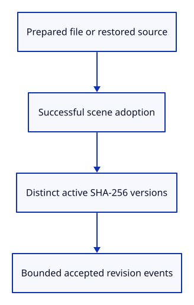

# 34gdga · Record accepted file revisions

**Typing: 18–35 minutes.** [Estimate](typing-load.md).

Read version hashes from the adopted scene and retain one event per distinct source version. Hash strings carry no document ownership.

## Type

Continue from [Measure accepted source fetches](34gdg-network.md). [Save or recover your work](recovery.md).

### 1. `src/revision.rs`

Collect only bounded hash strings from the accepted scene.

Create the file and type:

```rust
--8<-- "journey/code/34gdga-revision-01.rs"
```

### 2. `src/lib.rs`

Register accepted content identity.

<details>
<summary>Locate the existing block</summary>

```rust
pub mod document;
```

</details>

Replace that block with:

```rust
--8<-- "journey/code/34gdga-revision-02.rs"
```

### 3. `src/browser_phase.rs`

Record each accepted version as a bounded event.

<details>
<summary>Locate the existing block</summary>

```rust
pub fn completed(phase: crate::load_measure::Completed<'_>, source: &str) {
```

</details>

Replace that block with:

```rust
--8<-- "journey/code/34gdga-revision-03.rs"
```

### 4. `src/browser.rs`

Observe versions only after successful file adoption.

<details>
<summary>Locate the existing block</summary>

```rust
                    } else if event.type_() == "viewer-file" {
                        let message = if replacement
```

</details>

Replace that block with:

```rust
--8<-- "journey/code/34gdga-revision-04.rs"
```

### 5. `src/browser.rs`

Measure restored display synchronization and identify accepted source versions.

<details>
<summary>Locate the existing block</summary>

```rust
                    Ok(Some(crate::edit_replay::Reply::Changed(_))) => {
                        renderer.set_scene(&editor.scene, editor.selected);
```

</details>

Replace that block with:

```rust
--8<-- "journey/code/34gdga-revision-05.rs"
```

## Run and check

In your project:

```sh
cd workspace/journey
REGEN_PROTO=0 cargo build --lib --locked --target wasm32-unknown-unknown -j4
REGEN_PROTO=0 CARGO_BUILD_JOBS=4 trunk serve --port 8780
```

Open `http://127.0.0.1:8780/`. Keep an existing Trunk server running; saving rebuilds it.

Open a file and type `Report`. Each distinct accepted file version has a SHA-256 revision event.

**Verified checkpoint in Chrome.**


[Verification scope](release.md).

Run the state checks on your computer from your project folder:

```sh
REGEN_PROTO=0 cargo test --lib --locked --target host-tuple -j4
```

<details>
<summary>Code explanation and diagram</summary>

Run this only after successful file adoption or accepted source restoration. A failed validation, cancelled ticket or stale reply adds no accepted revision. Ordinary camera and object edits are not new file versions.

prepared document → successful editor transaction → source hash → bounded revision event.



Why record the version after the scene transaction succeeds?

A readable file can still fail validation or lose its ticket. Its bytes are not an accepted document revision.

Study estimate, including typing and experiments: 0.5–1 hours.

</details>

<details>
<summary>Optional experiment</summary>

Reopen identical bytes and then a corrupt file. The valid adoption reports its hash; the rejected file adds no revision.

</details>

<details>
<summary>Check and save your work</summary>

Restore experimental edits, then run from `session_viewer`:

```sh
npm --prefix ../session_tests run course -- check 34gdga-revision
npm --prefix ../session_tests run course -- save 34gdga-revision
```

Source comparison leaves your project untouched. [Save and recovery instructions](recovery.md).

</details>

<details>
<summary>Viewer coverage and verification</summary>

This identifies accepted file content, not edit-history revisions. Later live HTTP replacement uses the same adoption boundary.

Native checks deduplicate source versions without retaining them. Chrome checks exact accepted hashes, failed adoption and source restoration.

Chrome compares accepted events with the actual file SHA-256 and checks failed adoption, source reload, Undo and Redo.

[Full validation scope](release.md).

To reproduce the scripted acceptance of the reference checkpoint, run from `session_viewer` with the [course bundle server](release.md#reproduce) running on port 8781:

```sh
npm --prefix ../session_tests run course -- capture 34gdga-revision
```

This uses the verified reference bundle; it does not check or change your typed project.

</details>
