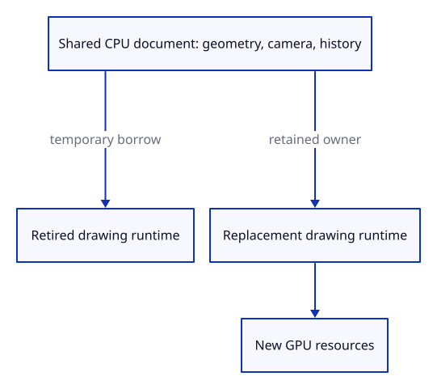

# 34ge · Keep the document outside the GPU runtime

**Typing: 13–26 minutes.** [Estimate](typing-load.md).

Move the editor into a shared CPU owner before constructing the drawing runtime. Borrow it for startup and for each synchronous browser event.

## Type

Continue from [Record accepted file revisions](34gdga-revision.md). [Save or recover your work](recovery.md).

### 1. `src/drawing_document.rs`

Give CPU document state an owner independent of a device or renderer.

Create the file and type:

```rust
--8<-- "journey/code/34ge-owner-01.rs"
```

### 2. `src/lib.rs`

Register the independent document owner.

<details>
<summary>Locate the existing block</summary>

```rust
pub mod editor;
```

</details>

Replace that block with:

```rust
--8<-- "journey/code/34ge-owner-02.rs"
```

### 3. `src/browser.rs`

Allow a drawing runtime to use an existing CPU document.

<details>
<summary>Locate the existing block</summary>

```rust
pub async fn run() -> Result<(), JsValue> {
```

</details>

Replace that block with:

```rust
--8<-- "journey/code/34ge-owner-03.rs"
```

### 4. `src/browser.rs`

Borrow the retained editor during startup.

<details>
<summary>Locate the existing block</summary>

```rust
    let mut editor = Editor::default();
```

</details>

Replace that block with:

```rust
--8<-- "journey/code/34ge-owner-04.rs"
```

### 5. `src/browser.rs`

End the startup borrow before the event closure borrows the same editor.

<details>
<summary>Locate the existing block</summary>

```rust
    let active_fault = fault.clone();
    let update = Closure::<dyn FnMut(web_sys::Event)>::new(move |event: web_sys::Event| {
        if active_fault.message().is_some() { return; }
```

</details>

Replace that block with:

```rust
--8<-- "journey/code/34ge-owner-05.rs"
```

### 6. `src/browser.rs`

Retain document authority beside the runtime’s cancellation owners.

<details>
<summary>Locate the existing block</summary>

```rust
    crate::browser_runtime::install(listeners, owned_request, owned_reload, fault);
```

</details>

Replace that block with:

```rust
--8<-- "journey/code/34ge-owner-06.rs"
```

### 7. `src/browser_runtime.rs`

Keep a CPU owner available to an authorized recovery path.

<details>
<summary>Locate the existing block</summary>

```rust
    fault: crate::gpu_fault::Fault,
```

</details>

Replace that block with:

```rust
--8<-- "journey/code/34ge-owner-07.rs"
```

### 8. `src/browser_runtime.rs`

Only the current drawing device can obtain the retained CPU document.

<details>
<summary>Locate the existing block</summary>

```rust
pub fn install(listeners: Listeners, request: Rc<RefCell<ReadGate>>, reload: Shared, fault: crate::gpu_fault::Fault) {
    ACTIVE.with(|slot| slot.replace(Some(Runtime { _listeners: listeners, request, reload, fault })));
}
```

</details>

Replace that block with:

```rust
--8<-- "journey/code/34ge-owner-08.rs"
```

## Run and check

In your project:

```sh
cd workspace/journey
REGEN_PROTO=0 cargo build --lib --locked --target wasm32-unknown-unknown -j4
REGEN_PROTO=0 CARGO_BUILD_JOBS=4 trunk serve --port 8780
```

Open `http://127.0.0.1:8780/`. Keep an existing Trunk server running; saving rebuilds it.

The viewer behaves as before. The GPU fixture tears down and recreates a renderer while retaining the edited document and history.

**Verified checkpoint in Chrome.**


[Verification scope](release.md).

Run the state checks on your computer from your project folder:

```sh
REGEN_PROTO=0 cargo test --lib --locked --target host-tuple -j4
```

<details>
<summary>Code explanation and diagram</summary>

A renderer owns GPU resources; it does not own document authority. Recovery can later reuse this CPU owner after listeners and the failed renderer are dropped. Ordinary runtime shutdown still releases the owner when no recovery retains it.

CPU editor owner → drawing runtime → shared event access → GPU teardown → retained document.



Why retain the editor rather than serialize a recovery snapshot?

The editor already owns exact geometry, selection, camera and Undo/Redo history. Reusing it preserves those states without lossy display reconstruction.

Study estimate, including typing and experiments: 0.5–1 hours.

</details>

<details>
<summary>Optional experiment</summary>

Run the GPU check and inspect the weak owner assertions: dropping a renderer releases its GPU geometry while the document remains alive.

</details>

<details>
<summary>Check and save your work</summary>

Restore experimental edits, then run from `session_viewer`:

```sh
npm --prefix ../session_tests run course -- check 34ge-owner
npm --prefix ../session_tests run course -- save 34ge-owner
```

Source comparison leaves your project untouched. [Save and recovery instructions](recovery.md).

</details>

<details>
<summary>Viewer coverage and verification</summary>

The document remains independent of GPU resources. Production’s automatic recovery reload is taught next; page reloads discard unsaved editor state.

The native GPU fixture proves document/history survival and release of retired GPU owners. Chrome repeats the full preceding telemetry route.

Chrome repeats actual imports, accepted revisions, cancelled fetches and queue ownership checks with the document stored outside the drawing closure.

[Full validation scope](release.md).

To reproduce the scripted acceptance of the reference checkpoint, run from `session_viewer` with the [course bundle server](release.md#reproduce) running on port 8781:

```sh
npm --prefix ../session_tests run course -- capture 34ge-owner
```

This uses the verified reference bundle; it does not check or change your typed project.

</details>
