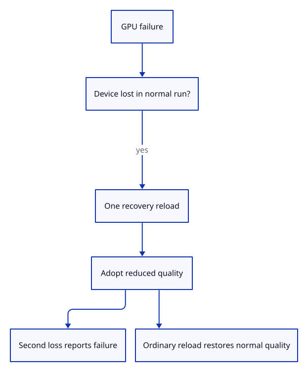

# 34gea · Permit one conservative recovery reload

**Typing: 5–9 minutes.** [Estimate](typing-load.md).

Permit recovery only for device loss and only once. A recovered page starts with reduced quality and refuses another automatic reload.

## Type

Continue from [Keep the document outside the GPU runtime](34ge-owner.md). [Save or recover your work](recovery.md).

### 1. `src/recovery.rs`

Permit one recovery only for a normal run that lost its device.

Create the file and type:

```rust
--8<-- "journey/code/34gea-policy-01.rs"
```

### 2. `src/lib.rs`

Register the one-reload policy and its tests.

<details>
<summary>Locate the existing block</summary>

```rust
pub mod drawing_document;
```

</details>

Replace that block with:

```rust
--8<-- "journey/code/34gea-policy-02.rs"
```

### 3. `src/recovery_tests.rs`

Copy normal, duplicate, recovered and fresh-run checks.

Copy this check file:

```rust
--8<-- "journey/code/34gea-policy-03.rs"
```

## Run and check

In your project:

```sh
cd workspace/journey
REGEN_PROTO=0 cargo build --lib --locked --target wasm32-unknown-unknown -j4
REGEN_PROTO=0 CARGO_BUILD_JOBS=4 trunk serve --port 8780
```

Open `http://127.0.0.1:8780/`. Keep an existing Trunk server running; saving rebuilds it.

Run the policy checks. Normal runs permit one device-loss reload; recovered runs refuse another.

**Verified checkpoint in Chrome.**


[Verification scope](release.md).

Run the state checks on your computer from your project folder:

```sh
REGEN_PROTO=0 cargo test --lib --locked --target host-tuple -j4
```

<details>
<summary>Code explanation and diagram</summary>

The policy contains no browser or document handles. Native checks exercise normal, pending and recovered runs. The next lesson connects this decision to the actual URL, saved diagnostic and canvas density.

device loss → one reload request → adopted recovery → reduced quality → next ordinary reload.



Why refuse another recovery when the page is already reduced?

Repeated losses can otherwise create an endless reload loop. A recovered run keeps its diagnostic and reports a second loss without another automatic reload.

Study estimate, including typing and experiments: 0.25–0.5 hours.

</details>

<details>
<summary>Optional experiment</summary>

Request recovery for a validation error, then for device loss. Only the device-loss request is accepted.

</details>

<details>
<summary>Check and save your work</summary>

Restore experimental edits, then run from `session_viewer`:

```sh
npm --prefix ../session_tests run course -- check 34gea-policy
npm --prefix ../session_tests run course -- save 34gea-policy
```

Source comparison leaves your project untouched. [Save and recovery instructions](recovery.md).

</details>

<details>
<summary>Viewer coverage and verification</summary>

This follows production’s one-reload recovery policy. Reduced quality lasts until the next ordinary reload; it does not preserve unsaved editor state across a page reload.

Native checks reject unrelated errors, duplicate requests and repeated recovery; a fresh policy restores normal quality.

Chrome repeats the preceding telemetry route while the one-reload policy is introduced.

[Full validation scope](release.md).

To reproduce the scripted acceptance of the reference checkpoint, run from `session_viewer` with the [course bundle server](release.md#reproduce) running on port 8781:

```sh
npm --prefix ../session_tests run course -- capture 34gea-policy
```

This uses the verified reference bundle; it does not check or change your typed project.

</details>
