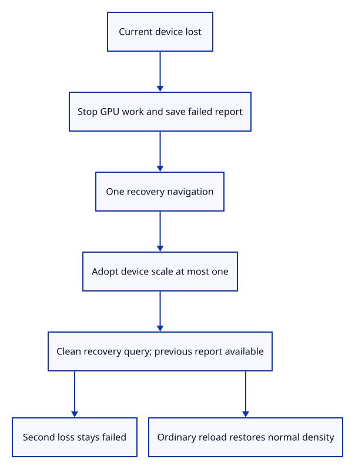

# 34geb · Recover once at reduced canvas density

**Typing: 20–40 minutes.** [Estimate](typing-load.md).

Save the current failure before navigating. Carry a bounded reason through the recovery URL, adopt reduced quality, then remove that temporary parameter.

## Type

Continue from [Permit one conservative recovery reload](34gea-policy.md). [Save or recover your work](recovery.md).

### 1. `Cargo.toml`

Enable recovery URL cleanup through the browser history API.

<details>
<summary>Locate the existing block</summary>

```toml
"Location", "Navigator"
```

</details>

Replace that block with:

```toml
--8<-- "journey/code/34geb-reload-01.rs"
```

### 2. `src/browser_recovery.rs`

Adopt one conservative reload and retain all other URL parameters.

Create the file and type:

```rust
--8<-- "journey/code/34geb-reload-02.rs"
```

### 3. `src/lib.rs`

Register browser recovery policy and navigation.

<details>
<summary>Locate the existing block</summary>

```rust
#[cfg(target_arch = "wasm32")]
mod browser;
```

</details>

Replace that block with:

```rust
--8<-- "journey/code/34geb-reload-03.rs"
```

### 4. `src/browser.rs`

Persist and download the failed run before requesting its recovery reload.

<details>
<summary>Locate the existing block</summary>

```rust
            crate::browser_report::fatal(&message);
            report(&format!("Cannot draw: {message}"));
```

</details>

Replace that block with:

```rust
--8<-- "journey/code/34geb-reload-04.rs"
```

### 5. `src/browser.rs`

Adopt reduced quality before beginning the new drawing run.

<details>
<summary>Locate the existing block</summary>

```rust
    crate::browser_report::start()?;
```

</details>

Replace that block with:

```rust
--8<-- "journey/code/34geb-reload-05.rs"
```

### 6. `src/browser.rs`

Keep the recovery reason visible in the real command dock.

<details>
<summary>Locate the existing block</summary>

```rust
    if let Some(message) = crate::browser_report::previous_notice() { panel.result(message); }
```

</details>

Replace that block with:

```rust
--8<-- "journey/code/34geb-reload-06.rs"
```

### 7. `src/browser.rs`

Report conservative recovery without changing the normal startup instruction.

<details>
<summary>Locate the existing block</summary>

```rust
    report("Wheel zooms; type commands anywhere in the drawing. Escape cancels a drag.");
```

</details>

Replace that block with:

```rust
--8<-- "journey/code/34geb-reload-07.rs"
```

### 8. `src/browser.rs`

Cap recovered device density while preserving normal high-DPI drawing.

<details>
<summary>Locate the existing block</summary>

```rust
        window.device_pixel_ratio(),
```

</details>

Replace that block with:

```rust
--8<-- "journey/code/34geb-reload-08.rs"
```

## Run and check

In your project:

```sh
cd workspace/journey
REGEN_PROTO=0 cargo build --lib --locked --target wasm32-unknown-unknown -j4
REGEN_PROTO=0 CARGO_BUILD_JOBS=4 trunk serve --port 8780
```

Open `http://127.0.0.1:8780/`. Keep an existing Trunk server running; saving rebuilds it.

A real device loss triggers one reload. The recovered canvas uses device scale at most one; `Report Previous` downloads the failed run.

**Verified checkpoint in Chrome.**


[Verification scope](release.md).

Run the state checks on your computer from your project folder:

```sh
REGEN_PROTO=0 cargo test --lib --locked --target host-tuple -j4
```

<details>
<summary>Code explanation and diagram</summary>

Cap the recovered canvas at device scale one. A second loss stays failed; an ordinary reload starts normal quality again. Page navigation discards unsaved edits. The URL-based scene loader introduced later reloads its published source.

current device loss → saved report → recovery URL → reduced drawing → clean URL → ordinary reload.



Why save the failure before replacing the page URL?

The old page cannot report after navigation. Persisting and downloading first keeps the original device-loss reason available in the recovered run.

Study estimate, including typing and experiments: 0.75–1.25 hours.

</details>

<details>
<summary>Optional experiment</summary>

Lose the recovered device again. It reports failure without another reload. Reload normally to restore the original canvas density.

</details>

<details>
<summary>Check and save your work</summary>

Restore experimental edits, then run from `session_viewer`:

```sh
npm --prefix ../session_tests run course -- check 34geb-reload
npm --prefix ../session_tests run course -- save 34geb-reload
```

Source comparison leaves your project untouched. [Save and recovery instructions](recovery.md).

</details>

<details>
<summary>Viewer coverage and verification</summary>

This matches the production recovery reload and quality lifetime. Antialiasing is already off in this endpoint; the later multisample renderer must also disable it during recovery.

Native policy and GPU checks pass. Chrome verifies actual device loss, preserved URL parameters, DPR two-to-one reduction, previous diagnostics, terminal second loss and ordinary reload.

Chrome destroys real drawing devices, verifies one reload, downloads the original diagnostic, refuses a second reload and restores normal density.

[Full validation scope](release.md).

To reproduce the scripted acceptance of the reference checkpoint, run from `session_viewer` with the [course bundle server](release.md#reproduce) running on port 8781:

```sh
npm --prefix ../session_tests run course -- capture 34geb-reload
```

This uses the verified reference bundle; it does not check or change your typed project.

</details>
