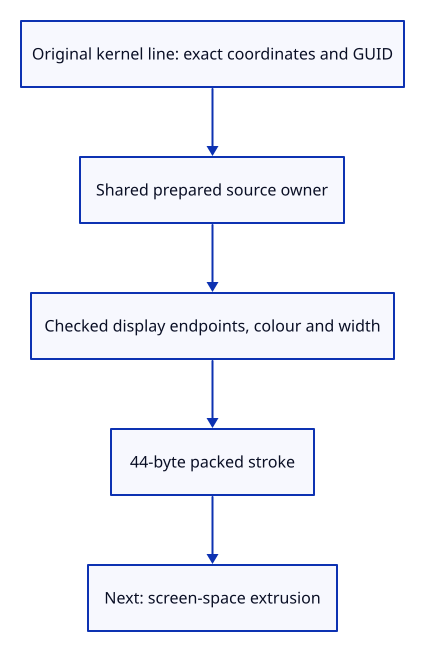

# 35 · Prepare a stroke without changing its source

**Typing: 14–27 minutes.** [Estimate](typing-load.md).

Prepare one line for display while keeping its original kernel owner. Store two finite endpoints, colour and a width measured in screen pixels.

## Type

Continue from [Recover once at reduced canvas density](34geb-reload.md). [Save or recover your work](recovery.md).

### 1. `src/stroke.rs`

Keep exact kernel ownership separate from a checked packed display record.

Create the file and type:

```rust
--8<-- "journey/code/35-stroke-01.rs"
```

### 2. `src/lib.rs`

Register stroke preparation and its checks.

<details>
<summary>Locate the existing block</summary>

```rust
pub mod mesh;
```

</details>

Replace that block with:

```rust
--8<-- "journey/code/35-stroke-02.rs"
```

### 3. `src/stroke_tests.rs`

Copy source ownership, packed layout and invalid-display checks.

Copy this check file:

```rust
--8<-- "journey/code/35-stroke-03.rs"
```

## Run and check

In your project:

```sh
cd workspace/journey
REGEN_PROTO=0 cargo build --lib --locked --target wasm32-unknown-unknown -j4
REGEN_PROTO=0 CARGO_BUILD_JOBS=4 trunk serve --port 8780
```

Open `http://127.0.0.1:8780/`. Keep an existing Trunk server running; saving rebuilds it.

Run the native checks. The packed record is 44 bytes; exact source coordinates, GUID and colour remain available.

**Verified checkpoint in Chrome.**


[Verification scope](release.md).

Run the state checks on your computer from your project folder:

```sh
REGEN_PROTO=0 cargo test --lib --locked --target host-tuple -j4
```

<details>
<summary>Code explanation and diagram</summary>

Packing changes display precision only. Invalid coordinates or widths fail before GPU allocation. A zero-length line remains a valid source; the later shader suppresses its empty stroke. Width zero, negative or nonfinite uses the default pen, matching production.

kernel Line → source owner → display record → checked packed bytes → later GPU lane.



Why retain the original line after packing its endpoints into floats?

Display floats cannot preserve exact coordinates or source metadata. Editing and saving must continue to use the original kernel line.

Study estimate, including typing and experiments: 0.5–1 hours.

</details>

<details>
<summary>Optional experiment</summary>

Prepare the same shared line twice and drop one prepared owner. Both used the same source; the other owner still retains it.

</details>

<details>
<summary>Check and save your work</summary>

Restore experimental edits, then run from `session_viewer`:

```sh
npm --prefix ../session_tests run course -- check 35-stroke
npm --prefix ../session_tests run course -- save 35-stroke
```

Source comparison leaves your project untouched. [Save and recovery instructions](recovery.md).

</details>

<details>
<summary>Viewer coverage and verification</summary>

The drawing is unchanged in this preparation step. The next stroke lessons connect this record to screen-space extrusion and a GPU lane; joins, depth visibility and picking follow.

Native tests check packed layout, exact source ownership/precision, width defaults and display-range rejection. Native GPU and Chrome preserve the preceding endpoint.

Chrome repeats the verified recovery route while stroke preparation adds no drawing or input behavior.

[Full validation scope](release.md).

To reproduce the scripted acceptance of the reference checkpoint, run from `session_viewer` with the [course bundle server](release.md#reproduce) running on port 8781:

```sh
npm --prefix ../session_tests run course -- capture 35-stroke
```

This uses the verified reference bundle; it does not check or change your typed project.

</details>
