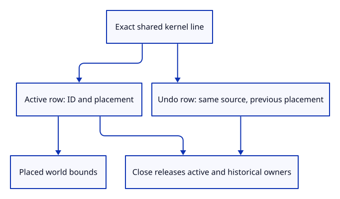

# 35a · Retain line owners in document history

**Typing: 22–43 minutes.** [Estimate](typing-load.md).

Keep line rows beside the existing mesh rows. Give both tables IDs from the same checked sequence and clone only shared kernel owners into history.

## Type

Continue from [Prepare a stroke without changing its source](35-stroke.md). [Save or recover your work](recovery.md).

### 1. `src/scene.rs`

Retain exact line owners and apply placement before display conversion.

<details>
<summary>Locate the existing block</summary>

```rust
#[derive(Clone)]
pub struct Scene {
```

</details>

Replace that block with:

```rust
--8<-- "journey/code/35a-document-01.rs"
```

### 2. `src/scene.rs`

Start the demo with no line rows.

<details>
<summary>Locate the existing block</summary>

```rust
        let mut scene = Self { objects: Vec::new(), next_id: 1, extra: None };
```

</details>

Replace that block with:

```rust
--8<-- "journey/code/35a-document-02.rs"
```

### 3. `src/scene.rs`

Include original placed line endpoints in Fit’s world bounds.

<details>
<summary>Locate the existing block</summary>

```rust
        bounds
    }

    pub fn selected_bounds
```

</details>

Replace that block with:

```rust
--8<-- "journey/code/35a-document-03.rs"
```

### 4. `src/scene.rs`

Use the same checked ID sequence while keeping line placement separate from kernel geometry.

<details>
<summary>Locate the existing block</summary>

```rust
    pub fn objects(&self) -> &[Object] {
```

</details>

Replace that block with:

```rust
--8<-- "journey/code/35a-document-04.rs"
```

### 5. `src/scene.rs`

Release line rows on Close and replacement.

<details>
<summary>Locate the existing block</summary>

```rust
    pub fn clear(&mut self) {
        self.objects = Vec::new();
```

</details>

Replace that block with:

```rust
--8<-- "journey/code/35a-document-05.rs"
```

### 6. `src/document.rs`

Reject incomplete saves while the loader still supports only meshes.

<details>
<summary>Locate the existing block</summary>

```rust
pub fn snapshot(scene: &crate::scene::Scene) -> Result<Vec<u8>, &'static str> {
```

</details>

Replace that block with:

```rust
--8<-- "journey/code/35a-document-06.rs"
```

### 7. `src/lib.rs`

Register mixed row ownership checks.

<details>
<summary>Locate the existing block</summary>

```rust
pub mod scene;
```

</details>

Replace that block with:

```rust
--8<-- "journey/code/35a-document-07.rs"
```

### 8. `src/line_scene_tests.rs`

Copy mixed IDs, placement, history and release checks.

Copy this check file:

```rust
--8<-- "journey/code/35a-document-08.rs"
```

## Run and check

In your project:

```sh
cd workspace/journey
REGEN_PROTO=0 cargo build --lib --locked --target wasm32-unknown-unknown -j4
REGEN_PROTO=0 CARGO_BUILD_JOBS=4 trunk serve --port 8780
```

Open `http://127.0.0.1:8780/`. Keep an existing Trunk server running; saving rebuilds it.

Run the checks. Line IDs stay distinct from mesh IDs, bounds include placed endpoints, and Close releases active and historical line sources.

**Verified checkpoint in Chrome.**


[Verification scope](release.md).

Run the state checks on your computer from your project folder:

```sh
REGEN_PROTO=0 cargo test --lib --locked --target host-tuple -j4
```

<details>
<summary>Code explanation and diagram</summary>

Include original placed endpoints in scene bounds. Clear both tables on Close or replacement. The existing mesh-only snapshot rejects new line rows explicitly; complete mixed-geometry saving is taught with the later loader.

prepared line → scene row → shared source history → placed bounds → complete Close.



Why share a line source across history snapshots?

A placement edit changes the row’s transform, not its exact source line. Undo can restore placement while retaining the same kernel owner.

Study estimate, including typing and experiments: 0.75–1.25 hours.

</details>

<details>
<summary>Optional experiment</summary>

Move a line row, Undo and Redo, then Close. The kernel owner remains shared until both the scene and history release it.

</details>

<details>
<summary>Check and save your work</summary>

Restore experimental edits, then run from `session_viewer`:

```sh
npm --prefix ../session_tests run course -- check 35a-document
npm --prefix ../session_tests run course -- save 35a-document
```

Source comparison leaves your project untouched. [Save and recovery instructions](recovery.md).

</details>

<details>
<summary>Viewer coverage and verification</summary>

Stroke drawing and input follow. Saving remains limited to the earlier mesh subset until the later complete geometry loader; it rejects a scene containing lines rather than silently losing them.

Native checks cover shared IDs, world bounds, exact history placement, owner release and refusal of incomplete snapshots.

Chrome repeats the preceding recovery route. No new stroke is drawn until the later GPU lesson.

[Full validation scope](release.md).

To reproduce the scripted acceptance of the reference checkpoint, run from `session_viewer` with the [course bundle server](release.md#reproduce) running on port 8781:

```sh
npm --prefix ../session_tests run course -- capture 35a-document
```

This uses the verified reference bundle; it does not check or change your typed project.

</details>
