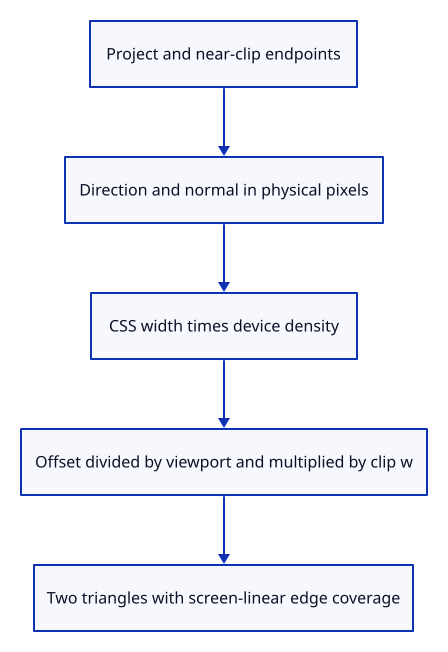

# 35b · Extrude a stroke in screen pixels

**Typing: 20–40 minutes.** [Estimate](typing-load.md).

Project both endpoints, clip a crossing segment to the near plane, then expand perpendicular to its direction in pixels. Multiplying the offset by clip w preserves width through perspective division.

## Type

Continue from [Retain line owners in document history](35a-document.md). [Save or recover your work](recovery.md).

### 1. `src/stroke.wgsl`

Extrude in physical pixels and interpolate coverage in screen space.

Create the file and type:

```wgsl
--8<-- "journey/code/35b-extrude-01.wgsl"
```

### 2. `src/stroke.rs`

Expose the same shader text to the lane and its GPU check.

<details>
<summary>Locate the existing block</summary>

```rust
use std::rc::Rc;
```

</details>

Replace that block with:

```rust
--8<-- "journey/code/35b-extrude-02.rs"
```

## Run and check

In your project:

```sh
cd workspace/journey
REGEN_PROTO=0 cargo build --lib --locked --target wasm32-unknown-unknown -j4
REGEN_PROTO=0 CARGO_BUILD_JOBS=4 trunk serve --port 8780
```

Open `http://127.0.0.1:8780/`. Keep an existing Trunk server running; saving rebuilds it.

Run the GPU check. The real drawing device validates the stroke shader; its visible lane is connected next.

**Verified checkpoint in Chrome.**


[Verification scope](release.md).

Run the state checks on your computer from your project folder:

```sh
REGEN_PROTO=0 cargo test --lib --locked --target host-tuple -j4
```

<details>
<summary>Code explanation and diagram</summary>

Suppress a segment with no projected length. Linear screen interpolation carries edge distance to the fragment stage, which fades only the last pixel. Device density converts the CSS pen width into physical pixels.

world endpoints → near clipping → pixel direction → perpendicular extrusion → edge coverage.



Why multiply a screen offset by the endpoint’s clip w?

Perspective division would otherwise shrink that offset with distance. Multiplying by w keeps its final projected width constant.

Study estimate, including typing and experiments: 0.75–1.25 hours.

</details>

<details>
<summary>Optional experiment</summary>

Trace the six corners: they form two triangles. The width divides by viewport pixels and multiplies by clip w before perspective division.

</details>

<details>
<summary>Check and save your work</summary>

Restore experimental edits, then run from `session_viewer`:

```sh
npm --prefix ../session_tests run course -- check 35b-extrude
npm --prefix ../session_tests run course -- save 35b-extrude
```

Source comparison leaves your project untouched. [Save and recovery instructions](recovery.md).

</details>

<details>
<summary>Viewer coverage and verification</summary>

This introduces readable isolated strokes. The next step supplies GPU buffers; joins, arrowheads and detailed hidden-line rules are later lessons.

The native GPU fixture validates the actual WGSL module on the drawing device. Existing native tests and Chrome remain unchanged; pixel-width acceptance follows with the lane.

Chrome preserves the preceding route while the GPU fixture validates the new shader. The next lesson draws it.

[Full validation scope](release.md).

To reproduce the scripted acceptance of the reference checkpoint, run from `session_viewer` with the [course bundle server](release.md#reproduce) running on port 8781:

```sh
npm --prefix ../session_tests run course -- capture 35b-extrude
```

This uses the verified reference bundle; it does not check or change your typed project.

</details>
