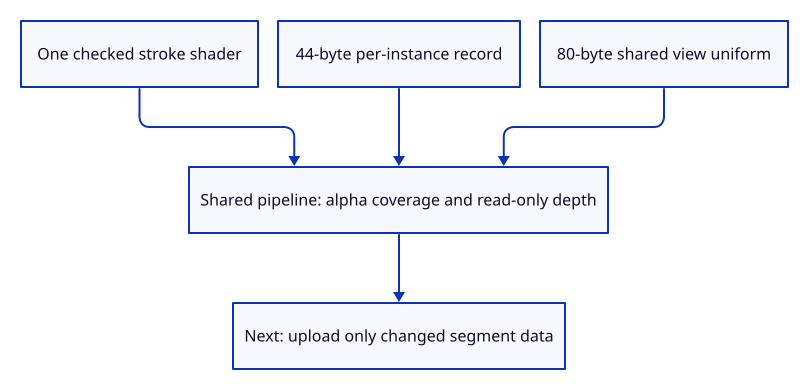

# 35c · Create the shared stroke pipeline

**Typing: 24–48 minutes.** [Estimate](typing-load.md).

Create a shared stroke pipeline with an instance record for each segment. The shader generates six corners; the batch supplies endpoints, colour and width.

## Type

Continue from [Extrude a stroke in screen pixels](35b-extrude.md). [Save or recover your work](recovery.md).

### 1. `src/stroke_gpu.rs`

Create one depth-tested instanced lane with alpha coverage and its own view binding.

Create the file and type:

```rust
--8<-- "journey/code/35c-lane-01.rs"
```

### 2. `src/lib.rs`

Register the shared GPU lane.

<details>
<summary>Locate the existing block</summary>

```rust
pub mod stroke;
```

</details>

Replace that block with:

```rust
--8<-- "journey/code/35c-lane-02.rs"
```

## Run and check

In your project:

```sh
cd workspace/journey
REGEN_PROTO=0 cargo build --lib --locked --target wasm32-unknown-unknown -j4
REGEN_PROTO=0 CARGO_BUILD_JOBS=4 trunk serve --port 8780
```

Open `http://127.0.0.1:8780/`. Keep an existing Trunk server running; saving rebuilds it.

Run the GPU fixture. The actual device validates the shared pipeline, 44-byte instance layout and 80-byte view uniform.

**Verified checkpoint in Chrome.**


[Verification scope](release.md).

Run the state checks on your computer from your project folder:

```sh
REGEN_PROTO=0 cargo test --lib --locked --target host-tuple -j4
```

<details>
<summary>Code explanation and diagram</summary>

Use alpha blending for the shader’s edge coverage and the existing depth format without writing stroke depth. A separate view binding holds the matrix, viewport and density. Allocate segment buffers only when the lane receives data.

checked shader → instance layout → shared view binding → alpha coverage → depth-tested lane.



Why use six generated vertices and one instance record per segment?

Every segment uses the same two-triangle shape. Its endpoints and style change per instance, so no separate mesh or pipeline is needed for each line.

Study estimate, including typing and experiments: 0.75–1.25 hours.

</details>

<details>
<summary>Optional experiment</summary>

Match each vertex attribute’s offset to the packed record from lesson 35. Positions occupy the first 24 bytes; colour and width follow.

</details>

<details>
<summary>Check and save your work</summary>

Restore experimental edits, then run from `session_viewer`:

```sh
npm --prefix ../session_tests run course -- check 35c-lane
npm --prefix ../session_tests run course -- save 35c-lane
```

Source comparison leaves your project untouched. [Save and recovery instructions](recovery.md).

</details>

<details>
<summary>Viewer coverage and verification</summary>

The lane is created once and starts empty. Buffer synchronization and visible drawing are connected next.

The native GPU fixture constructs the actual pipeline under a validation scope. Existing native tests and Chrome keep the preceding route.

The actual native drawing device validates the pipeline; Chrome keeps the preceding behavior until synchronization is connected.

[Full validation scope](release.md).

To reproduce the scripted acceptance of the reference checkpoint, run from `session_viewer` with the [course bundle server](release.md#reproduce) running on port 8781:

```sh
npm --prefix ../session_tests run course -- capture 35c-lane
```

This uses the verified reference bundle; it does not check or change your typed project.

</details>
