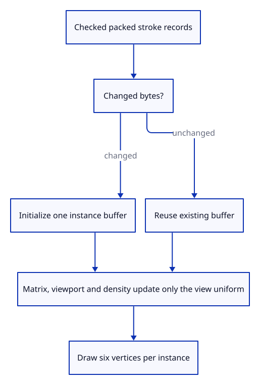

# 35ca · Upload changed stroke instances only

**Typing: 18–36 minutes.** [Estimate](typing-load.md).

Upload a stroke batch only when its checked packed bytes change. Keep camera, viewport and density in the shared uniform instead of rebuilding segment vertices.

## Type

Continue from [Create the shared stroke pipeline](35c-lane.md). [Save or recover your work](recovery.md).

### 1. `src/stroke_gpu.rs`

Keep segment uploads separate from camera uniforms and release empty batches.

<details>
<summary>Locate the existing block</summary>

```rust
impl Lane {
    pub fn new
```

</details>

Replace that block with:

```rust
--8<-- "journey/code/35ca-sync-01.rs"
```

## Run and check

In your project:

```sh
cd workspace/journey
REGEN_PROTO=0 cargo build --lib --locked --target wasm32-unknown-unknown -j4
REGEN_PROTO=0 CARGO_BUILD_JOBS=4 trunk serve --port 8780
```

Open `http://127.0.0.1:8780/`. Keep an existing Trunk server running; saving rebuilds it.

Run the GPU fixture. Twenty-four real renders preserve measured pen width across zoom, both projections and densities one and two.

**Verified checkpoint in Chrome.**


[Verification scope](release.md).

Run the state checks on your computer from your project folder:

```sh
REGEN_PROTO=0 cargo test --lib --locked --target host-tuple -j4
```

<details>
<summary>Code explanation and diagram</summary>

An empty batch drops its buffer. Invalid data leaves the existing batch unchanged. Native GPU renders measure anti-aliased width in linear colour space and verify buffer reuse, exact payload accounting and release.

checked packed strokes → changed bytes → one GPU buffer → view-only updates → six vertices per instance.



Why compare packed data before replacing the vertex buffer?

Camera and unrelated mesh edits do not change stroke endpoints or style. Reusing the buffer avoids uploading the same data on every interaction.

Study estimate, including typing and experiments: 0.75–1.25 hours.

</details>

<details>
<summary>Optional experiment</summary>

Synchronize the same stroke twice, then update only its view. Its vertex upload counter must remain one; clearing the lane releases its buffer.

</details>

<details>
<summary>Check and save your work</summary>

Restore experimental edits, then run from `session_viewer`:

```sh
npm --prefix ../session_tests run course -- check 35ca-sync
npm --prefix ../session_tests run course -- save 35ca-sync
```

Source comparison leaves your project untouched. [Save and recovery instructions](recovery.md).

</details>

<details>
<summary>Viewer coverage and verification</summary>

The lane renders real instances here. The following lesson connects it to the document renderer and browser events.

Twenty-four native GPU renders measure widths 1/3/9 across zoom, projection and density. Buffer reuse, finite input refusal and empty-buffer release also pass; browser-visible strokes follow next.

Native GPU renders verify the actual lane; Chrome preserves the preceding viewer while document wiring follows.

[Full validation scope](release.md).

To reproduce the scripted acceptance of the reference checkpoint, run from `session_viewer` with the [course bundle server](release.md#reproduce) running on port 8781:

```sh
npm --prefix ../session_tests run course -- capture 35ca-sync
```

This uses the verified reference bundle; it does not check or change your typed project.

</details>
