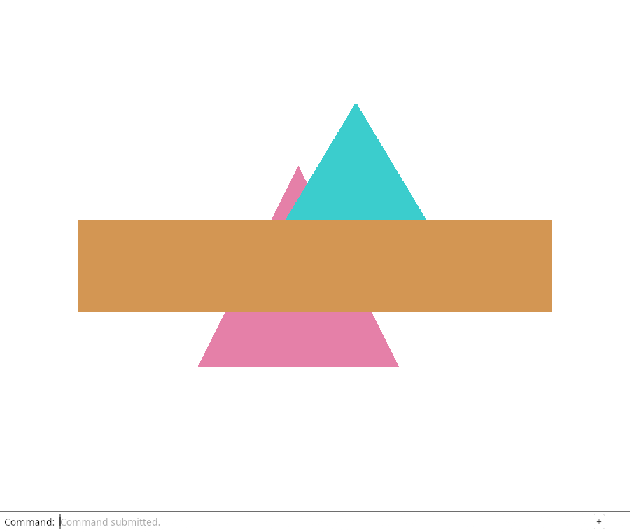
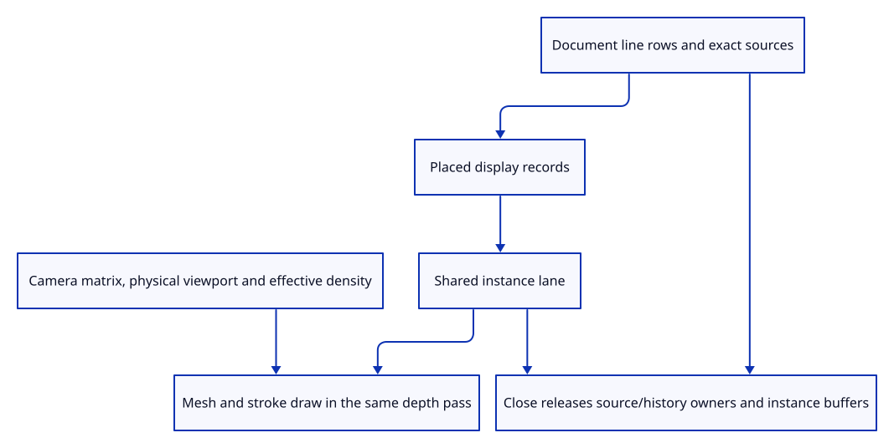

# 35cb · Connect the stroke lane to the document renderer

**Typing: 25–49 minutes.** [Estimate](typing-load.md).

Synchronize placed line records when the scene changes, then draw their shared lane in the existing depth pass. Camera changes update uniforms while vertex data stays resident.

## Type

Continue from [Upload changed stroke instances only](35ca-sync.md). [Save or recover your work](recovery.md).

### 1. `src/renderer.rs`

Retain one stroke lane and the physical view dimensions.

<details>
<summary>Locate the existing block</summary>

```rust
    depth: wgpu::TextureView,
```

</details>

Replace that block with:

```rust
--8<-- "journey/code/35cb-render-01.rs"
```

### 2. `src/renderer.rs`

Create the shared lane with the actual drawing device.

<details>
<summary>Locate the existing block</summary>

```rust
        let mut renderer = Self { device, queue, pipeline, meshes: Vec::new(),
```

</details>

Replace that block with:

```rust
--8<-- "journey/code/35cb-render-02.rs"
```

### 3. `src/renderer.rs`

Initialize native view size and default density.

<details>
<summary>Locate the existing block</summary>

```rust
            settings_bytes: 0, uniform, view_group, depth };
```

</details>

Replace that block with:

```rust
--8<-- "journey/code/35cb-render-03.rs"
```

### 4. `src/renderer.rs`

Keep physical viewport dimensions beside the shared depth texture.

<details>
<summary>Locate the existing block</summary>

```rust
    pub fn resize(&mut self, size: crate::viewport::Viewport) {
```

</details>

Replace that block with:

```rust
--8<-- "journey/code/35cb-render-04.rs"
```

### 5. `src/renderer.rs`

Reuse unchanged strokes and expose exact instance-buffer accounting.

<details>
<summary>Locate the existing block</summary>

```rust
    pub fn set_scene(&mut self, scene: &Scene, selected: Option<ObjectId>) {
```

</details>

Replace that block with:

```rust
--8<-- "journey/code/35cb-render-05.rs"
```

### 6. `src/renderer.rs`

Include stroke payloads in measured scene upload bytes.

<details>
<summary>Locate the existing block</summary>

```rust
        self.geometry.uploaded_bytes + self.settings_allocations as u64 * 80 + self.settings_bytes as u64
```

</details>

Replace that block with:

```rust
--8<-- "journey/code/35cb-render-06.rs"
```

### 7. `src/renderer.rs`

Update camera and density separately from segment vertices.

<details>
<summary>Locate the existing block</summary>

```rust
        self.queue.write_buffer(&self.uniform, 0, &bytes);
```

</details>

Replace that block with:

```rust
--8<-- "journey/code/35cb-render-07.rs"
```

### 8. `src/renderer.rs`

Use the same scene depth when drawing the stroke batch.

<details>
<summary>Locate the existing block</summary>

```rust
            for mesh in &self.meshes {
                mesh.draw(&mut pass);
            }
```

</details>

Replace that block with:

```rust
--8<-- "journey/code/35cb-render-08.rs"
```

### 9. `src/browser.rs`

Use recovery’s effective density for both canvas size and stroke width.

<details>
<summary>Locate the existing block</summary>

```rust
    let Some(size) = Viewport::from_css(
```

</details>

Replace that block with:

```rust
--8<-- "journey/code/35cb-render-09.rs"
```

### 10. `src/browser.rs`

Size the canvas with the same effective density.

<details>
<summary>Locate the existing block</summary>

```rust
        crate::browser_recovery::density(window.device_pixel_ratio()),
```

</details>

Replace that block with:

```rust
--8<-- "journey/code/35cb-render-10.rs"
```

### 11. `src/memory.rs`

Count line rows, distinct kernel owners and allocated row capacity.

<details>
<summary>Locate the existing block</summary>

```rust
pub fn gpu<'a>
```

</details>

Replace that block with:

```rust
--8<-- "journey/code/35cb-render-11.rs"
```

### 12. `src/scene.rs`

Expose actual line table capacity for CPU accounting.

<details>
<summary>Locate the existing block</summary>

```rust
    pub fn lines(&self) -> &[LineObject] { &self.lines }
```

</details>

Replace that block with:

```rust
--8<-- "journey/code/35cb-render-12.rs"
```

### 13. `src/scene.rs`

Reject unrenderable placed endpoints before changing document state.

<details>
<summary>Locate the existing block</summary>

```rust
        let row = self.lines.iter_mut().find(|row| row.id == id).ok_or("Line not found")?;
        row.model = model; Ok(())
```

</details>

Replace that block with:

```rust
--8<-- "journey/code/35cb-render-13.rs"
```

### 14. `src/browser.rs`

Expose the actual new resource counters beside the existing inspector values.

<details>
<summary>Locate the existing block</summary>

```rust
    canvas.set_attribute("data-selected-id",
```

</details>

Replace that block with:

```rust
--8<-- "journey/code/35cb-render-14.rs"
```

## Run and check

In your project:

```sh
cd workspace/journey
REGEN_PROTO=0 cargo build --lib --locked --target wasm32-unknown-unknown -j4
REGEN_PROTO=0 CARGO_BUILD_JOBS=4 trunk serve --port 8780
```

Open `http://127.0.0.1:8780/`. Keep an existing Trunk server running; saving rebuilds it.

The native fixture draws a real source line with the existing meshes and verifies line buffer accounting. Browser command insertion follows next.

**Verified checkpoint in Chrome.**



[Verification scope](release.md).

Run the state checks on your computer from your project folder:

```sh
REGEN_PROTO=0 cargo test --lib --locked --target host-tuple -j4
```

<details>
<summary>Code explanation and diagram</summary>

Pass the effective browser density through recovery’s existing cap. Report line rows and buffer usage separately from the earlier mesh counters. Closing clears line owners, history and GPU instances; the renderer retains no kernel line handle.

scene line owners → unchanged-data reuse → shared drawing pass → density-aware view → buffer release.



Why does the renderer receive packed strokes rather than kernel owners?

The document owns editable sources and history. GPU display data can survive source release without keeping those kernel owners alive.

Study estimate, including typing and experiments: 0.75–1.25 hours.

</details>

<details>
<summary>Optional experiment</summary>

Close the line-bearing document in the GPU fixture. Its kernel weak owner expires and stroke buffer usage returns to zero.

</details>

<details>
<summary>Check and save your work</summary>

Restore experimental edits, then run from `session_viewer`:

```sh
npm --prefix ../session_tests run course -- check 35cb-render
npm --prefix ../session_tests run course -- save 35cb-render
```

Source comparison leaves your project untouched. [Save and recovery instructions](recovery.md).

</details>

<details>
<summary>Viewer coverage and verification</summary>

The shared drawing pass and resource lifetime are connected here. The next endpoint exposes an Example Line command and checks actual browser pixels.

The native fixture draws mixed geometry and proves source release, view-only reuse, payload counts and empty-buffer release. Twenty-four width renders remain; browser-visible input follows.

Native rendering now includes a prepared line; Chrome keeps the preceding scene until the following input lesson adds the command.

[Full validation scope](release.md).

To reproduce the scripted acceptance of the reference checkpoint, run from `session_viewer` with the [course bundle server](release.md#reproduce) running on port 8781:

```sh
npm --prefix ../session_tests run course -- capture 35cb-render
```

This uses the verified reference bundle; it does not check or change your typed project.

</details>
