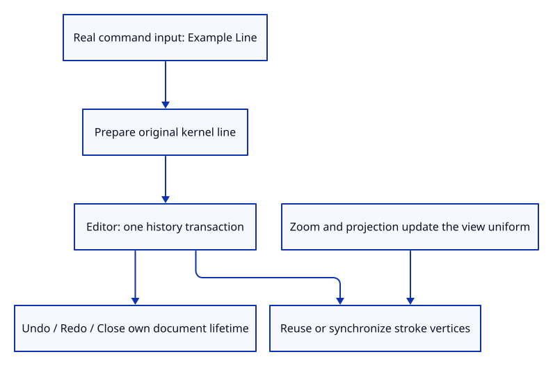

# 35d · Insert a line through the real command dock

**Typing: 7–14 minutes.** [Estimate](typing-load.md).

Register Example Line in the existing dock and dispatch an Editor action. Prepare the kernel line before committing one history transaction. The line retains its original endpoints and style.

## Type

Continue from [Connect the stroke lane to the document renderer](35cb-render.md). [Save or recover your work](recovery.md).

### 1. `src/editor.rs`

Add a document action for the example line.

<details>
<summary>Locate the existing block</summary>

```rust
    AddBox,
```

</details>

Replace that block with:

```rust
--8<-- "journey/code/35d-input-01.rs"
```

### 2. `src/editor.rs`

Prepare the original line, then commit insertion through existing history.

<details>
<summary>Locate the existing block</summary>

```rust
            Action::AddBox => {
```

</details>

Replace that block with:

```rust
--8<-- "journey/code/35d-input-02.rs"
```

### 3. `src/browser.rs`

Expose the new action through the actual command list.

<details>
<summary>Locate the existing block</summary>

```rust
            "Example Box",
```

</details>

Replace that block with:

```rust
--8<-- "journey/code/35d-input-03.rs"
```

### 4. `src/browser.rs`

Dispatch accepted input to the editor instead of directly to GPU data.

<details>
<summary>Locate the existing block</summary>

```rust
                    "example box" => Action::AddBox,
```

</details>

Replace that block with:

```rust
--8<-- "journey/code/35d-input-04.rs"
```

### 5. `src/stroke_input_tests.rs`

Copy the source lifetime and undoable command checks.

Copy this check file:

```rust
--8<-- "journey/code/35d-input-05.rs"
```

### 6. `src/lib.rs`

Register the command checks.

<details>
<summary>Locate the existing block</summary>

```rust
pub mod stroke;
```

</details>

Replace that block with:

```rust
--8<-- "journey/code/35d-input-06.rs"
```

## Run and check

In your project:

```sh
cd workspace/journey
REGEN_PROTO=0 cargo build --lib --locked --target wasm32-unknown-unknown -j4
REGEN_PROTO=0 CARGO_BUILD_JOBS=4 trunk serve --port 8780
```

Open `http://127.0.0.1:8780/`. Keep an existing Trunk server running; saving rebuilds it.

Close the document, type Example Line, then zoom. The horizontal stroke remains five CSS pixels wide.

**Verified checkpoint in Chrome.**


[Verification scope](release.md).

Run the state checks on your computer from your project folder:

```sh
REGEN_PROTO=0 cargo test --lib --locked --target host-tuple -j4
```

<details>
<summary>Code explanation and diagram</summary>

Chrome checks real width at densities one and two in both projections, unchanged vertex uploads during zoom, document Undo/Redo and complete Close. Saving lines remains an explicit error until mixed-geometry serialization is taught.

Example Line → prepared source → one history transaction → stroke batch → camera-only reuse.



Why does line insertion go through Editor instead of directly changing the GPU buffer?

The document must own identity, original coordinates and Undo. The renderer follows accepted document changes and never becomes the editable authority.

Study estimate, including typing and experiments: 0.75–1.25 hours.

</details>

<details>
<summary>Optional experiment</summary>

Undo the line, Redo it, then Close. Inspect actual live line and GPU counters before and after each command.

</details>

<details>
<summary>Check and save your work</summary>

Restore experimental edits, then run from `session_viewer`:

```sh
npm --prefix ../session_tests run course -- check 35d-input
npm --prefix ../session_tests run course -- save 35d-input
```

Source comparison leaves your project untouched. [Save and recovery instructions](recovery.md).

</details>

<details>
<summary>Viewer coverage and verification</summary>

This checkpoint exposes one line example. Full line picking, visibility, interactive construction and mixed-document loading follow in their respective chapters.

Native tests cover command history, shared sources and Close. Actual headed Chrome measures stroke pixels in both projections at two densities; zoom reuses the vertex buffer.

Chrome draws a real five-pixel source line after command insertion and verifies zoom, density, Undo/Redo and Close.

[Full validation scope](release.md).

To reproduce the scripted acceptance of the reference checkpoint, run from `session_viewer` with the [course bundle server](release.md#reproduce) running on port 8781:

```sh
npm --prefix ../session_tests run course -- capture 35d-input
```

This uses the verified reference bundle; it does not check or change your typed project.

</details>
