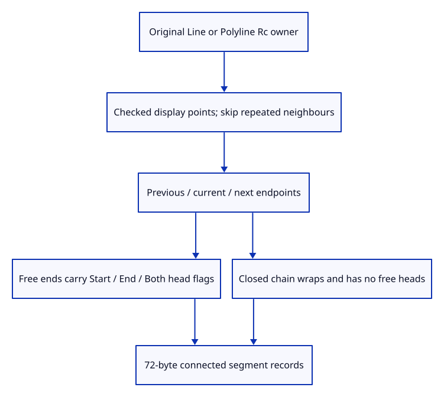

# 36 · Retain connected source geometry

**Typing: 22–44 minutes.** [Estimate](typing-load.md).

Retain an Rc owner for a line or polyline, then prepare checked display points. Consecutive repeated points add no span; the original coordinates remain intact.

## Type

Continue from [Insert a line through the real command dock](35d-input.md). [Save or recover your work](recovery.md).

### 1. `src/chain.rs`

Retain exact source geometry while deriving finite neighbour and head records.

Create the file and type:

```rust
--8<-- "journey/code/36-chain-01.rs"
```

### 2. `src/lib.rs`

Register connected geometry and its checks.

<details>
<summary>Locate the existing block</summary>

```rust
pub mod stroke;
```

</details>

Replace that block with:

```rust
--8<-- "journey/code/36-chain-02.rs"
```

### 3. `src/chain_tests.rs`

Copy source precision, links, degeneracy and packed-head checks.

Copy this check file:

```rust
--8<-- "journey/code/36-chain-03.rs"
```

## Run and check

In your project:

```sh
cd workspace/journey
REGEN_PROTO=0 cargo build --lib --locked --target wasm32-unknown-unknown -j4
REGEN_PROTO=0 CARGO_BUILD_JOBS=4 trunk serve --port 8780
```

Open `http://127.0.0.1:8780/`. Keep an existing Trunk server running; saving rebuilds it.

Run the exact-source checks. Display conversion retains the original kernel coordinates and owner.

**Verified checkpoint in Chrome.**


[Verification scope](release.md).

Run the state checks on your computer from your project folder:

```sh
REGEN_PROTO=0 cargo test --lib --locked --target host-tuple -j4
```

<details>
<summary>Code explanation and diagram</summary>

Keep a shared display-point cache beside the exact source. Cloning document history can share both values without rounding coordinates in the kernel object. Neighbour and head records follow next.

original owner → checked display points → repeated-point removal → shared display cache.



Why are repeated display points removed without changing the source polyline?

A zero-length projected span has no direction for extrusion. Display preparation can omit it while saving and editing retain the original coordinates.

Study estimate, including typing and experiments: 0.75–1.25 hours.

</details>

<details>
<summary>Optional experiment</summary>

Prepare a polyline with repeated points and clone its prepared value. The display points are shared, and the original coordinates remain unchanged.

</details>

<details>
<summary>Check and save your work</summary>

Restore experimental edits, then run from `session_viewer`:

```sh
npm --prefix ../session_tests run course -- check 36-chain
npm --prefix ../session_tests run course -- save 36-chain
```

Source comparison leaves your project untouched. [Save and recovery instructions](recovery.md).

</details>

<details>
<summary>Viewer coverage and verification</summary>

This checkpoint prepares original source ownership and display points. Neighbour records, arrow flags and GPU drawing follow.

Native checks prove original source ownership, precision, shared display points and invalid input refusal. Existing actual Chrome stroke checks remain; connected drawing follows.

Chrome still draws the existing line example. Connected records are checked natively before their GPU pipeline is introduced.

[Full validation scope](release.md).

To reproduce the scripted acceptance of the reference checkpoint, run from `session_viewer` with the [course bundle server](release.md#reproduce) running on port 8781:

```sh
npm --prefix ../session_tests run course -- capture 36-chain
```

This uses the verified reference bundle; it does not check or change your typed project.

</details>
