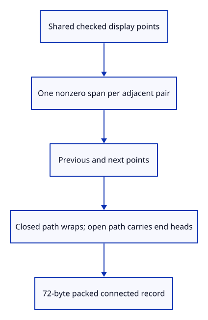

# 36a · Link adjacent spans and headed ends

**Typing: 12–24 minutes.** [Estimate](typing-load.md).

Turn adjacent display points into connected span records. Repeated display points already have no span; the source still retains them.

## Type

Continue from [Retain connected source geometry](36-chain.md). [Save or recover your work](recovery.md).

### 1. `src/chain.rs`

Describe neighbours and heads without modifying the original source.

<details>
<summary>Locate the existing block</summary>

```rust
        Ok(Self { source, points: Rc::new(points), colour, width, heads })
    }

}
```

</details>

Replace that block with:

```rust
--8<-- "journey/code/36a-links-01.rs"
```

### 2. `src/chain_link_tests.rs`

Copy closed-neighbour and headed-span checks.

Copy this check file:

```rust
--8<-- "journey/code/36a-links-02.rs"
```

### 3. `src/lib.rs`

Register the connected span checks.

<details>
<summary>Locate the existing block</summary>

```rust
pub mod chain;
```

</details>

Replace that block with:

```rust
--8<-- "journey/code/36a-links-03.rs"
```

## Run and check

In your project:

```sh
cd workspace/journey
REGEN_PROTO=0 cargo build --lib --locked --target wasm32-unknown-unknown -j4
REGEN_PROTO=0 CARGO_BUILD_JOBS=4 trunk serve --port 8780
```

Open `http://127.0.0.1:8780/`. Keep an existing Trunk server running; saving rebuilds it.

Run neighbour checks. A closed chain wraps both ends and suppresses free arrowheads; an open chain uses its first and last nonzero spans.

**Verified checkpoint in Chrome.**


[Verification scope](release.md).

Run the state checks on your computer from your project folder:

```sh
REGEN_PROTO=0 cargo test --lib --locked --target host-tuple -j4
```

<details>
<summary>Code explanation and diagram</summary>

Closed paths wrap their neighbour references and suppress free-end arrows. Open paths carry head flags only at their first and last nonzero spans. Pack each record into an explicit 72-byte instance layout.

shared display points → previous/current/next → closed wraparound → headed free spans → 72-byte payload.



Why are repeated display points removed without changing the source polyline?

A zero-length projected span has no direction for extrusion. Display preparation can omit it while saving and editing retain the original coordinates.

Study estimate, including typing and experiments: 0.75–1.25 hours.

</details>

<details>
<summary>Optional experiment</summary>

Inspect a closed triangle and an open headed chain. Verify their source coordinates survive repeated-point removal exactly.

</details>

<details>
<summary>Check and save your work</summary>

Restore experimental edits, then run from `session_viewer`:

```sh
npm --prefix ../session_tests run course -- check 36a-links
npm --prefix ../session_tests run course -- save 36a-links
```

Source comparison leaves your project untouched. [Save and recovery instructions](recovery.md).

</details>

<details>
<summary>Viewer coverage and verification</summary>

Connected records are complete here. The projected join shader, arrowheads and browser drawing follow.

Native tests prove closed wraparound, repeated-point handling, free-end head flags and exact 72-byte packing. Connected GPU pixels follow.

Chrome retains the existing real line example while native tests verify connected instance records.

[Full validation scope](release.md).

To reproduce the scripted acceptance of the reference checkpoint, run from `session_viewer` with the [course bundle server](release.md#reproduce) running on port 8781:

```sh
npm --prefix ../session_tests run course -- capture 36a-links
```

This uses the verified reference bundle; it does not check or change your typed project.

</details>
