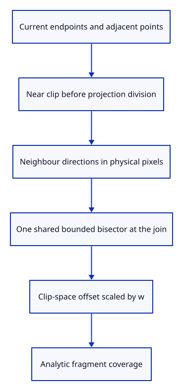

# 36b · Project neighbours for bounded stroke joins

**Typing: 13–25 minutes.** [Estimate](typing-load.md).

Project adjacent points before calculating their shared joint cross-section. Bound near-reversal joins so an unstable bisector cannot create an unbounded spike.

## Type

Continue from [Link adjacent spans and headed ends](36a-links.md). [Save or recover your work](recovery.md).

### 1. `src/chain.wgsl`

Share bounded projected joins while retaining near clipping and edge coverage.

Create the file and type:

```wgsl
--8<-- "journey/code/36b-join-01.wgsl"
```

### 2. `src/chain.rs`

Expose the actual connected shader source.

<details>
<summary>Locate the existing block</summary>

```rust
use std::rc::Rc;
```

</details>

Replace that block with:

```rust
--8<-- "journey/code/36b-join-02.rs"
```

## Run and check

In your project:

```sh
cd workspace/journey
REGEN_PROTO=0 cargo build --lib --locked --target wasm32-unknown-unknown -j4
REGEN_PROTO=0 CARGO_BUILD_JOBS=4 trunk serve --port 8780
```

Open `http://127.0.0.1:8780/`. Keep an existing Trunk server running; saving rebuilds it.

The actual drawing device validates the WGSL helper module. Vertex drawing follows next.

**Verified checkpoint in Chrome.**


[Verification scope](release.md).

Run the state checks on your computer from your project folder:

```sh
REGEN_PROTO=0 cargo test --lib --locked --target host-tuple -j4
```

<details>
<summary>Code explanation and diagram</summary>

A hidden neighbour or zero-length projected span falls back to the current segment normal. Vertex extrusion and analytic fragment coverage follow next.

project adjacent points → reject hidden or zero spans → bisector → bounded cross-section.



Why bound the join when two projected spans nearly reverse?

Their bisector becomes unstable as the directions oppose. A bounded cross-section avoids unbounded spikes; later visibility checks still use the original source spans.

Study estimate, including typing and experiments: 0.75–1.25 hours.

</details>

<details>
<summary>Optional experiment</summary>

Compare previous/current and current/next directions at a shared endpoint. Both segments must agree on the cross-section.

</details>

<details>
<summary>Check and save your work</summary>

Restore experimental edits, then run from `session_viewer`:

```sh
npm --prefix ../session_tests run course -- check 36b-join
npm --prefix ../session_tests run course -- save 36b-join
```

Source comparison leaves your project untouched. [Save and recovery instructions](recovery.md).

</details>

<details>
<summary>Viewer coverage and verification</summary>

This checkpoint introduces connected projection helpers. The following endpoint wires their bounded cross-sections into real vertices.

The actual drawing device validates the complete helper module. Vertex extrusion and connected GPU pixels follow separately.

Chrome retains the existing verified line while the connected shader is introduced.

[Full validation scope](release.md).

To reproduce the scripted acceptance of the reference checkpoint, run from `session_viewer` with the [course bundle server](release.md#reproduce) running on port 8781:

```sh
npm --prefix ../session_tests run course -- capture 36b-join
```

This uses the verified reference bundle; it does not check or change your typed project.

</details>
