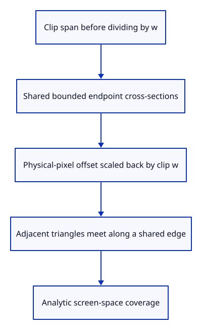

# 36ba · Extrude the joined stroke body

**Typing: 21–41 minutes.** [Estimate](typing-load.md).

Clip each span before dividing by w, then offset its ends along their shared bounded cross-sections. Convert physical-pixel offsets back into clip coordinates using w.

## Type

Continue from [Project neighbours for bounded stroke joins](36b-join.md). [Save or recover your work](recovery.md).

### 1. `src/chain.wgsl`

Clip before projection, meet bounded endpoint sections and cover the stroke analytically.

<details>
<summary>Locate the existing block</summary>

```wgsl
    return bisector / max(dot(bisector, normal), 0.25);
}
```

</details>

Replace that block with:

```wgsl
--8<-- "journey/code/36ba-body-01.wgsl"
```

## Run and check

In your project:

```sh
cd workspace/journey
REGEN_PROTO=0 cargo build --lib --locked --target wasm32-unknown-unknown -j4
REGEN_PROTO=0 CARGO_BUILD_JOBS=4 trunk serve --port 8780
```

Open `http://127.0.0.1:8780/`. Keep an existing Trunk server running; saving rebuilds it.

The actual drawing device validates the complete joined-body shader. Real connected instance drawing follows after arrowhead extrusion.

**Verified checkpoint in Chrome.**


[Verification scope](release.md).

Run the state checks on your computer from your project folder:

```sh
REGEN_PROTO=0 cargo test --lib --locked --target host-tuple -j4
```

<details>
<summary>Code explanation and diagram</summary>

The triangles of adjacent spans meet along their common endpoint section. Fragment coverage measures distance from the span in screen pixels, retaining constant width under camera changes.

clip endpoint → bounded join offset → clip w scaling → shared raster edge → analytic coverage.



Why bound the join when two projected spans nearly reverse?

Their bisector becomes unstable as the directions oppose. A bounded cross-section avoids unbounded spikes; later visibility checks still use the original source spans.

Study estimate, including typing and experiments: 0.75–1.25 hours.

</details>

<details>
<summary>Optional experiment</summary>

Trace both triangles meeting at a shared path point. Their end cross-section comes from the same projected neighbours.

</details>

<details>
<summary>Check and save your work</summary>

Restore experimental edits, then run from `session_viewer`:

```sh
npm --prefix ../session_tests run course -- check 36ba-body
npm --prefix ../session_tests run course -- save 36ba-body
```

Source comparison leaves your project untouched. [Save and recovery instructions](recovery.md).

</details>

<details>
<summary>Viewer coverage and verification</summary>

Connected-body extrusion is complete here. Arrowheads, the instance pipeline and browser drawing follow.

The real native drawing device validates the joined vertex and fragment entry points. Connected body turn and pixel checks follow at the pipeline endpoint.

Chrome retains the existing verified line while the connected shader is introduced.

[Full validation scope](release.md).

To reproduce the scripted acceptance of the reference checkpoint, run from `session_viewer` with the [course bundle server](release.md#reproduce) running on port 8781:

```sh
npm --prefix ../session_tests run course -- capture 36ba-body
```

This uses the verified reference bundle; it does not check or change your typed project.

</details>
