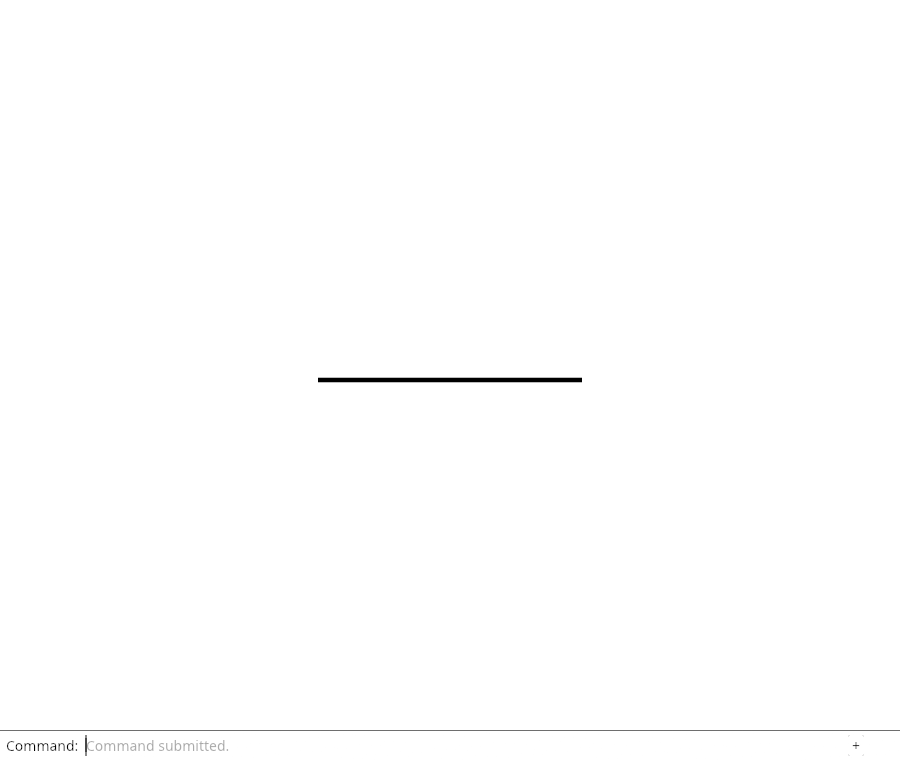
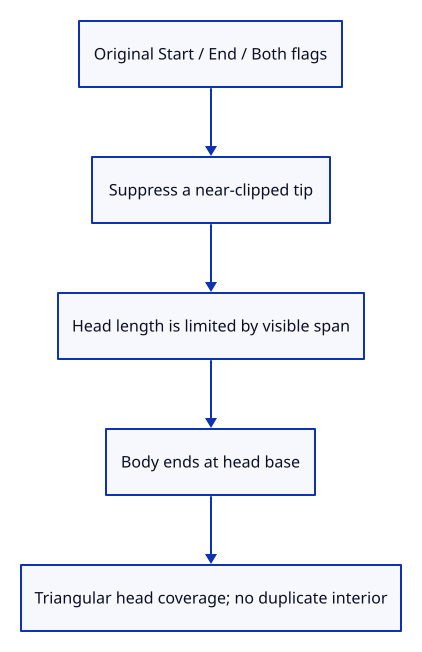

# 36bb · Extrude free-end arrowheads

**Typing: 21–41 minutes.** [Estimate](typing-load.md).

Use the source head flags at free endpoints and suppress a head when clipping removes its tip. Limit the head length so short arrows retain a shaft.

## Type

Continue from [Extrude the joined stroke body](36ba-body.md). [Save or recover your work](recovery.md).

### 1. `src/chain.wgsl`

Carry head shape separately from body coverage.

<details>
<summary>Locate the existing block</summary>

```wgsl
    @location(4) @interpolate(flat) half_width: f32,
}
```

</details>

Replace that block with:

```wgsl
--8<-- "journey/code/36bb-heads-01.wgsl"
```

### 2. `src/chain.wgsl`

Shape real free-end heads and partition their shaft at the base.

<details>
<summary>Locate the existing block</summary>

```wgsl
    let corner = corners[index]; let half_width = width * view.density * 0.5;
    var position = select(a, b, corner.x > 0.5);
```

</details>

Replace that block with:

```wgsl
--8<-- "journey/code/36bb-heads-02.wgsl"
```

### 3. `src/chain.wgsl`

Identify body fragments independently of head triangles.

<details>
<summary>Locate the existing block</summary>

```wgsl
    return Output(position, colour, screen(position), screen(a), direction, half_width);
```

</details>

Replace that block with:

```wgsl
--8<-- "journey/code/36bb-heads-03.wgsl"
```

### 4. `src/chain.wgsl`

Cover triangle edges while preserving a continuous, singly blended shaft seam.

<details>
<summary>Locate the existing block</summary>

```wgsl
    let distance = dot(input.pixel - input.origin, perpendicular(input.direction));
    let coverage = clamp(input.half_width + 0.5 - abs(distance), 0.0, 1.0);
```

</details>

Replace that block with:

```wgsl
--8<-- "journey/code/36bb-heads-04.wgsl"
```

## Run and check

In your project:

```sh
cd workspace/journey
REGEN_PROTO=0 cargo build --lib --locked --target wasm32-unknown-unknown -j4
REGEN_PROTO=0 CARGO_BUILD_JOBS=4 trunk serve --port 8780
```

Open `http://127.0.0.1:8780/`. Keep an existing Trunk server running; saving rebuilds it.

The actual drawing device validates the headed stroke shader. Connected instance rendering follows next.

**Verified checkpoint in Chrome.**



[Verification scope](release.md).

Run the state checks on your computer from your project folder:

```sh
REGEN_PROTO=0 cargo test --lib --locked --target host-tuple -j4
```

<details>
<summary>Code explanation and diagram</summary>

Draw the body and each head as separate six-vertex parts. Cut the shaft at the head base, and use triangular fragment coverage without blending the same interior twice.

free-end head flags → projected shaft → bounded head length → split shaft/head seam → triangular coverage.



Why must a clipped end lose its arrowhead?

The clipped endpoint is a new display boundary rather than the original source tip. A head there would claim a direction and endpoint the document never contained.

Study estimate, including typing and experiments: 0.75–1.25 hours.

</details>

<details>
<summary>Optional experiment</summary>

Follow Start and End flags through the three six-vertex parts. A closed chain or a near-clipped end must not produce a free arrowhead.

</details>

<details>
<summary>Check and save your work</summary>

Restore experimental edits, then run from `session_viewer`:

```sh
npm --prefix ../session_tests run course -- check 36bb-heads
npm --prefix ../session_tests run course -- save 36bb-heads
```

Source comparison leaves your project untouched. [Save and recovery instructions](recovery.md).

</details>

<details>
<summary>Viewer coverage and verification</summary>

Shader extrusion now covers joined bodies and free-end heads. The following endpoint connects its complete 72-byte instance layout and pixel checks.

The actual native drawing device validates the headed vertex and fragment entry points. Turn, head flag, short-arrow and opacity pixels follow with the connected pipeline.

Chrome retains the existing verified line while the connected shader is introduced.

[Full validation scope](release.md).

To reproduce the scripted acceptance of the reference checkpoint, run from `session_viewer` with the [course bundle server](release.md#reproduce) running on port 8781:

```sh
npm --prefix ../session_tests run course -- capture 36bb-heads
```

This uses the verified reference bundle; it does not check or change your typed project.

</details>
