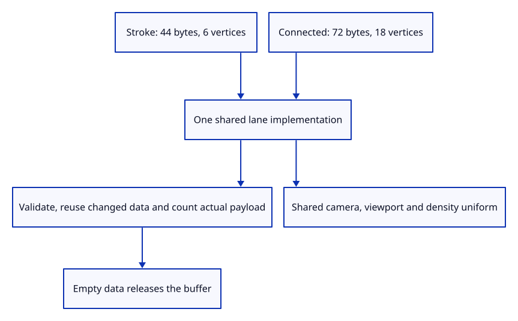

# 36c · Share instance drawing with connected strokes

**Typing: 25–50 minutes.** [Estimate](typing-load.md).

Parameterize the existing lane by shader, attributes, byte stride and vertex count. Keep its view uniform, changed-data reuse and release policy shared.

## Type

Continue from [Extrude free-end arrowheads](36bb-heads.md). [Save or recover your work](recovery.md).

### 1. `src/stroke_gpu.rs`

Keep format-specific layout beside the shared lane resources.

<details>
<summary>Locate the existing block</summary>

```rust
    data: Vec<u8>,
```

</details>

Replace that block with:

```rust
--8<-- "journey/code/36c-lane-01.rs"
```

### 2. `src/stroke_gpu.rs`

Validate each connected record, then reuse the same changed-byte transaction.

<details>
<summary>Locate the existing block</summary>

```rust
        u32::try_from(data.len() / 44).map_err(|_| "Too many stroke instances")?;
```

</details>

Replace that block with:

```rust
--8<-- "journey/code/36c-lane-02.rs"
```

### 3. `src/stroke_gpu.rs`

Draw the correct number of vertices for either instance format.

<details>
<summary>Locate the existing block</summary>

```rust
        pass.set_vertex_buffer(0, vertices.slice(..)); pass.draw(0..6, 0..(self.data.len() / 44) as u32);
```

</details>

Replace that block with:

```rust
--8<-- "journey/code/36c-lane-03.rs"
```

### 4. `src/stroke_gpu.rs`

Count actual instances from their format-specific stride.

<details>
<summary>Locate the existing block</summary>

```rust
        [self.data.len() as u64 / 44, self.vertices.as_ref().map_or(0, wgpu::Buffer::size)]
```

</details>

Replace that block with:

```rust
--8<-- "journey/code/36c-lane-04.rs"
```

### 5. `src/stroke_gpu.rs`

Construct either layout using one pipeline and view implementation.

<details>
<summary>Locate the existing block</summary>

```rust
    pub fn new(device: &wgpu::Device, format: wgpu::TextureFormat) -> Self {
```

</details>

Replace that block with:

```rust
--8<-- "journey/code/36c-lane-05.rs"
```

### 6. `src/stroke_gpu.rs`

Use the actual shader belonging to this instance layout.

<details>
<summary>Locate the existing block</summary>

```rust
            label: Some("stroke"), source: wgpu::ShaderSource::Wgsl(crate::stroke::SHADER.into()),
```

</details>

Replace that block with:

```rust
--8<-- "journey/code/36c-lane-06.rs"
```

### 7. `src/stroke_gpu.rs`

Bind the exact attributes and byte stride.

<details>
<summary>Locate the existing block</summary>

```rust
                buffers: &[wgpu::VertexBufferLayout { array_stride: 44, step_mode: wgpu::VertexStepMode::Instance,
                    attributes: &wgpu::vertex_attr_array![0 => Float32x3, 1 => Float32x3, 2 => Float32x4, 3 => Float32] }],
```

</details>

Replace that block with:

```rust
--8<-- "journey/code/36c-lane-07.rs"
```

### 8. `src/stroke_gpu.rs`

Retain both layout parameters for synchronized draw and accounting.

<details>
<summary>Locate the existing block</summary>

```rust
        Self { pipeline, uniform, group, vertices: None, data: Vec::new(), uploads: 0, uploaded_bytes: 0 }
```

</details>

Replace that block with:

```rust
--8<-- "journey/code/36c-lane-08.rs"
```

### 9. `src/stroke_gpu.rs`

Keep the buffer initialization trait at the method that uses it.

<details>
<summary>Locate the existing block</summary>

```rust
        use wgpu::util::DeviceExt;
        let mut data = Vec::new();
```

</details>

Replace that block with:

```rust
--8<-- "journey/code/36c-lane-09.rs"
```

## Run and check

In your project:

```sh
cd workspace/journey
REGEN_PROTO=0 cargo build --lib --locked --target wasm32-unknown-unknown -j4
REGEN_PROTO=0 CARGO_BUILD_JOBS=4 trunk serve --port 8780
```

Open `http://127.0.0.1:8780/`. Keep an existing Trunk server running; saving rebuilds it.

Run native GPU checks. Connected turns and headed ends draw with the same density and upload policy as the original stroke lane.

**Verified checkpoint in Chrome.**


[Verification scope](release.md).

Run the state checks on your computer from your project folder:

```sh
REGEN_PROTO=0 cargo test --lib --locked --target host-tuple -j4
```

<details>
<summary>Code explanation and diagram</summary>

Validate connected endpoints, neighbours and head flags before changing buffers. Real GPU checks draw turns and all arrowhead options, inspect alpha at the join and retain original line width checks.

checked connected records → one changed-data buffer → same view uniform → 18 vertices → complete release.



Why reuse the same lane rather than copying its upload and lifetime code?

Both formats need identical changed-data reuse, queue writes and Close release. Their shader, attributes, stride and vertex count are the differences.

Study estimate, including typing and experiments: 0.75–1.25 hours.

</details>

<details>
<summary>Optional experiment</summary>

Synchronize a connected batch twice and change only the camera. Its instance buffer and upload count must remain unchanged.

</details>

<details>
<summary>Check and save your work</summary>

Restore experimental edits, then run from `session_viewer`:

```sh
npm --prefix ../session_tests run course -- check 36c-lane
npm --prefix ../session_tests run course -- save 36c-lane
```

Source comparison leaves your project untouched. [Save and recovery instructions](recovery.md).

</details>

<details>
<summary>Viewer coverage and verification</summary>

Both stroke formats now render on actual GPU instances. Document placement and connected browser commands follow.

Native GPU pixels check joined alpha coverage, all headed ends, stable original widths, actual payload accounting, invalid records and empty release. Connected browser rows follow next.

Chrome retains the existing verified line while the connected shader is introduced.

[Full validation scope](release.md).

To reproduce the scripted acceptance of the reference checkpoint, run from `session_viewer` with the [course bundle server](release.md#reproduce) running on port 8781:

```sh
npm --prefix ../session_tests run course -- capture 36c-lane
```

This uses the verified reference bundle; it does not check or change your typed project.

</details>
