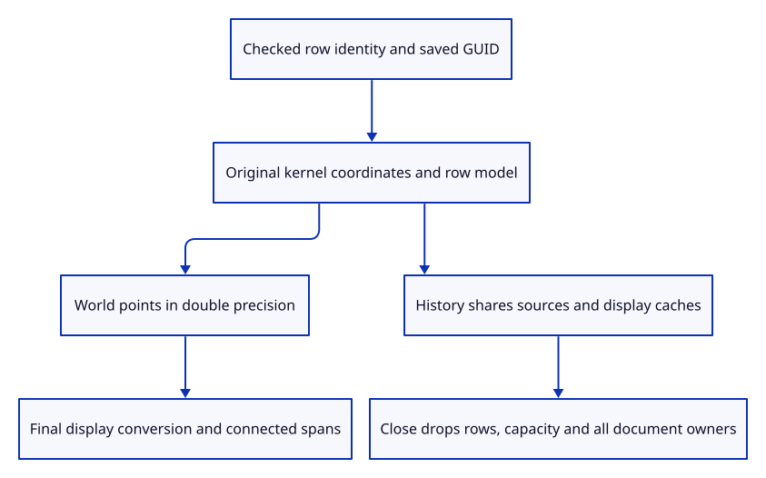

# 36d · Retain connected paths in document history

**Typing: 20–39 minutes.** [Estimate](typing-load.md).

Give each connected path a checked object identity and saved GUID beside its exact source. Keep connected rows independent of mesh and single-line tables.

## Type

Continue from [Share instance drawing with connected strokes](36c-lane.md). [Save or recover your work](recovery.md).

### 1. `src/chain.rs`

Expose the original identity and allocation for document ownership accounting.

<details>
<summary>Locate the existing block</summary>

```rust
impl Source {
    pub fn coordinates
```

</details>

Replace that block with:

```rust
--8<-- "journey/code/36d-document-01.rs"
```

### 2. `src/scene.rs`

Place original source points before producing connected world display spans.

<details>
<summary>Locate the existing block</summary>

```rust
#[derive(Clone)]
pub struct Scene {
```

</details>

Replace that block with:

```rust
--8<-- "journey/code/36d-document-02.rs"
```

### 3. `src/scene.rs`

Initialize the connected row table independently of mesh and line tables.

<details>
<summary>Locate the existing block</summary>

```rust
objects: Vec::new(), lines: Vec::new(),
```

</details>

Replace that block with:

```rust
--8<-- "journey/code/36d-document-03.rs"
```

### 4. `src/scene.rs`

Include all original placed path points in world bounds.

<details>
<summary>Locate the existing block</summary>

```rust
        bounds
    }
```

</details>

Replace that block with:

```rust
--8<-- "journey/code/36d-document-04.rs"
```

### 5. `src/scene.rs`

Allocate distinct saved identities and validate complete placement before changing a row.

<details>
<summary>Locate the existing block</summary>

```rust
    pub fn lines(&self)
```

</details>

Replace that block with:

```rust
--8<-- "journey/code/36d-document-05.rs"
```

### 6. `src/scene.rs`

Drop connected row capacity along with the rest of the document.

<details>
<summary>Locate the existing block</summary>

```rust
    pub fn clear(&mut self) {
```

</details>

Replace that block with:

```rust
--8<-- "journey/code/36d-document-06.rs"
```

### 7. `src/document.rs`

Refuse unsupported mixed saving rather than silently omitting connected geometry.

<details>
<summary>Locate the existing block</summary>

```rust
    if !scene.lines().is_empty() {
```

</details>

Replace that block with:

```rust
--8<-- "journey/code/36d-document-07.rs"
```

### 8. `src/lib.rs`

Register the precise path-document checks.

<details>
<summary>Locate the existing block</summary>

```rust
pub mod chain;
```

</details>

Replace that block with:

```rust
--8<-- "journey/code/36d-document-09.rs"
```

### 9. `src/path_document_tests.rs`

Copy precise placement, original identity, sharing and release checks.

Copy this check file:

```rust
--8<-- "journey/code/36d-document-10.rs"
```

## Run and check

In your project:

```sh
cd workspace/journey
REGEN_PROTO=0 cargo build --lib --locked --target wasm32-unknown-unknown -j4
REGEN_PROTO=0 CARGO_BUILD_JOBS=4 trunk serve --port 8780
```

Open `http://127.0.0.1:8780/`. Keep an existing Trunk server running; saving rebuilds it.

Run native identity and history checks. Connected rows keep their original source coordinates and disappear after complete Close.

**Verified checkpoint in Chrome.**


[Verification scope](release.md).

Run the state checks on your computer from your project folder:

```sh
REGEN_PROTO=0 cargo test --lib --locked --target host-tuple -j4
```

<details>
<summary>Code explanation and diagram</summary>

History shares immutable source and display owners. Close drops both active and history roots; saving connected rows remains an explicit error until mixed-geometry serialization.

prepared source → checked row ID and saved GUID → shared history owners → complete Close.



Why transform original coordinates before converting placed endpoints to f32?

The model can magnify rounding error. Bounds and editing use original doubles; the display conversion belongs after the world placement.

Study estimate, including typing and experiments: 0.75–1.25 hours.

</details>

<details>
<summary>Optional experiment</summary>

Insert the same prepared source twice. The document rows need distinct saved GUIDs while both retain the same immutable kernel source.

</details>

<details>
<summary>Check and save your work</summary>

Restore experimental edits, then run from `session_viewer`:

```sh
npm --prefix ../session_tests run course -- check 36d-document
npm --prefix ../session_tests run course -- save 36d-document
```

Source comparison leaves your project untouched. [Save and recovery instructions](recovery.md).

</details>

<details>
<summary>Viewer coverage and verification</summary>

Connected source rows and history ownership are complete here. Precise placement/accounting and renderer wiring follow next.

Native checks prove distinct document identities, original precision, history retention and complete source release. Precise placement and resource ledgers follow.

Chrome retains the existing verified line while the connected shader is introduced.

[Full validation scope](release.md).

To reproduce the scripted acceptance of the reference checkpoint, run from `session_viewer` with the [course bundle server](release.md#reproduce) running on port 8781:

```sh
npm --prefix ../session_tests run course -- capture 36d-document
```

This uses the verified reference bundle; it does not check or change your typed project.

</details>
