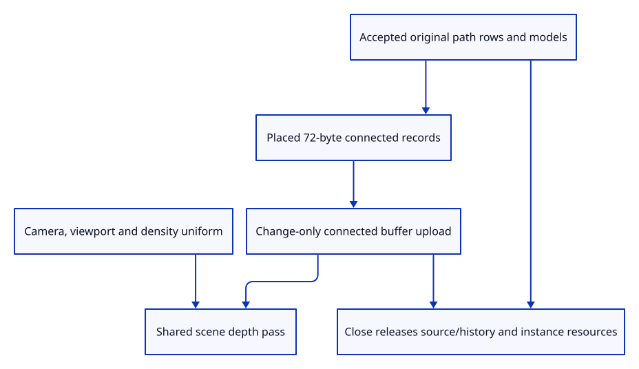

# 36da · Draw connected document rows

**Typing: 12–24 minutes.** [Estimate](typing-load.md).

Prepare world connected records when accepted document state changes. Draw them through the same depth pass as meshes and independent single strokes.

## Type

Continue from [Place original connected coordinates and count shared owners](36db-placement.md). [Save or recover your work](recovery.md).

### 1. `src/renderer.rs`

Retain one connected lane beside the independent stroke batch.

<details>
<summary>Locate the existing block</summary>

```rust
    strokes: crate::stroke_gpu::Lane,
```

</details>

Replace that block with:

```rust
--8<-- "journey/code/36da-render-01.rs"
```

### 2. `src/renderer.rs`

Create the connected pipeline with the actual drawing device and target format.

<details>
<summary>Locate the existing block</summary>

```rust
        let strokes = crate::stroke_gpu::Lane::new(&device, format);
```

</details>

Replace that block with:

```rust
--8<-- "journey/code/36da-render-02.rs"
```

### 3. `src/renderer.rs`

Retain the connected lane in renderer ownership.

<details>
<summary>Locate the existing block</summary>

```rust
depth, strokes, size: [640, 480]
```

</details>

Replace that block with:

```rust
--8<-- "journey/code/36da-render-03.rs"
```

### 4. `src/renderer.rs`

Reuse checked connected instances and expose their actual allocation counters.

<details>
<summary>Locate the existing block</summary>

```rust
    pub fn set_scene(&mut self, scene: &Scene, selected: Option<ObjectId>) {
```

</details>

Replace that block with:

```rust
--8<-- "journey/code/36da-render-04.rs"
```

### 5. `src/renderer.rs`

Include initialized connected payloads in upload phase measurements.

<details>
<summary>Locate the existing block</summary>

```rust
            + self.strokes.uploaded_bytes
```

</details>

Replace that block with:

```rust
--8<-- "journey/code/36da-render-05.rs"
```

### 6. `src/renderer.rs`

Update camera uniforms independently of connected segment bytes.

<details>
<summary>Locate the existing block</summary>

```rust
        self.strokes.view(&self.queue, transform, self.size, self.density);
```

</details>

Replace that block with:

```rust
--8<-- "journey/code/36da-render-06.rs"
```

### 7. `src/renderer.rs`

Draw connected bodies and heads in the existing shared depth pass.

<details>
<summary>Locate the existing block</summary>

```rust
            self.strokes.draw(&mut pass);
```

</details>

Replace that block with:

```rust
--8<-- "journey/code/36da-render-07.rs"
```

### 8. `src/browser.rs`

Inspect real path resources without changing the earlier mesh and line counter meanings.

<details>
<summary>Locate the existing block</summary>

```rust
    canvas.set_attribute("data-stroke-usage",
```

</details>

Replace that block with:

```rust
--8<-- "journey/code/36da-render-08.rs"
```

## Run and check

In your project:

```sh
cd workspace/journey
REGEN_PROTO=0 cargo build --lib --locked --target wasm32-unknown-unknown -j4
REGEN_PROTO=0 CARGO_BUILD_JOBS=4 trunk serve --port 8780
```

Open `http://127.0.0.1:8780/`. Keep an existing Trunk server running; saving rebuilds it.

Run mixed-document GPU checks. Connected paths draw beside meshes and lines; Close clears all live path and instance resources.

**Verified checkpoint in Chrome.**


[Verification scope](release.md).

Run the state checks on your computer from your project folder:

```sh
REGEN_PROTO=0 cargo test --lib --locked --target host-tuple -j4
```

<details>
<summary>Code explanation and diagram</summary>

Keep camera and density in the shared view uniform, count actual connected payloads separately, and discard empty buffers on Close. GPU values retain no kernel path owner.

accepted document paths → placed connected records → changed-data lane → shared depth pass → complete resource release.



Why does a camera change leave connected vertex uploads unchanged?

The accepted world endpoints and styles have not changed. Projection, viewport and display density live in the shared view uniform.

Study estimate, including typing and experiments: 0.75–1.25 hours.

</details>

<details>
<summary>Optional experiment</summary>

Synchronize unchanged paths and then zoom. The connected upload count must stay unchanged; closing drops its buffer.

</details>

<details>
<summary>Check and save your work</summary>

Restore experimental edits, then run from `session_viewer`:

```sh
npm --prefix ../session_tests run course -- check 36da-render
npm --prefix ../session_tests run course -- save 36da-render
```

Source comparison leaves your project untouched. [Save and recovery instructions](recovery.md).

</details>

<details>
<summary>Viewer coverage and verification</summary>

Actual document-connected GPU drawing is complete here. The following endpoint registers connected examples in the real command dock and checks browser pixels.

Native mixed geometry draws a real connected source path. Weak owner, row/cache ledgers, exact instance allocation, view-only reuse and complete Close are verified.

Native rendering includes a connected source path; real browser insertion follows next.

[Full validation scope](release.md).

To reproduce the scripted acceptance of the reference checkpoint, run from `session_viewer` with the [course bundle server](release.md#reproduce) running on port 8781:

```sh
npm --prefix ../session_tests run course -- capture 36da-render
```

This uses the verified reference bundle; it does not check or change your typed project.

</details>
