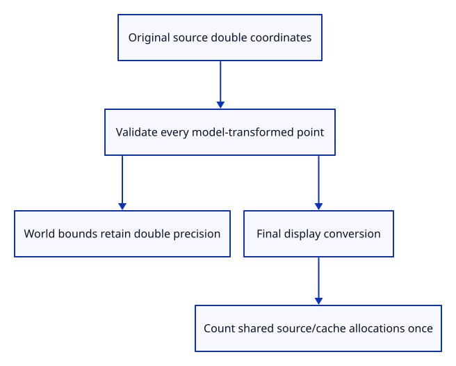

# 36db · Place original connected coordinates and count shared owners

**Typing: 18–36 minutes.** [Estimate](typing-load.md).

Transform original path coordinates before preparing final display spans. Validate every placed point before changing the row model.

## Type

Continue from [Retain connected paths in document history](36d-document.md). [Save or recover your work](recovery.md).

### 1. `src/chain.rs`

Identify source allocations separately for each kernel type.

<details>
<summary>Locate the existing block</summary>

```rust
    pub fn coordinates
```

</details>

Replace that block with:

```rust
--8<-- "journey/code/36db-placement-01.rs"
```

### 2. `src/scene.rs`

Convert placed original doubles to display records only at the drawing boundary.

<details>
<summary>Locate the existing block</summary>

```rust
impl PathObject {
```

</details>

Replace that block with:

```rust
--8<-- "journey/code/36db-placement-02.rs"
```

### 3. `src/scene.rs`

Validate every placed point before committing the row model.

<details>
<summary>Locate the existing block</summary>

```rust
    pub fn lines(&self)
```

</details>

Replace that block with:

```rust
--8<-- "journey/code/36db-placement-03.rs"
```

### 4. `src/memory.rs`

Count row capacity and shared display buffers once across active and history roots.

<details>
<summary>Locate the existing block</summary>

```rust
pub fn lines<'a>
```

</details>

Replace that block with:

```rust
--8<-- "journey/code/36db-placement-04.rs"
```

### 5. `src/path_placement_tests.rs`

Copy precise world placement, sharing, atomic refusal and release checks.

Copy this check file:

```rust
--8<-- "journey/code/36db-placement-05.rs"
```

### 6. `src/lib.rs`

Register precise placement and accounting checks.

<details>
<summary>Locate the existing block</summary>

```rust
pub mod chain;
```

</details>

Replace that block with:

```rust
--8<-- "journey/code/36db-placement-06.rs"
```

## Run and check

In your project:

```sh
cd workspace/journey
REGEN_PROTO=0 cargo build --lib --locked --target wasm32-unknown-unknown -j4
REGEN_PROTO=0 CARGO_BUILD_JOBS=4 trunk serve --port 8780
```

Open `http://127.0.0.1:8780/`. Keep an existing Trunk server running; saving rebuilds it.

Run precise placement and accounting checks. Invalid models leave the row unchanged and Close clears every ledger.

**Verified checkpoint in Chrome.**


[Verification scope](release.md).

Run the state checks on your computer from your project folder:

```sh
REGEN_PROTO=0 cargo test --lib --locked --target host-tuple -j4
```

<details>
<summary>Code explanation and diagram</summary>

Count row capacity and distinct shared display buffers across the active scene and both history branches. These ledgers cover path rows and display coordinates; full kernel payload and driver overhead remain outside their scope.

source doubles → checked model → placed double bounds → final f32 records → distinct allocation ledgers.



Why transform original coordinates before converting placed endpoints to f32?

The model can magnify rounding error. Bounds and editing use original doubles; the display conversion belongs after the world placement.

Study estimate, including typing and experiments: 0.75–1.25 hours.

</details>

<details>
<summary>Optional experiment</summary>

Apply a large translation to the precise source. Its world bounds use the original double coordinates, and Undo/Redo retain the same owner.

</details>

<details>
<summary>Check and save your work</summary>

Restore experimental edits, then run from `session_viewer`:

```sh
npm --prefix ../session_tests run course -- check 36db-placement
npm --prefix ../session_tests run course -- save 36db-placement
```

Source comparison leaves your project untouched. [Save and recovery instructions](recovery.md).

</details>

<details>
<summary>Viewer coverage and verification</summary>

Connected rows now retain precise placement and truthful row/cache ledgers. Renderer wiring follows next.

Native tests cover precise placed bounds, atomic invalid-placement refusal, shared source/cache accounting, Undo/Redo and complete Close.

Chrome retains the existing verified line while the connected shader is introduced.

[Full validation scope](release.md).

To reproduce the scripted acceptance of the reference checkpoint, run from `session_viewer` with the [course bundle server](release.md#reproduce) running on port 8781:

```sh
npm --prefix ../session_tests run course -- capture 36db-placement
```

This uses the verified reference bundle; it does not check or change your typed project.

</details>
