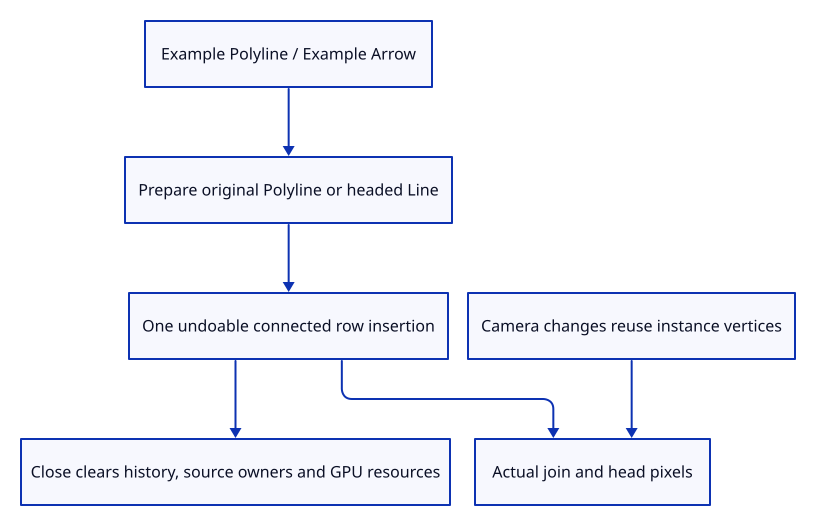

# 36e · Insert connected paths and arrow examples

**Typing: 14–28 minutes.** [Estimate](typing-load.md).

Register Example Polyline and Example Arrow in the existing command dock. Prepare the original geometry before accepting one undoable insertion.

## Type

Continue from [Draw connected document rows](36da-render.md). [Save or recover your work](recovery.md).

### 1. `src/editor.rs`

Expose connected examples as document actions.

<details>
<summary>Locate the existing block</summary>

```rust
    AddLine,
```

</details>

Replace that block with:

```rust
--8<-- "journey/code/36e-input-01.rs"
```

### 2. `src/editor.rs`

Prepare the original path or headed line before accepting one history transaction.

<details>
<summary>Locate the existing block</summary>

```rust
            Action::AddLine => {
```

</details>

Replace that block with:

```rust
--8<-- "journey/code/36e-input-02.rs"
```

### 3. `src/browser.rs`

Expose the two source-backed examples in actual dock completion and Help.

<details>
<summary>Locate the existing block</summary>

```rust
            "Example Line",
```

</details>

Replace that block with:

```rust
--8<-- "journey/code/36e-input-03.rs"
```

### 4. `src/browser.rs`

Dispatch accepted input through the editor.

<details>
<summary>Locate the existing block</summary>

```rust
                    "example line" => Action::AddLine,
```

</details>

Replace that block with:

```rust
--8<-- "journey/code/36e-input-04.rs"
```

### 5. `src/lib.rs`

Register the undoable source-kind checks.

<details>
<summary>Locate the existing block</summary>

```rust
pub mod chain;
```

</details>

Replace that block with:

```rust
--8<-- "journey/code/36e-input-05.rs"
```

### 6. `src/path_input_tests.rs`

Copy source-kind, one-step Undo/Redo, identity and Close checks.

Copy this check file:

```rust
--8<-- "journey/code/36e-input-06.rs"
```

## Run and check

In your project:

```sh
cd workspace/journey
REGEN_PROTO=0 cargo build --lib --locked --target wasm32-unknown-unknown -j4
REGEN_PROTO=0 CARGO_BUILD_JOBS=4 trunk serve --port 8780
```

Open `http://127.0.0.1:8780/`. Keep an existing Trunk server running; saving rebuilds it.

Close, type Example Polyline, then zoom. Type Example Arrow to add a source line with heads at both original endpoints.

**Verified checkpoint in Chrome.**


[Verification scope](release.md).

Run the state checks on your computer from your project folder:

```sh
REGEN_PROTO=0 cargo test --lib --locked --target host-tuple -j4
```

<details>
<summary>Code explanation and diagram</summary>

Chrome checks actual join alpha, headed area, camera-only buffer reuse, high-DPI rendering, Undo/Redo and complete Close. The examples remain source-backed paths, ready for later visibility, picking and editing.

accepted dock command → original source → one history transaction → connected lane → pixel and release checks.



Why are connected examples inserted as original geometry rather than disconnected display spans?

Their source retains identity, original coordinates and arrowhead policy. Display spans can be rebuilt while Undo and future editing still operate on one document object.

Study estimate, including typing and experiments: 0.75–1.25 hours.

</details>

<details>
<summary>Optional experiment</summary>

Undo and Redo each example. Camera changes reuse vertex uploads, and Close clears both the connected GPU buffer and document owners.

</details>

<details>
<summary>Check and save your work</summary>

Restore experimental edits, then run from `session_viewer`:

```sh
npm --prefix ../session_tests run course -- check 36e-input
npm --prefix ../session_tests run course -- save 36e-input
```

Source comparison leaves your project untouched. [Save and recovery instructions](recovery.md).

</details>

<details>
<summary>Viewer coverage and verification</summary>

Connected rendering, source ownership and example commands are complete. General interactive curve construction, picking, visibility and mixed-document saving remain in their planned chapters.

Native command checks prove one-step history, original Line/Polyline kinds, stable identity and complete Close. Headed Chrome checks join alpha, real arrow pixels, zoom/projection reuse and DPR1/2.

Actual Chrome draws a joined polyline and both original arrow tips from real command insertion.

[Full validation scope](release.md).

To reproduce the scripted acceptance of the reference checkpoint, run from `session_viewer` with the [course bundle server](release.md#reproduce) running on port 8781:

```sh
npm --prefix ../session_tests run course -- capture 36e-input
```

This uses the verified reference bundle; it does not check or change your typed project.

</details>
