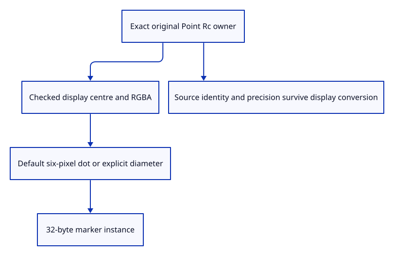

# 37 · Prepare an original point for a screen marker

**Typing: 13–25 minutes.** [Estimate](typing-load.md).

Retain the original Point owner and convert only its display position. Pack centre, diameter and colour into one explicit 32-byte record.

## Type

Continue from [Insert connected paths and arrow examples](36e-input.md). [Save or recover your work](recovery.md).

### 1. `src/marker.rs`

Retain exact point ownership and pack finite display data with the viewer’s diameter policy.

Create the file and type:

```rust
--8<-- "journey/code/37-point-01.rs"
```

### 2. `src/lib.rs`

Register point preparation and its source checks.

<details>
<summary>Locate the existing block</summary>

```rust
pub mod chain;
```

</details>

Replace that block with:

```rust
--8<-- "journey/code/37-point-02.rs"
```

### 3. `src/marker_tests.rs`

Copy point precision, packing, style and lifetime checks.

Copy this check file:

```rust
--8<-- "journey/code/37-point-03.rs"
```

## Run and check

In your project:

```sh
cd workspace/journey
REGEN_PROTO=0 cargo build --lib --locked --target wasm32-unknown-unknown -j4
REGEN_PROTO=0 CARGO_BUILD_JOBS=4 trunk serve --port 8780
```

Open `http://127.0.0.1:8780/`. Keep an existing Trunk server running; saving rebuilds it.

Run point preparation checks. The source keeps its exact coordinates while the marker uses explicit display precision and diameter.

**Verified checkpoint in Chrome.**


[Verification scope](release.md).

Run the state checks on your computer from your project folder:

```sh
REGEN_PROTO=0 cargo test --lib --locked --target host-tuple -j4
```

<details>
<summary>Code explanation and diagram</summary>

Match the current viewer’s point defaults: an unspecified/default pen draws a six-pixel diameter dot, while an explicit width changes its diameter. Invalid display coordinates or overflowing widths fail before GPU allocation.

original Point owner → checked position and style → explicit default diameter → packed marker record.



Why retain a source Point beside the display marker?

The marker is a screen representation. Original doubles, identity and metadata remain available for saving, placing and later picking or editing.

Study estimate, including typing and experiments: 0.75–1.25 hours.

</details>

<details>
<summary>Optional experiment</summary>

Use a coordinate that changes during f32 conversion. The source must remain unchanged; cloning prepared data must share its source owner.

</details>

<details>
<summary>Check and save your work</summary>

Restore experimental edits, then run from `session_viewer`:

```sh
npm --prefix ../session_tests run course -- check 37-point
npm --prefix ../session_tests run course -- save 37-point
```

Source comparison leaves your project untouched. [Save and recovery instructions](recovery.md).

</details>

<details>
<summary>Viewer coverage and verification</summary>

Original point payload preparation is complete here. Marker extrusion, document IDs, actual drawing and controls follow in later checkpoints.

Native tests verify exact source precision, identity, shared lifetime, marker packing, default/style policy and finite display refusal. Connected browser checks remain the baseline until markers draw.

Chrome retains the existing connected examples while native checks establish point source and payload policy.

[Full validation scope](release.md).

To reproduce the scripted acceptance of the reference checkpoint, run from `session_viewer` with the [course bundle server](release.md#reproduce) running on port 8781:

```sh
npm --prefix ../session_tests run course -- capture 37-point
```

This uses the verified reference bundle; it does not check or change your typed project.

</details>
