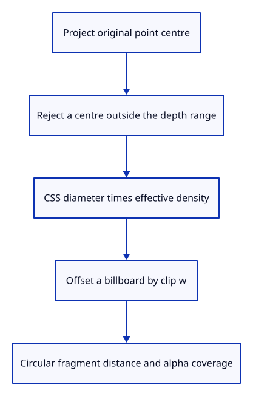

# 37a · Extrude a circular marker in screen pixels

**Typing: 15–29 minutes.** [Estimate](typing-load.md).

Project the original point centre and reject centres outside the depth range. Offset a six-vertex billboard in physical pixels, using the current effective density.

## Type

Continue from [Prepare an original point for a screen marker](37-point.md). [Save or recover your work](recovery.md).

### 1. `src/marker.wgsl`

Keep disc diameter in screen pixels and cover its edge analytically.

Create the file and type:

```wgsl
--8<-- "journey/code/37a-disc-01.wgsl"
```

### 2. `src/marker.rs`

Expose the actual marker shader source.

<details>
<summary>Locate the existing block</summary>

```rust
use std::rc::Rc;
```

</details>

Replace that block with:

```rust
--8<-- "journey/code/37a-disc-02.rs"
```

## Run and check

In your project:

```sh
cd workspace/journey
REGEN_PROTO=0 cargo build --lib --locked --target wasm32-unknown-unknown -j4
REGEN_PROTO=0 CARGO_BUILD_JOBS=4 trunk serve --port 8780
```

Open `http://127.0.0.1:8780/`. Keep an existing Trunk server running; saving rebuilds it.

The actual drawing device validates the complete marker shader. Its real instance layout and pixel checks are the next endpoint.

**Verified checkpoint in Chrome.**


[Verification scope](release.md).

Run the state checks on your computer from your project folder:

```sh
REGEN_PROTO=0 cargo test --lib --locked --target host-tuple -j4
```

<details>
<summary>Code explanation and diagram</summary>

Scale the clip offset by w so zoom cannot change the screen diameter. A circular distance function gives its edge coverage; the shared depth pass will hide a marker behind nearer geometry.

checked centre → clip rejection → physical radius → clip-w billboard → circular coverage.



Why scale a marker offset by clip w?

Perspective divides its position by w. Multiplying the screen offset by w before that division keeps the marker’s diameter independent of distance.

Study estimate, including typing and experiments: 0.75–1.25 hours.

</details>

<details>
<summary>Optional experiment</summary>

Follow a diameter of six CSS pixels through effective density one and two. The marker radius becomes three or six physical pixels.

</details>

<details>
<summary>Check and save your work</summary>

Restore experimental edits, then run from `session_viewer`:

```sh
npm --prefix ../session_tests run course -- check 37a-disc
npm --prefix ../session_tests run course -- save 37a-disc
```

Source comparison leaves your project untouched. [Save and recovery instructions](recovery.md).

</details>

<details>
<summary>Viewer coverage and verification</summary>

Screen-marker extrusion is complete. The next checkpoint connects the actual 32-byte instance layout and tests its rendered area.

The actual drawing device validates marker vertex and fragment entry points. Real area, alpha, projection and density checks follow with the instance lane.

Chrome retains the existing connected examples while native checks establish point source and payload policy.

[Full validation scope](release.md).

To reproduce the scripted acceptance of the reference checkpoint, run from `session_viewer` with the [course bundle server](release.md#reproduce) running on port 8781:

```sh
npm --prefix ../session_tests run course -- capture 37a-disc
```

This uses the verified reference bundle; it does not check or change your typed project.

</details>
