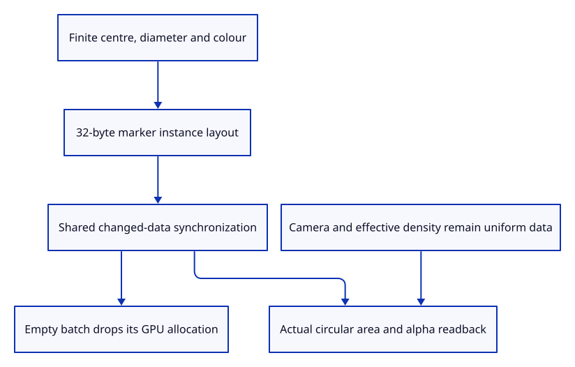

# 37b · Draw markers with the shared instance lane

**Typing: 8–16 minutes.** [Estimate](typing-load.md).

Add the marker’s 32-byte instance layout to the existing shared lane. Validate its centre, diameter and colour before accepting any new payload.

## Type

Continue from [Extrude a circular marker in screen pixels](37a-disc.md). [Save or recover your work](recovery.md).

### 1. `src/stroke_gpu.rs`

Validate marker payloads before using shared change-only synchronization.

<details>
<summary>Locate the existing block</summary>

```rust
    fn set_bytes(&mut self, device: &wgpu::Device, data: Vec<u8>) -> Result<(), &'static str> {
```

</details>

Replace that block with:

```rust
--8<-- "journey/code/37b-lane-01.rs"
```

### 2. `src/stroke_gpu.rs`

Use the exact centre, diameter and colour attributes for marker instances.

<details>
<summary>Locate the existing block</summary>

```rust
    fn layout(device: &wgpu::Device, format: wgpu::TextureFormat, source: &'static str,
```

</details>

Replace that block with:

```rust
--8<-- "journey/code/37b-lane-02.rs"
```

## Run and check

In your project:

```sh
cd workspace/journey
REGEN_PROTO=0 cargo build --lib --locked --target wasm32-unknown-unknown -j4
REGEN_PROTO=0 CARGO_BUILD_JOBS=4 trunk serve --port 8780
```

Open `http://127.0.0.1:8780/`. Keep an existing Trunk server running; saving rebuilds it.

Run native GPU checks. Screen-marker area and alpha remain stable under zoom and both projections at densities one and two.

**Verified checkpoint in Chrome.**


[Verification scope](release.md).

Run the state checks on your computer from your project folder:

```sh
REGEN_PROTO=0 cargo test --lib --locked --target host-tuple -j4
```

<details>
<summary>Code explanation and diagram</summary>

Native texture readback measures real circular area and interior alpha at both projections, zoom levels and densities. Repeated data reuses its buffer; empty data releases it.

finite marker records → format-specific attributes → shared upload/view policy → actual disc pixels → empty release.



Why give markers another layout rather than another resource-management implementation?

Their attributes and shader differ. Changed-data reuse, uniform updates, payload accounting and buffer lifetime remain the same responsibilities.

Study estimate, including typing and experiments: 0.75–1.25 hours.

</details>

<details>
<summary>Optional experiment</summary>

Submit the same marker twice, change only its camera, and inspect uploads. Invalid marker input must preserve the accepted buffer.

</details>

<details>
<summary>Check and save your work</summary>

Restore experimental edits, then run from `session_viewer`:

```sh
npm --prefix ../session_tests run course -- check 37b-lane
npm --prefix ../session_tests run course -- save 37b-lane
```

Source comparison leaves your project untouched. [Save and recovery instructions](recovery.md).

</details>

<details>
<summary>Viewer coverage and verification</summary>

Actual point-marker GPU drawing is complete. Original document IDs, placement, browser input and control ownership follow.

Sixteen actual marker renders check circular area and alpha across sizes6/12, zoom, projection and DPR1/2. Buffer reuse, invalid-record refusal and empty release pass beside the earlier stroke checks.

Chrome retains the existing connected examples while native checks establish point source and payload policy.

[Full validation scope](release.md).

To reproduce the scripted acceptance of the reference checkpoint, run from `session_viewer` with the [course bundle server](release.md#reproduce) running on port 8781:

```sh
npm --prefix ../session_tests run course -- capture 37b-lane
```

This uses the verified reference bundle; it does not check or change your typed project.

</details>
