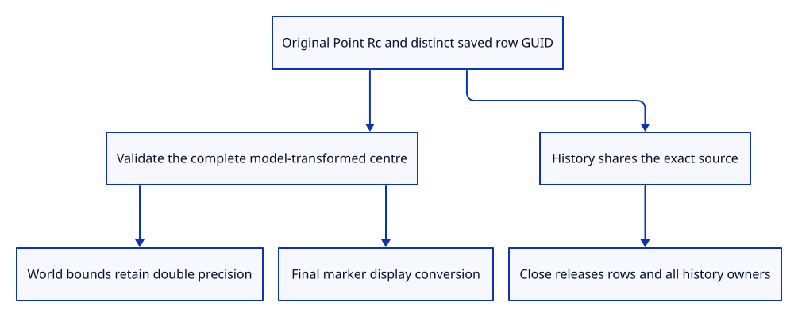

# 37c · Retain original point rows and placement

**Typing: 24–48 minutes.** [Estimate](typing-load.md).

Retain one original Point source for each independently placed document row. Allocate a checked object identity and distinct saved GUID before insertion.

## Type

Continue from [Draw markers with the shared instance lane](37b-lane.md). [Save or recover your work](recovery.md).

### 1. `src/scene.rs`

Retain exact point sources and derive placed display centres independently.

<details>
<summary>Locate the existing block</summary>

```rust
#[derive(Clone)]
pub struct Scene {
```

</details>

Replace that block with:

```rust
--8<-- "journey/code/37c-document-01.rs"
```

### 2. `src/scene.rs`

Initialize the independent point-row table.

<details>
<summary>Locate the existing block</summary>

```rust
objects: Vec::new(), paths: Vec::new(),
```

</details>

Replace that block with:

```rust
--8<-- "journey/code/37c-document-02.rs"
```

### 3. `src/scene.rs`

Include exact placed point centres in world bounds.

<details>
<summary>Locate the existing block</summary>

```rust
        bounds
    }
```

</details>

Replace that block with:

```rust
--8<-- "journey/code/37c-document-03.rs"
```

### 4. `src/scene.rs`

Allocate distinct row identities and reject invalid placed centres before mutation.

<details>
<summary>Locate the existing block</summary>

```rust
    pub fn paths(&self)
```

</details>

Replace that block with:

```rust
--8<-- "journey/code/37c-document-04.rs"
```

### 5. `src/scene.rs`

Drop point rows and capacity with complete document Close.

<details>
<summary>Locate the existing block</summary>

```rust
    pub fn clear(&mut self) {
```

</details>

Replace that block with:

```rust
--8<-- "journey/code/37c-document-05.rs"
```

### 6. `src/document.rs`

Refuse unsupported point saving rather than silently omit original geometry.

<details>
<summary>Locate the existing block</summary>

```rust
    if !scene.lines().is_empty() || !scene.paths().is_empty() {
```

</details>

Replace that block with:

```rust
--8<-- "journey/code/37c-document-06.rs"
```

### 7. `src/lib.rs`

Register precise point-placement and history checks.

<details>
<summary>Locate the existing block</summary>

```rust
pub mod marker;
```

</details>

Replace that block with:

```rust
--8<-- "journey/code/37c-document-07.rs"
```

### 8. `src/point_document_tests.rs`

Copy exact placement, source sharing, identity and complete release checks.

Copy this check file:

```rust
--8<-- "journey/code/37c-document-08.rs"
```

## Run and check

In your project:

```sh
cd workspace/journey
REGEN_PROTO=0 cargo build --lib --locked --target wasm32-unknown-unknown -j4
REGEN_PROTO=0 CARGO_BUILD_JOBS=4 trunk serve --port 8780
```

Open `http://127.0.0.1:8780/`. Keep an existing Trunk server running; saving rebuilds it.

Run point-document checks. Exact placed bounds, shared history owners and complete Close remain independent of the marker’s screen diameter.

**Verified checkpoint in Chrome.**


[Verification scope](release.md).

Run the state checks on your computer from your project folder:

```sh
REGEN_PROTO=0 cargo test --lib --locked --target host-tuple -j4
```

<details>
<summary>Code explanation and diagram</summary>

Validate the complete placed point before changing its model. World bounds include the exact centre, while screen diameter remains presentation data. History retains immutable source owners and Close releases them.

original Point → distinct row identity/GUID → checked model → double world bounds → final marker centre → Close.



Why does a placed marker derive its centre from the original source point?

Display coordinates already lost precision. Applying the model to the original doubles keeps world bounds and edits accurate before the final GPU conversion.

Study estimate, including typing and experiments: 0.75–1.25 hours.

</details>

<details>
<summary>Optional experiment</summary>

Translate a point with a precise fractional coordinate and Undo/Redo. Its source stays unchanged, while its placed world coordinates remain double precision.

</details>

<details>
<summary>Check and save your work</summary>

Restore experimental edits, then run from `session_viewer`:

```sh
npm --prefix ../session_tests run course -- check 37c-document
npm --prefix ../session_tests run course -- save 37c-document
```

Source comparison leaves your project untouched. [Save and recovery instructions](recovery.md).

</details>

<details>
<summary>Viewer coverage and verification</summary>

Original point rows and placement are complete here. GPU synchronization, actual dock input and control ownership follow.

Native checks prove distinct identities, original doubles, precise bounds, atomic invalid-placement refusal, shared history and complete Close. Mixed-geometry saving remains explicit future work.

Chrome retains the existing connected examples while native checks establish point source and payload policy.

[Full validation scope](release.md).

To reproduce the scripted acceptance of the reference checkpoint, run from `session_viewer` with the [course bundle server](release.md#reproduce) running on port 8781:

```sh
npm --prefix ../session_tests run course -- capture 37c-document
```

This uses the verified reference bundle; it does not check or change your typed project.

</details>
