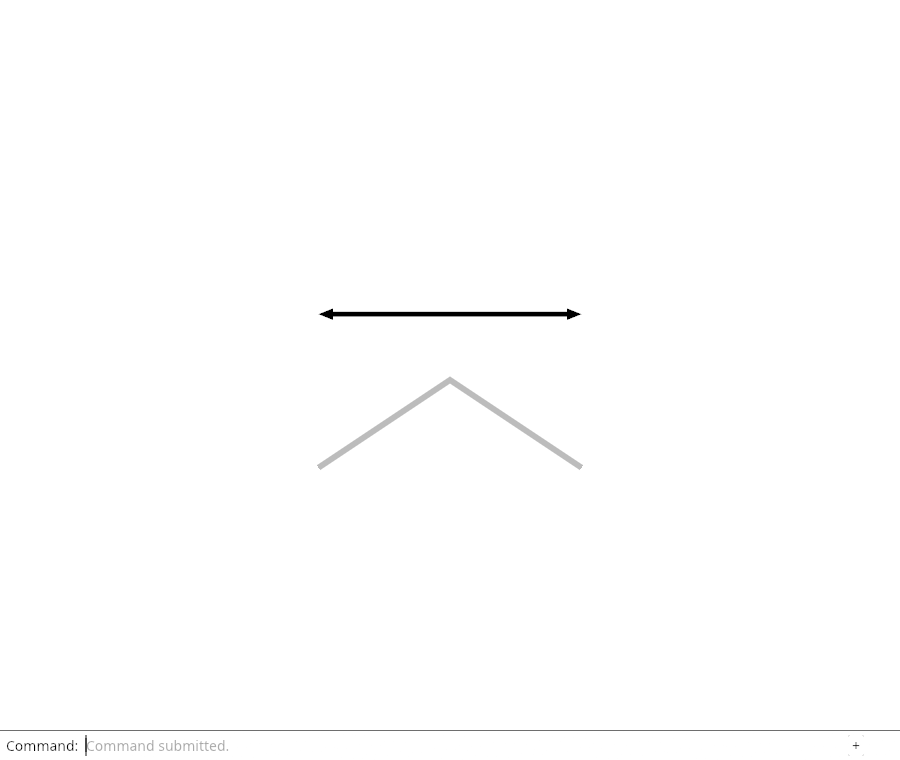
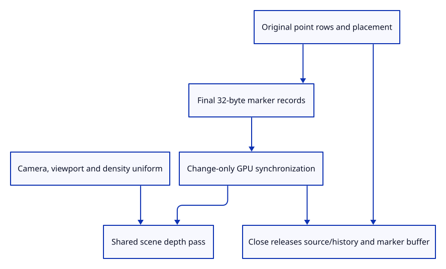

# 37d · Draw original point rows and count their resources

**Typing: 17–33 minutes.** [Estimate](typing-load.md).

Synchronize original point rows through the shared marker lane after accepted document changes. Keep camera and density in the view uniform.

## Type

Continue from [Retain original point rows and placement](37c-document.md). [Save or recover your work](recovery.md).

### 1. `src/renderer.rs`

Keep one marker lane beside the other scene batches.

<details>
<summary>Locate the existing block</summary>

```rust
    paths: crate::stroke_gpu::Lane,
```

</details>

Replace that block with:

```rust
--8<-- "journey/code/37d-render-01.rs"
```

### 2. `src/renderer.rs`

Create the actual marker pipeline with the scene drawing device.

<details>
<summary>Locate the existing block</summary>

```rust
        let paths = crate::stroke_gpu::Lane::joined(&device, format);
```

</details>

Replace that block with:

```rust
--8<-- "journey/code/37d-render-02.rs"
```

### 3. `src/renderer.rs`

Retain the marker batch under renderer ownership.

<details>
<summary>Locate the existing block</summary>

```rust
depth, strokes, paths, size: [640, 480]
```

</details>

Replace that block with:

```rust
--8<-- "journey/code/37d-render-03.rs"
```

### 4. `src/renderer.rs`

Reuse accepted point display data and report actual marker allocation.

<details>
<summary>Locate the existing block</summary>

```rust
    pub fn set_scene(&mut self, scene: &Scene, selected: Option<ObjectId>) {
```

</details>

Replace that block with:

```rust
--8<-- "journey/code/37d-render-04.rs"
```

### 5. `src/renderer.rs`

Include initialized marker payloads in measured scene upload bytes.

<details>
<summary>Locate the existing block</summary>

```rust
            + self.strokes.uploaded_bytes + self.paths.uploaded_bytes
```

</details>

Replace that block with:

```rust
--8<-- "journey/code/37d-render-05.rs"
```

### 6. `src/renderer.rs`

Keep view-only marker changes in the shared uniform.

<details>
<summary>Locate the existing block</summary>

```rust
        self.paths.view(&self.queue, transform, self.size, self.density);
```

</details>

Replace that block with:

```rust
--8<-- "journey/code/37d-render-06.rs"
```

### 7. `src/renderer.rs`

Depth-test point markers in the same scene pass.

<details>
<summary>Locate the existing block</summary>

```rust
            self.paths.draw(&mut pass);
```

</details>

Replace that block with:

```rust
--8<-- "journey/code/37d-render-07.rs"
```

### 8. `src/memory.rs`

Count actual point rows, unique source owners and retained row capacity.

<details>
<summary>Locate the existing block</summary>

```rust
pub fn paths<'a>
```

</details>

Replace that block with:

```rust
--8<-- "journey/code/37d-render-08.rs"
```

### 9. `src/browser.rs`

Inspect point resource categories independently of earlier counters.

<details>
<summary>Locate the existing block</summary>

```rust
    canvas.set_attribute("data-path-gpu",
```

</details>

Replace that block with:

```rust
--8<-- "journey/code/37d-render-09.rs"
```

## Run and check

In your project:

```sh
cd workspace/journey
REGEN_PROTO=0 cargo build --lib --locked --target wasm32-unknown-unknown -j4
REGEN_PROTO=0 CARGO_BUILD_JOBS=4 trunk serve --port 8780
```

Open `http://127.0.0.1:8780/`. Keep an existing Trunk server running; saving rebuilds it.

Run mixed-document GPU checks. Source points draw alongside connected paths; Close clears every live point and marker resource.

**Verified checkpoint in Chrome.**



[Verification scope](release.md).

Run the state checks on your computer from your project folder:

```sh
REGEN_PROTO=0 cargo test --lib --locked --target host-tuple -j4
```

<details>
<summary>Code explanation and diagram</summary>

Draw with the same depth texture as meshes and strokes. CPU counters report point rows, distinct sources and row capacity; GPU counters report actual marker instances, buffer bytes and initialized payloads.

accepted point rows → final placed marker records → change-only lane → shared depth → source and buffer release.



Why does the renderer retain marker bytes without the original Point owner?

Editing and history own the source. The GPU needs display data only, so document Close can release original sources immediately before buffer synchronization.

Study estimate, including typing and experiments: 0.75–1.25 hours.

</details>

<details>
<summary>Optional experiment</summary>

Zoom with the marker-bearing scene. Vertex uploads remain unchanged, and complete Close expires the original source and drops the marker buffer.

</details>

<details>
<summary>Check and save your work</summary>

Restore experimental edits, then run from `session_viewer`:

```sh
npm --prefix ../session_tests run course -- check 37d-render
npm --prefix ../session_tests run course -- save 37d-render
```

Source comparison leaves your project untouched. [Save and recovery instructions](recovery.md).

</details>

<details>
<summary>Viewer coverage and verification</summary>

Point-row drawing is complete. The next endpoint exposes a real command and checks actual browser marker pixels.

Native texture readback retains all marker/stroke checks and draws an actual source point in the mixed fixture. Weak owners, precise counters, camera reuse and complete Close pass.

Chrome retains the existing connected examples while native checks establish point source and payload policy.

[Full validation scope](release.md).

To reproduce the scripted acceptance of the reference checkpoint, run from `session_viewer` with the [course bundle server](release.md#reproduce) running on port 8781:

```sh
npm --prefix ../session_tests run course -- capture 37d-render
```

This uses the verified reference bundle; it does not check or change your typed project.

</details>
