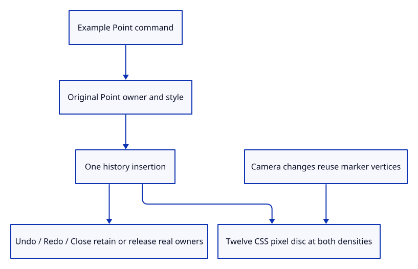

# 37da · Insert original points through the real dock

**Typing: 7–14 minutes.** [Estimate](typing-load.md).

Register Example Point in the existing dock and prepare its original Point before committing one history insertion.

## Type

Continue from [Draw original point rows and count their resources](37d-render.md). [Save or recover your work](recovery.md).

### 1. `src/editor.rs`

Expose an original point insertion as an editor action.

<details>
<summary>Locate the existing block</summary>

```rust
    AddLine,
```

</details>

Replace that block with:

```rust
--8<-- "journey/code/37da-input-01.rs"
```

### 2. `src/editor.rs`

Prepare the original point before one accepted undoable insertion.

<details>
<summary>Locate the existing block</summary>

```rust
            Action::AddLine => {
```

</details>

Replace that block with:

```rust
--8<-- "journey/code/37da-input-02.rs"
```

### 3. `src/browser.rs`

Include the point example in completion and Help.

<details>
<summary>Locate the existing block</summary>

```rust
            "Example Line",
```

</details>

Replace that block with:

```rust
--8<-- "journey/code/37da-input-03.rs"
```

### 4. `src/browser.rs`

Dispatch actual input through the editor action.

<details>
<summary>Locate the existing block</summary>

```rust
                    "example line" => Action::AddLine,
```

</details>

Replace that block with:

```rust
--8<-- "journey/code/37da-input-04.rs"
```

### 5. `src/lib.rs`

Register the point input ownership checks.

<details>
<summary>Locate the existing block</summary>

```rust
pub mod marker;
```

</details>

Replace that block with:

```rust
--8<-- "journey/code/37da-input-05.rs"
```

### 6. `src/point_input_tests.rs`

Copy original identity, style, one-step history and release checks.

Copy this check file:

```rust
--8<-- "journey/code/37da-input-06.rs"
```

## Run and check

In your project:

```sh
cd workspace/journey
REGEN_PROTO=0 cargo build --lib --locked --target wasm32-unknown-unknown -j4
REGEN_PROTO=0 CARGO_BUILD_JOBS=4 trunk serve --port 8780
```

Open `http://127.0.0.1:8780/`. Keep an existing Trunk server running; saving rebuilds it.

Close, type Example Point, then zoom and switch projection. The marker keeps a twelve-pixel diameter.

**Verified checkpoint in Chrome.**


[Verification scope](release.md).

Run the state checks on your computer from your project folder:

```sh
REGEN_PROTO=0 cargo test --lib --locked --target host-tuple -j4
```

<details>
<summary>Code explanation and diagram</summary>

Use actual Chrome pixels to measure its diameter at both device densities, projections and zoom levels. Keep source ownership and buffer accounting visible through Undo, Redo and Close.

Example Point input → original source → one undoable point row → circular pixels → view-only reuse → Close.



What changes when a point marker is enlarged by zoom?

Its world position moves with the camera, but its diameter stays in CSS pixels. Device density changes physical coverage without changing its source or vertex payload.

Study estimate, including typing and experiments: 0.75–1.25 hours.

</details>

<details>
<summary>Optional experiment</summary>

Undo and Redo the point. Close clears original owners, history and the actual marker buffer.

</details>

<details>
<summary>Check and save your work</summary>

Restore experimental edits, then run from `session_viewer`:

```sh
npm --prefix ../session_tests run course -- check 37da-input
npm --prefix ../session_tests run course -- save 37da-input
```

Source comparison leaves your project untouched. [Save and recovery instructions](recovery.md).

</details>

<details>
<summary>Viewer coverage and verification</summary>

Point source preparation, document placement, marker rendering and real command insertion are complete. General point construction, picking and mixed-document saving follow in their planned chapters.

Native tests prove original identity, exact style, one-step Undo/Redo and release. Chrome measures real marker coverage at DPR1/2, both projections and zoom, and checks exact buffer reuse.

Actual Chrome draws the original point as a twelve-pixel circular marker.

[Full validation scope](release.md).

To reproduce the scripted acceptance of the reference checkpoint, run from `session_viewer` with the [course bundle server](release.md#reproduce) running on port 8781:

```sh
npm --prefix ../session_tests run course -- capture 37da-input
```

This uses the verified reference bundle; it does not check or change your typed project.

</details>
