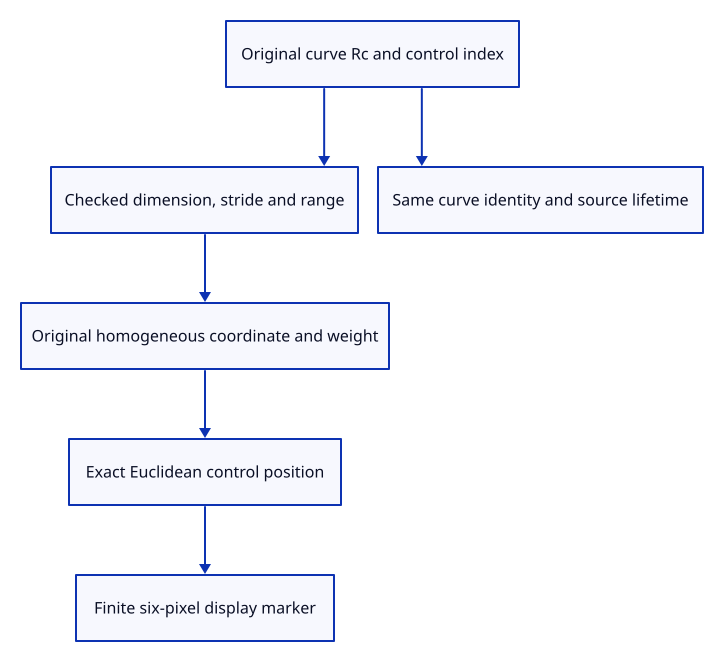

# 37e · Identify controls on the original curve owner

**Typing: 19–37 minutes.** [Estimate](typing-load.md).

A control reference owns the original curve and carries its control index. Resolve its position from the original homogeneous coordinates before producing a screen marker.

## Type

Continue from [Insert original points through the real dock](37da-input.md). [Save or recover your work](recovery.md).

### 1. `src/controls.rs`

Keep an indexed control on its original curve and guard every public layout access.

Create the file and type:

```rust
--8<-- "journey/code/37e-controls-01.rs"
```

### 2. `src/lib.rs`

Register original control references and their refusal checks.

<details>
<summary>Locate the existing block</summary>

```rust
pub mod marker;
```

</details>

Replace that block with:

```rust
--8<-- "journey/code/37e-controls-02.rs"
```

### 3. `src/control_tests.rs`

Copy original rational precision, owner release, dimension and malicious-layout checks.

Copy this check file:

```rust
--8<-- "journey/code/37e-controls-03.rs"
```

## Run and check

In your project:

```sh
cd workspace/journey
REGEN_PROTO=0 cargo build --lib --locked --target wasm32-unknown-unknown -j4
REGEN_PROTO=0 CARGO_BUILD_JOBS=4 trunk serve --port 8780
```

Open `http://127.0.0.1:8780/`. Keep an existing Trunk server running; saving rebuilds it.

Run original-owner and rational control tests. Control references share their curve and resolve an exact indexed coordinate.

**Verified checkpoint in Chrome.**


[Verification scope](release.md).

Run the state checks on your computer from your project folder:

```sh
REGEN_PROTO=0 cargo test --lib --locked --target host-tuple -j4
```

<details>
<summary>Code explanation and diagram</summary>

Validate dimensions, index, stride and checked slice bounds before touching a public kernel layout. Refuse zero or nonfinite rational weights and display overflow without allocating independent Point identities.

original curve Rc and index → checked control layout → exact Euclidean control → finite screen marker.



Why does a curve control marker avoid a new Point GUID?

It identifies a control inside the original curve. A fabricated independent Point would lose its parent, control index and rational weight when editing begins.

Study estimate, including typing and experiments: 0.75–1.25 hours.

</details>

<details>
<summary>Optional experiment</summary>

Use rational controls whose weight is two. Display positions divide by the weight while the source homogeneous coordinates remain untouched.

</details>

<details>
<summary>Check and save your work</summary>

Restore experimental edits, then run from `session_viewer`:

```sh
npm --prefix ../session_tests run course -- check 37e-controls
npm --prefix ../session_tests run course -- save 37e-controls
```

Source comparison leaves your project untouched. [Save and recovery instructions](recovery.md).

</details>

<details>
<summary>Viewer coverage and verification</summary>

Control references and marker preparation are complete. The next curve chapter connects them to retained curve rows; subobject picking and editing follow in chapter 44.

Native tests verify rational precision, stable index, shared owner lifetime, unchanged homogeneous coordinates and malformed-layout refusal. Browser point rendering remains the actual displayed baseline.

Chrome retains the original point example while native checks establish indexed curve-control ownership.

[Full validation scope](release.md).

To reproduce the scripted acceptance of the reference checkpoint, run from `session_viewer` with the [course bundle server](release.md#reproduce) running on port 8781:

```sh
npm --prefix ../session_tests run course -- capture 37e-controls
```

This uses the verified reference bundle; it does not check or change your typed project.

</details>
