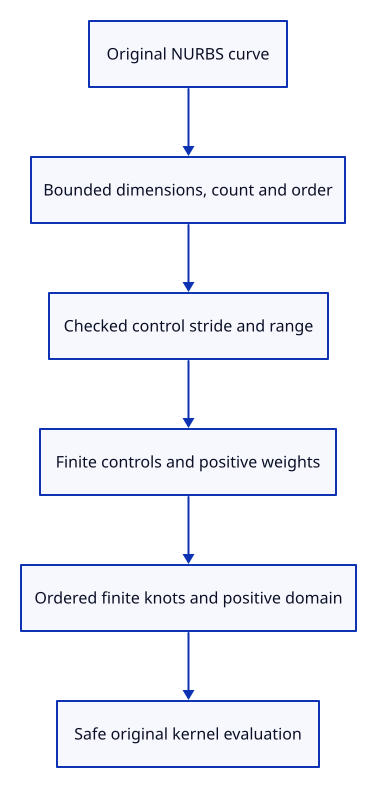

# 38 · Validate an original NURBS curve before sampling

**Typing: 17–34 minutes.** [Estimate](typing-load.md).

Validate the original curve before evaluating it. Check dimensions, count, order, stride, checked ranges, finite controls, positive rational weights and monotone knots.

## Type

Continue from [Identify controls on the original curve owner](37e-controls.md). [Save or recover your work](recovery.md).

### 1. `src/curve.rs`

Guard layout arithmetic and public arrays before original kernel evaluation.

Create the file and type:

```rust
--8<-- "journey/code/38-layout-01.rs"
```

### 2. `src/lib.rs`

Register source validation and malformed-input checks.

<details>
<summary>Locate the existing block</summary>

```rust
pub mod controls;
```

</details>

Replace that block with:

```rust
--8<-- "journey/code/38-layout-02.rs"
```

### 3. `src/curve_layout_tests.rs`

Copy valid original domains, unchanged sources and malformed-layout refusal checks.

Copy this check file:

```rust
--8<-- "journey/code/38-layout-03.rs"
```

## Run and check

In your project:

```sh
cd workspace/journey
REGEN_PROTO=0 cargo build --lib --locked --target wasm32-unknown-unknown -j4
REGEN_PROTO=0 CARGO_BUILD_JOBS=4 trunk serve --port 8780
```

Open `http://127.0.0.1:8780/`. Keep an existing Trunk server running; saving rebuilds it.

Run curve layout checks against valid, periodic, rational and maliciously incomplete inputs.

**Verified checkpoint in Chrome.**


[Verification scope](release.md).

Run the state checks on your computer from your project folder:

```sh
REGEN_PROTO=0 cargo test --lib --locked --target host-tuple -j4
```

<details>
<summary>Code explanation and diagram</summary>

Use the kernel domain only after those checks. Display approximation never replaces the original curve, knot vector or homogeneous control values.

original NURBS curve → bounded checked layout → finite positive weights → ordered knots → nonempty domain.



Why check public curve arrays before calling the kernel evaluator?

Public fields may contain incomplete or overflowing layouts. The viewer must refuse malformed input before a kernel slice access or display allocation.

Study estimate, including typing and experiments: 0.75–1.25 hours.

</details>

<details>
<summary>Optional experiment</summary>

Set the stride to usize::MAX. Validation must return an error without slicing or overflowing.

</details>

<details>
<summary>Check and save your work</summary>

Restore experimental edits, then run from `session_viewer`:

```sh
npm --prefix ../session_tests run course -- check 38-layout
npm --prefix ../session_tests run course -- save 38-layout
```

Source comparison leaves your project untouched. [Save and recovery instructions](recovery.md).

</details>

<details>
<summary>Viewer coverage and verification</summary>

Validated curve sources are ready for sampling. Sampled display data and retained document ownership follow in the next endpoints.

Native checks accept valid clamped, periodic and rational sources and refuse malformed counts, ranges, knots, weights and empty domains without panicking.

Chrome retains point and connected rendering while native checks guard original curve evaluation.

[Full validation scope](release.md).

To reproduce the scripted acceptance of the reference checkpoint, run from `session_viewer` with the [course bundle server](release.md#reproduce) running on port 8781:

```sh
npm --prefix ../session_tests run course -- capture 38-layout
```

This uses the verified reference bundle; it does not check or change your typed project.

</details>
