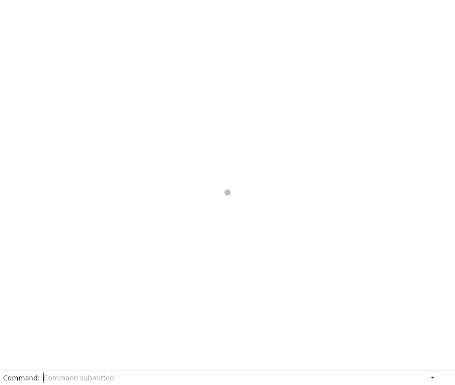
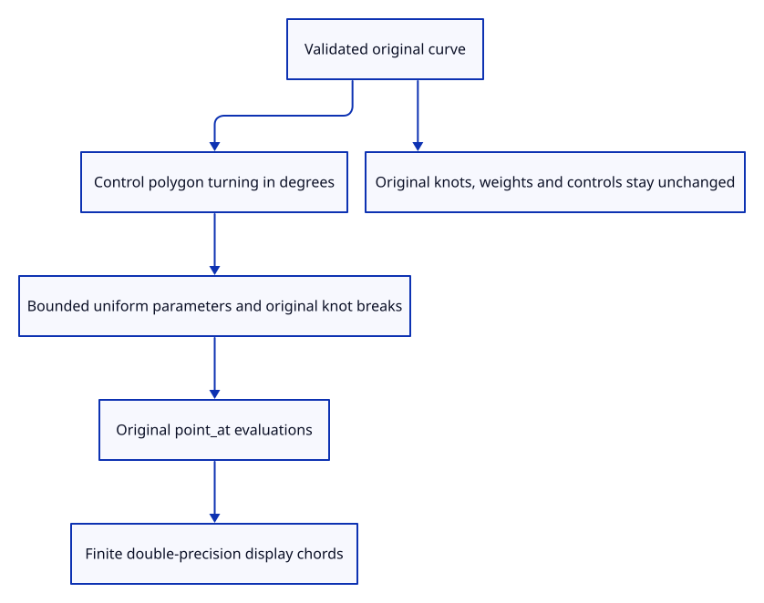

# 38a · Sample a validated curve without replacing its source

**Typing: 20–39 minutes.** [Estimate](typing-load.md).

Use the control polygon’s turning to choose display chords, matching the current viewer’s three-degree policy and 512 uniform-chord cap.

## Type

Continue from [Validate an original NURBS curve before sampling](38-layout.md). [Save or recover your work](recovery.md).

### 1. `src/curve.rs`

Sample the original evaluator with bounded uniform chords and exact interior knot breaks.

<details>
<summary>Locate the existing block</summary>

```rust
    Ok(domain)
}
```

</details>

Replace that block with:

```rust
--8<-- "journey/code/38a-samples-01.rs"
```

### 2. `src/lib.rs`

Register actual sampled geometry checks.

<details>
<summary>Locate the existing block</summary>

```rust
pub mod curve;
```

</details>

Replace that block with:

```rust
--8<-- "journey/code/38a-samples-02.rs"
```

### 3. `src/curve_sample_tests.rs`

Copy original preservation, dense measured error, periodic closure and knot-break checks.

Copy this check file:

```rust
--8<-- "journey/code/38a-samples-03.rs"
```

## Run and check

In your project:

```sh
cd workspace/journey
REGEN_PROTO=0 cargo build --lib --locked --target wasm32-unknown-unknown -j4
REGEN_PROTO=0 CARGO_BUILD_JOBS=4 trunk serve --port 8780
```

Open `http://127.0.0.1:8780/`. Keep an existing Trunk server running; saving rebuilds it.

Run straight, curved, periodic and malformed curve sampling checks. Original control arrays remain unchanged.

**Verified checkpoint in Chrome.**



[Verification scope](release.md).

Run the state checks on your computer from your project folder:

```sh
REGEN_PROTO=0 cargo test --lib --locked --target host-tuple -j4
```

<details>
<summary>Code explanation and diagram</summary>

Include original interior knot breaks as well. Bound the control count before allocating, keep sample positions in double precision, and refuse nonfinite or unrepresentable display coordinates. A sampled polyline remains an approximation rather than a replacement kernel curve.

validated original curve → control-polygon turning → bounded parameter samples and knot breaks → finite double-precision chords.



What does the sampled polyline know that the original curve does not lose?

It provides drawing chords at chosen parameters. The original knots, degree, rational weights and exact controls remain the editing source; the chords are explicitly an approximation.

Study estimate, including typing and experiments: 0.75–1.25 hours.

</details>

<details>
<summary>Optional experiment</summary>

Compare dense kernel evaluations with the sampled quadratic arch. Check measured chord error, rather than mistaking its control polygon for the curve.

</details>

<details>
<summary>Check and save your work</summary>

Restore experimental edits, then run from `session_viewer`:

```sh
npm --prefix ../session_tests run course -- check 38a-samples
npm --prefix ../session_tests run course -- save 38a-samples
```

Source comparison leaves your project untouched. [Save and recovery instructions](recovery.md).

</details>

<details>
<summary>Viewer coverage and verification</summary>

Curve display sampling is complete. Original curve rows, control markers and real input follow in the remaining curve checkpoints.

Native checks prove exact original preservation, straight minimal samples, real quadratic arch shape and measured dense chord error, periodic endpoints, knot-break inclusion and bounded malformed-input refusal.

Chrome retains point and connected rendering while native checks guard original curve evaluation.

[Full validation scope](release.md).

To reproduce the scripted acceptance of the reference checkpoint, run from `session_viewer` with the [course bundle server](release.md#reproduce) running on port 8781:

```sh
npm --prefix ../session_tests run course -- capture 38a-samples
```

This uses the verified reference bundle; it does not check or change your typed project.

</details>
