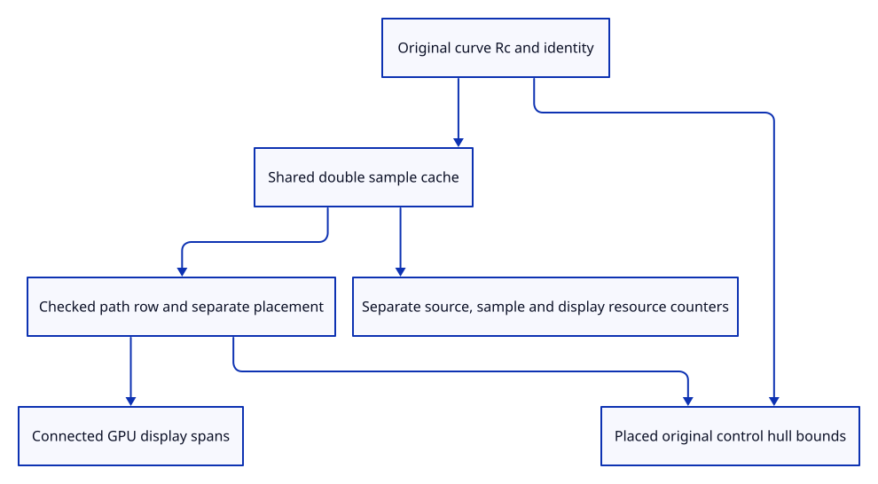

# 38b · Retain original curves beside their display samples

**Typing: 27–54 minutes.** [Estimate](typing-load.md).

Extend path ownership with the original curve and a shared double-precision sample cache. GPU spans keep their existing connected format.

## Type

Continue from [Sample a validated curve without replacing its source](38a-samples.md). [Save or recover your work](recovery.md).

### 1. `src/chain.rs`

Retain the original curve separately from shared approximation samples.

<details>
<summary>Locate the existing block</summary>

```rust
pub enum Source { Line(Rc<Line>), Polyline(Rc<Polyline>) }
```

</details>

Replace that block with:

```rust
--8<-- "journey/code/38b-source-01.rs"
```

### 2. `src/chain.rs`

Keep original curve identity under path ownership.

<details>
<summary>Locate the existing block</summary>

```rust
Self::Polyline(line) => line.guid()
```

</details>

Replace that block with:

```rust
--8<-- "journey/code/38b-source-02.rs"
```

### 3. `src/chain.rs`

Count curve source owners independently of sampled data.

<details>
<summary>Locate the existing block</summary>

```rust
Self::Polyline(line) => (1, Rc::as_ptr(line) as usize)
```

</details>

Replace that block with:

```rust
--8<-- "journey/code/38b-source-03.rs"
```

### 4. `src/chain.rs`

Use cached original evaluator positions when placing display chords.

<details>
<summary>Locate the existing block</summary>

```rust
            Self::Polyline(line) => line.coords.chunks_exact(3).map(|p| [p[0], p[1], p[2]]).collect(),
```

</details>

Replace that block with:

```rust
--8<-- "journey/code/38b-source-04.rs"
```

### 5. `src/chain.rs`

Keep stable original control indices and a conservative positive-weight hull.

<details>
<summary>Locate the existing block</summary>

```rust
    pub fn coordinates(&self) -> Vec<[f64; 3]> {
```

</details>

Replace that block with:

```rust
--8<-- "journey/code/38b-source-05.rs"
```

### 6. `src/chain.rs`

Validate and cache the original curve before accepting connected display preparation.

<details>
<summary>Locate the existing block</summary>

```rust
    pub fn line(source: Rc<Line>) -> Result<Self, &'static str> {
```

</details>

Replace that block with:

```rust
--8<-- "journey/code/38b-source-06.rs"
```

### 7. `src/chain.rs`

Use the original curve arrowhead policy.

<details>
<summary>Locate the existing block</summary>

```rust
Source::Polyline(line) => line.arrowhead
```

</details>

Replace that block with:

```rust
--8<-- "journey/code/38b-source-07.rs"
```

### 8. `src/scene.rs`

Place conservative curve bounds from original double controls.

<details>
<summary>Locate the existing block</summary>

```rust
    pub fn points(&self) -> Vec<session_rust::Point> {
```

</details>

Replace that block with:

```rust
--8<-- "journey/code/38b-source-08.rs"
```

### 9. `src/scene.rs`

Include the complete placed control hull in document Fit bounds.

<details>
<summary>Locate the existing block</summary>

```rust
        for row in &self.paths {
            for point in row.points() {
```

</details>

Replace that block with:

```rust
--8<-- "journey/code/38b-source-09.rs"
```

### 10. `src/memory.rs`

Count sampled doubles separately from source owners and packed GPU data.

<details>
<summary>Locate the existing block</summary>

```rust
pub fn paths<'a>
```

</details>

Replace that block with:

```rust
--8<-- "journey/code/38b-source-10.rs"
```

### 11. `src/lib.rs`

Register retained source and placed bounds checks.

<details>
<summary>Locate the existing block</summary>

```rust
pub mod curve;
```

</details>

Replace that block with:

```rust
--8<-- "journey/code/38b-source-11.rs"
```

### 12. `src/curve_source_tests.rs`

Copy retained source identity, distinct IDs, precise placement, conservative bounds and release checks.

Copy this check file:

```rust
--8<-- "journey/code/38b-source-12.rs"
```

## Run and check

In your project:

```sh
cd workspace/journey
REGEN_PROTO=0 cargo build --lib --locked --target wasm32-unknown-unknown -j4
REGEN_PROTO=0 CARGO_BUILD_JOBS=4 trunk serve --port 8780
```

Open `http://127.0.0.1:8780/`. Keep an existing Trunk server running; saving rebuilds it.

Insert an original curve into a document in native checks. Duplicate rows share source and samples while retaining distinct document IDs.

**Verified checkpoint in Chrome.**


[Verification scope](release.md).

Run the state checks on your computer from your project folder:

```sh
REGEN_PROTO=0 cargo test --lib --locked --target host-tuple -j4
```

<details>
<summary>Code explanation and diagram</summary>

Retain original GUIDs and checked document IDs. Use transformed original controls for conservative curve bounds, and report sampled doubles separately from kernel ownership and packed display vertices.

original NURBS Rc → validated shared double samples → path row and checked ID → placed display chords and conservative bounds.



Why does a curve row retain its original control hull beside sampled chords?

The display approximation can miss an extremum. Positive-weight control bounds conservatively contain the curve, while the original curve remains available for editing and exact measurement.

Study estimate, including typing and experiments: 0.75–1.25 hours.

</details>

<details>
<summary>Optional experiment</summary>

Translate a curve row with high-precision coordinates. Original controls remain unchanged, display endpoints move, and bounds include its placed control hull.

</details>

<details>
<summary>Check and save your work</summary>

Restore experimental edits, then run from `session_viewer`:

```sh
npm --prefix ../session_tests run course -- check 38b-source
npm --prefix ../session_tests run course -- save 38b-source
```

Source comparison leaves your project untouched. [Save and recovery instructions](recovery.md).

</details>

<details>
<summary>Viewer coverage and verification</summary>

Original curve path rows and placements are complete. Control drawing and real curve input follow. Bounds here are conservative control hulls; exact command measurements belong to chapter 84.

Native checks prove original identity, shared sample/source lifetime, distinct IDs, precise placed control-hull bounds, real curved segments and complete resource release.

Chrome retains point and connected rendering while native checks guard original curve evaluation.

[Full validation scope](release.md).

To reproduce the scripted acceptance of the reference checkpoint, run from `session_viewer` with the [course bundle server](release.md#reproduce) running on port 8781:

```sh
npm --prefix ../session_tests run course -- capture 38b-source
```

This uses the verified reference bundle; it does not check or change your typed project.

</details>
