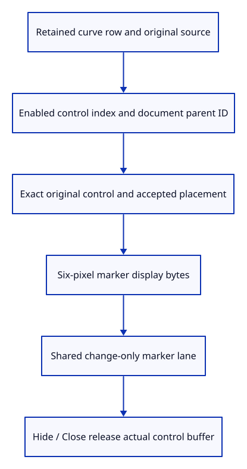

# 38c · Draw controls with their original curve parent and index

**Typing: 17–33 minutes.** [Estimate](typing-load.md).

Resolve visible control markers from retained curve rows. Carry the document parent and original index beside each display marker, then send only marker bytes to the GPU.

## Type

Continue from [Retain original curves beside their display samples](38b-source.md). [Save or recover your work](recovery.md).

### 1. `src/scene.rs`

Retain explicit control display state on each document path row.

<details>
<summary>Locate the existing block</summary>

```rust
pub struct PathObject { pub id: ObjectId,
```

</details>

Replace that block with:

```rust
--8<-- "journey/code/38c-controls-01.rs"
```

### 2. `src/scene.rs`

Keep original curve controls disabled until requested.

<details>
<summary>Locate the existing block</summary>

```rust
PathObject { id, guid, prepared, model:
```

</details>

Replace that block with:

```rust
--8<-- "journey/code/38c-controls-02.rs"
```

### 3. `src/scene.rs`

Reject invalid placed controls before accepting a curve row transform.

<details>
<summary>Locate the existing block</summary>

```rust
        for p in row.prepared.source.coordinates() {
```

</details>

Replace that block with:

```rust
--8<-- "journey/code/38c-controls-03.rs"
```

### 4. `src/scene.rs`

Carry document parent and original control index beside each placed marker.

<details>
<summary>Locate the existing block</summary>

```rust
#[derive(Clone)]
pub struct PointObject
```

</details>

Replace that block with:

```rust
--8<-- "journey/code/38c-controls-04.rs"
```

### 5. `src/scene.rs`

Resolve placed original controls with stable parent IDs and control indices.

<details>
<summary>Locate the existing block</summary>

```rust
    pub fn paths(&self) -> &[PathObject] { &self.paths }
```

</details>

Replace that block with:

```rust
--8<-- "journey/code/38c-controls-05.rs"
```

### 6. `src/renderer.rs`

Send only placed display bytes to the marker lane, retaining source ownership in the document.

<details>
<summary>Locate the existing block</summary>

```rust
scene.points().iter().map(crate::scene::PointObject::marker))
```

</details>

Replace that block with:

```rust
--8<-- "journey/code/38c-controls-06.rs"
```

### 7. `src/browser.rs`

Inspect sampled curve resources and actual enabled control count separately.

<details>
<summary>Locate the existing block</summary>

```rust
    canvas.set_attribute("data-point-cpu",
```

</details>

Replace that block with:

```rust
--8<-- "journey/code/38c-controls-07.rs"
```

### 8. `src/lib.rs`

Register document parent and placement checks.

<details>
<summary>Locate the existing block</summary>

```rust
pub mod controls;
```

</details>

Replace that block with:

```rust
--8<-- "journey/code/38c-controls-08.rs"
```

### 9. `src/control_parent_tests.rs`

Copy shared curve identity, distinct parent IDs, original indices, correct placement and release checks.

Copy this check file:

```rust
--8<-- "journey/code/38c-controls-09.rs"
```

## Run and check

In your project:

```sh
cd workspace/journey
REGEN_PROTO=0 cargo build --lib --locked --target wasm32-unknown-unknown -j4
REGEN_PROTO=0 CARGO_BUILD_JOBS=4 trunk serve --port 8780
```

Open `http://127.0.0.1:8780/`. Keep an existing Trunk server running; saving rebuilds it.

Enable controls on retained curve rows in native checks. Marker counts and buffer bytes reflect their actual controls.

**Verified checkpoint in Chrome.**


[Verification scope](release.md).

Run the state checks on your computer from your project folder:

```sh
REGEN_PROTO=0 cargo test --lib --locked --target host-tuple -j4
```

<details>
<summary>Code explanation and diagram</summary>

Validate both sampled chords and original controls during placement. Keep markers disabled by default, reuse the existing marker lane, and count enabled controls separately from standalone point sources.

retained curve path row → enabled original controls → parent/index marker records → placed marker lane → Close release.



How do two rows sharing one curve distinguish their control markers?

Each marker carries its document parent ID and original control index. Both still refer to the same original curve owner, while each row applies its own placement.

Study estimate, including typing and experiments: 0.75–1.25 hours.

</details>

<details>
<summary>Optional experiment</summary>

Place two rows sharing one curve at different offsets. Their controls share original ownership but retain distinct parent IDs and correct world positions.

</details>

<details>
<summary>Check and save your work</summary>

Restore experimental edits, then run from `session_viewer`:

```sh
npm --prefix ../session_tests run course -- check 38c-controls
npm --prefix ../session_tests run course -- save 38c-controls
```

Source comparison leaves your project untouched. [Save and recovery instructions](recovery.md).

</details>

<details>
<summary>Viewer coverage and verification</summary>

Curve controls draw from retained original rows. Actual curve and Controls On/Off input follow next; picking those parent/index references belongs to chapter 44.

Native tests prove shared original owners, distinct parent IDs, exact placed controls and complete Close. GPU checks prove actual marker allocation, view-only reuse and zero buffers after release.

Chrome retains point and connected rendering while native checks guard original curve evaluation.

[Full validation scope](release.md).

To reproduce the scripted acceptance of the reference checkpoint, run from `session_viewer` with the [course bundle server](release.md#reproduce) running on port 8781:

```sh
npm --prefix ../session_tests run course -- capture 38c-controls
```

This uses the verified reference bundle; it does not check or change your typed project.

</details>
