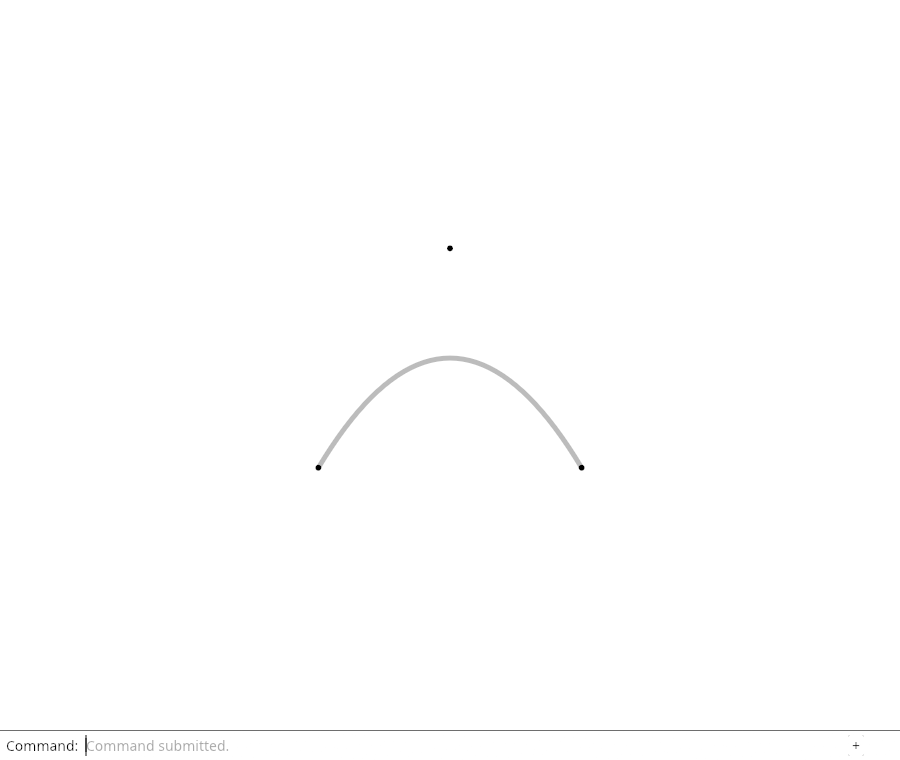
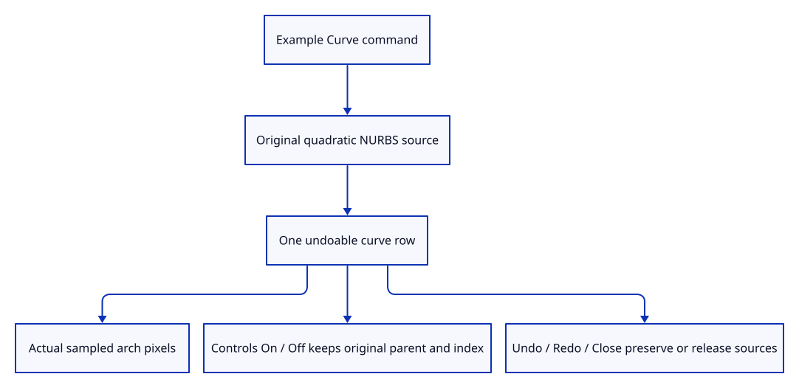

# 38d · Insert an original curve and inspect its controls

**Typing: 11–22 minutes.** [Estimate](typing-load.md).

Register Example Curve and explicit Controls On/Off input. Insert an original quadratic curve in one history transaction; control display changes do not consume that transaction.

## Type

Continue from [Draw controls with their original curve parent and index](38c-controls.md). [Save or recover your work](recovery.md).

### 1. `src/editor.rs`

Expose original curve insertion and explicit control display actions.

<details>
<summary>Locate the existing block</summary>

```rust
    AddPoint,
```

</details>

Replace that block with:

```rust
--8<-- "journey/code/38d-input-01.rs"
```

### 2. `src/editor.rs`

Insert an original curve transaction and keep control visibility out of geometry history.

<details>
<summary>Locate the existing block</summary>

```rust
            Action::AddPoint => {
```

</details>

Replace that block with:

```rust
--8<-- "journey/code/38d-input-02.rs"
```

### 3. `src/browser.rs`

Expose curve and control inputs in dock completion and Help.

<details>
<summary>Locate the existing block</summary>

```rust
            "Example Point",
```

</details>

Replace that block with:

```rust
--8<-- "journey/code/38d-input-03.rs"
```

### 4. `src/browser.rs`

Dispatch accepted curve and explicit control input through the editor.

<details>
<summary>Locate the existing block</summary>

```rust
                    "example point" => Action::AddPoint,
```

</details>

Replace that block with:

```rust
--8<-- "journey/code/38d-input-04.rs"
```

### 5. `src/lib.rs`

Register actual curve insertion history and ownership checks.

<details>
<summary>Locate the existing block</summary>

```rust
pub mod curve;
```

</details>

Replace that block with:

```rust
--8<-- "journey/code/38d-input-05.rs"
```

### 6. `src/curve_input_tests.rs`

Copy original curve identity, control display history independence and complete release checks.

Copy this check file:

```rust
--8<-- "journey/code/38d-input-06.rs"
```

## Run and check

In your project:

```sh
cd workspace/journey
REGEN_PROTO=0 cargo build --lib --locked --target wasm32-unknown-unknown -j4
REGEN_PROTO=0 CARGO_BUILD_JOBS=4 trunk serve --port 8780
```

Open `http://127.0.0.1:8780/`. Keep an existing Trunk server running; saving rebuilds it.

Close, type Example Curve, then Controls On. Inspect the sampled arch and its three original control markers.

**Verified checkpoint in Chrome.**



[Verification scope](release.md).

Run the state checks on your computer from your project folder:

```sh
REGEN_PROTO=0 cargo test --lib --locked --target host-tuple -j4
```

<details>
<summary>Code explanation and diagram</summary>

Chrome verifies real arch pixels at the kernel midpoint, absence of a drawn control polygon, original control markers at their projected positions, camera-only buffer reuse and complete Close.

Example Curve input → original curve path row → real sampled arch → Controls On/Off → parent/index markers → history and Close.



Why does the curve arch stop below its middle control point?

A quadratic curve follows the kernel’s weighted interpolation of controls. Its control polygon shapes the curve but is not the displayed curve itself.

Study estimate, including typing and experiments: 0.75–1.25 hours.

</details>

<details>
<summary>Optional experiment</summary>

Toggle Controls Off, switch projection and zoom. The curve vertex payload remains unchanged; markers keep their screen diameter when enabled.

</details>

<details>
<summary>Check and save your work</summary>

Restore experimental edits, then run from `session_viewer`:

```sh
npm --prefix ../session_tests run course -- check 38d-input
npm --prefix ../session_tests run course -- save 38d-input
```

Source comparison leaves your project untouched. [Save and recovery instructions](recovery.md).

</details>

<details>
<summary>Viewer coverage and verification</summary>

Original NURBS sampling, retained ownership, placed control drawing and example commands are complete. General curve construction and subobject picking/editing remain in chapters 44 and 76.

Native command checks prove retained curve ownership, one-step Undo/Redo, unchanged display history and Close release. Chrome checks actual curved geometry and indexed control pixels at both DPRs, projections and zoom levels.

Actual Chrome draws a sampled quadratic arch and its three original curve control markers.

[Full validation scope](release.md).

To reproduce the scripted acceptance of the reference checkpoint, run from `session_viewer` with the [course bundle server](release.md#reproduce) running on port 8781:

```sh
npm --prefix ../session_tests run course -- capture 38d-input
```

This uses the verified reference bundle; it does not check or change your typed project.

</details>
