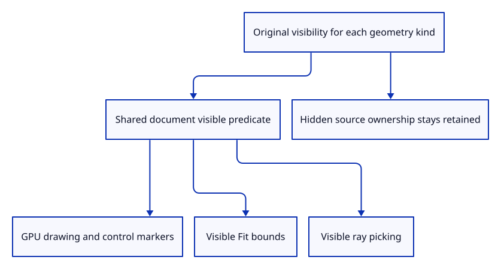

# 39 · Resolve original visibility for every drawing kind

**Typing: 23–45 minutes.** [Estimate](typing-load.md).

Centralize original visibility in one document predicate. Mesh rows use retained metadata even after source unloading; other rows consult their original shared geometry.

## Type

Continue from [Insert an original curve and inspect its controls](38d-input.md). [Save or recover your work](recovery.md).

### 1. `src/chain.rs`

Read visibility from the original shared path source.

<details>
<summary>Locate the existing block</summary>

```rust
    pub fn guid(&self) -> &str {
```

</details>

Replace that block with:

```rust
--8<-- "journey/code/39-visible-01.rs"
```

### 2. `src/scene.rs`

Resolve original visibility for every current document kind without removing ownership.

<details>
<summary>Locate the existing block</summary>

```rust
    pub fn bounds(&self) -> Option<crate::bounds::Bounds> {
```

</details>

Replace that block with:

```rust
--8<-- "journey/code/39-visible-02.rs"
```

### 3. `src/scene.rs`

Exclude invisible surfaces from visible Fit bounds.

<details>
<summary>Locate the existing block</summary>

```rust
        for object in &self.objects {
            for vertex in object.mesh.vertices() {
```

</details>

Replace that block with:

```rust
--8<-- "journey/code/39-visible-03.rs"
```

### 4. `src/scene.rs`

Exclude invisible original line endpoints from Fit.

<details>
<summary>Locate the existing block</summary>

```rust
        for line in &self.lines {
            for point in line.endpoints() {
```

</details>

Replace that block with:

```rust
--8<-- "journey/code/39-visible-04.rs"
```

### 5. `src/scene.rs`

Exclude hidden polylines and original curve hulls from Fit.

<details>
<summary>Locate the existing block</summary>

```rust
        for row in &self.paths {
            for point in row.bounds_points() {
```

</details>

Replace that block with:

```rust
--8<-- "journey/code/39-visible-05.rs"
```

### 6. `src/scene.rs`

Keep hidden standalone points out of visible bounds.

<details>
<summary>Locate the existing block</summary>

```rust
        for row in &self.points {
            let p = row.point();
```

</details>

Replace that block with:

```rust
--8<-- "journey/code/39-visible-06.rs"
```

### 7. `src/scene.rs`

Hide original controls with their invisible curve parent.

<details>
<summary>Locate the existing block</summary>

```rust
        for row in self.paths.iter().filter(|row| row.controls_visible) {
```

</details>

Replace that block with:

```rust
--8<-- "journey/code/39-visible-07.rs"
```

### 8. `src/scene.rs`

Prevent hidden selected surfaces from influencing Fit Selected.

<details>
<summary>Locate the existing block</summary>

```rust
    pub fn selected_bounds(&self, id: ObjectId) -> Option<crate::bounds::Bounds> {
```

</details>

Replace that block with:

```rust
--8<-- "journey/code/39-visible-08.rs"
```

### 9. `src/renderer.rs`

Draw only visible original point rows.

<details>
<summary>Locate the existing block</summary>

```rust
scene.points().iter().map(crate::scene::PointObject::marker)
```

</details>

Replace that block with:

```rust
--8<-- "journey/code/39-visible-09.rs"
```

### 10. `src/renderer.rs`

Keep invisible connected path data out of GPU instance allocation.

<details>
<summary>Locate the existing block</summary>

```rust
scene.paths().iter().flat_map(crate::scene::PathObject::segments)
```

</details>

Replace that block with:

```rust
--8<-- "journey/code/39-visible-10.rs"
```

### 11. `src/renderer.rs`

Keep hidden original lines out of the stroke batch.

<details>
<summary>Locate the existing block</summary>

```rust
scene.lines().iter().map(crate::scene::LineObject::stroke)
```

</details>

Replace that block with:

```rust
--8<-- "journey/code/39-visible-11.rs"
```

### 12. `src/renderer.rs`

Allocate surface GPU rows only for visible document objects.

<details>
<summary>Locate the existing block</summary>

```rust
        for object in scene.objects() {
```

</details>

Replace that block with:

```rust
--8<-- "journey/code/39-visible-12.rs"
```

### 13. `src/picking.rs`

Use the same visibility predicate for ray picking and drawing.

<details>
<summary>Locate the existing block</summary>

```rust
    for object in scene.objects() {
```

</details>

Replace that block with:

```rust
--8<-- "journey/code/39-visible-13.rs"
```

### 14. `src/lib.rs`

Register hidden ownership and visible picking checks.

<details>
<summary>Locate the existing block</summary>

```rust
pub mod scene;
```

</details>

Replace that block with:

```rust
--8<-- "journey/code/39-visible-14.rs"
```

### 15. `src/source_visibility_tests.rs`

Copy retained hidden ownership, empty visible bounds and invisible picking refusal checks.

Copy this check file:

```rust
--8<-- "journey/code/39-visible-15.rs"
```

### 16. `src/scene.rs`

Read retained source visibility directly without scanning all document IDs.

<details>
<summary>Locate the existing block</summary>

```rust
impl Object {
```

</details>

Replace that block with:

```rust
--8<-- "journey/code/39-visible-16.rs"
```

### 17. `src/scene.rs`

Read retained source visibility directly without scanning all document IDs.

<details>
<summary>Locate the existing block</summary>

```rust
impl LineObject {
```

</details>

Replace that block with:

```rust
--8<-- "journey/code/39-visible-17.rs"
```

### 18. `src/scene.rs`

Read retained source visibility directly without scanning all document IDs.

<details>
<summary>Locate the existing block</summary>

```rust
impl PathObject {
```

</details>

Replace that block with:

```rust
--8<-- "journey/code/39-visible-18.rs"
```

### 19. `src/scene.rs`

Read retained source visibility directly without scanning all document IDs.

<details>
<summary>Locate the existing block</summary>

```rust
impl PointObject {
```

</details>

Replace that block with:

```rust
--8<-- "journey/code/39-visible-19.rs"
```

### 20. `src/scene.rs`

Cycle only visible mesh rows without allocating a second object list.

<details>
<summary>Locate the existing block</summary>

```rust
        if self.objects.is_empty() {
            return None;
        }
        let index = self.objects.iter().position(|object| Some(object.id) == current)
            .map_or(0, |index| index + 1);
        Some(self.objects[index % self.objects.len()].id)
```

</details>

Replace that block with:

```rust
--8<-- "journey/code/39-visible-20.rs"
```

## Run and check

In your project:

```sh
cd workspace/journey
REGEN_PROTO=0 cargo build --lib --locked --target wasm32-unknown-unknown -j4
REGEN_PROTO=0 CARGO_BUILD_JOBS=4 trunk serve --port 8780
```

Open `http://127.0.0.1:8780/`. Keep an existing Trunk server running; saving rebuilds it.

Run hidden-source checks for meshes, lines, polylines, curves and points. No hidden drawing resources are created, but original source rows remain.

**Verified checkpoint in Chrome.**


[Verification scope](release.md).

Run the state checks on your computer from your project folder:

```sh
REGEN_PROTO=0 cargo test --lib --locked --target host-tuple -j4
```

<details>
<summary>Code explanation and diagram</summary>

Use the same predicate for every drawing lane, control markers, Fit bounds and mesh picking. Keep hidden document rows and sources intact so visibility remains distinct from deletion.

original source visibility → shared document predicate → visible drawing and bounds → retained hidden ownership.



Why does hiding a source remove its drawing without deleting its document row?

Visibility is a display choice. Its identity, geometry and history remain available for saving and later layer actions, while hidden geometry cannot influence visible picking or Fit.

Study estimate, including typing and experiments: 0.75–1.25 hours.

</details>

<details>
<summary>Optional experiment</summary>

Prepare an invisible curve and enable its controls. Its original curve and sample cache remain retained while both drawing lanes stay empty.

</details>

<details>
<summary>Check and save your work</summary>

Restore experimental edits, then run from `session_viewer`:

```sh
npm --prefix ../session_tests run course -- check 39-visible
npm --prefix ../session_tests run course -- save 39-visible
```

Source comparison leaves your project untouched. [Save and recovery instructions](recovery.md).

</details>

<details>
<summary>Viewer coverage and verification</summary>

Original visibility is resolved across all current kinds. Surface/ink depth checks follow next; user layer overrides and H/S shortcuts remain in chapter 53.

Native checks retain hidden original sources for every supported kind, exclude them from bounds and picking, and allocate no hidden GPU geometry or instance buffers. Close releases their retained sources.

Actual Chrome draws a sampled quadratic arch and its three original curve control markers.

[Full validation scope](release.md).

To reproduce the scripted acceptance of the reference checkpoint, run from `session_viewer` with the [course bundle server](release.md#reproduce) running on port 8781:

```sh
npm --prefix ../session_tests run course -- capture 39-visible
```

This uses the verified reference bundle; it does not check or change your typed project.

</details>
