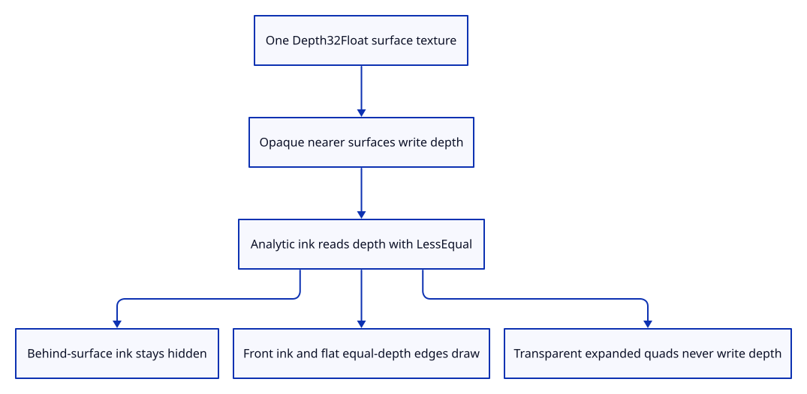

# 39a · Share surface depth across all ink lanes

**Typing: 7–14 minutes.** [Estimate](typing-load.md).

Keep depth format and comparison policy in one module. Opaque surfaces write nearer depth; analytic ink reads that same texture and accepts equal depth without writing its transparent quad.

## Type

Continue from [Resolve original visibility for every drawing kind](39-visible.md). [Save or recover your work](recovery.md).

### 1. `src/depth.rs`

Name one depth format and explicit surface/ink comparison policies.

Create the file and type:

```rust
--8<-- "journey/code/39a-depth-01.rs"
```

### 2. `src/lib.rs`

Register the shared depth contract.

<details>
<summary>Locate the existing block</summary>

```rust
pub mod renderer;
```

</details>

Replace that block with:

```rust
--8<-- "journey/code/39a-depth-02.rs"
```

### 3. `src/renderer.rs`

Use the shared writable nearer-surface policy.

<details>
<summary>Locate the existing block</summary>

```rust
            depth_stencil: Some(wgpu::DepthStencilState {
                format: wgpu::TextureFormat::Depth32Float,
                depth_write_enabled: Some(true),
                depth_compare: Some(wgpu::CompareFunction::Less),
                stencil: Default::default(),
                bias: Default::default(),
            }),
```

</details>

Replace that block with:

```rust
--8<-- "journey/code/39a-depth-03.rs"
```

### 4. `src/renderer.rs`

Allocate the exact depth format used by every drawing pipeline.

<details>
<summary>Locate the existing block</summary>

```rust
            format: wgpu::TextureFormat::Depth32Float,
```

</details>

Replace that block with:

```rust
--8<-- "journey/code/39a-depth-04.rs"
```

### 5. `src/stroke_gpu.rs`

Keep all analytic ink lanes read-only against the same surface depth.

<details>
<summary>Locate the existing block</summary>

```rust
            depth_stencil: Some(wgpu::DepthStencilState { format: wgpu::TextureFormat::Depth32Float,
                depth_write_enabled: Some(false), depth_compare: Some(wgpu::CompareFunction::LessEqual),
                stencil: Default::default(), bias: Default::default() }),
```

</details>

Replace that block with:

```rust
--8<-- "journey/code/39a-depth-05.rs"
```

## Run and check

In your project:

```sh
cd workspace/journey
REGEN_PROTO=0 cargo build --lib --locked --target wasm32-unknown-unknown -j4
REGEN_PROTO=0 CARGO_BUILD_JOBS=4 trunk serve --port 8780
```

Open `http://127.0.0.1:8780/`. Keep an existing Trunk server running; saving rebuilds it.

Run real surface/ink readback checks. Behind-surface lines, curves and points stay hidden; front ink and a flat coplanar edge draw.

**Verified checkpoint in Chrome.**


[Verification scope](release.md).

Run the state checks on your computer from your project folder:

```sh
REGEN_PROTO=0 cargo test --lib --locked --target host-tuple -j4
```

<details>
<summary>Code explanation and diagram</summary>

Actual texture readback proves behind-surface occlusion for lines, curves and markers, front ink, and a flat coplanar edge at both projections, zoom levels and densities. This is the shared depth contract; curved silhouette coverage is a later subject.

shared depth texture → opaque surface writes → read-only ink comparison → real hidden/front/coplanar pixels.



Why does ink read surface depth without writing its expanded quad?

A ribbon or marker quad contains transparent coverage outside its shape. Writing that quad would hide later geometry in pixels where no visible ink was drawn.

Study estimate, including typing and experiments: 0.75–1.25 hours.

</details>

<details>
<summary>Optional experiment</summary>

Repeat the fixture at both projections, zoom levels and device densities. Compare actual surface pixels before and after behind-surface ink.

</details>

<details>
<summary>Check and save your work</summary>

Restore experimental edits, then run from `session_viewer`:

```sh
npm --prefix ../session_tests run course -- check 39a-depth
npm --prefix ../session_tests run course -- save 39a-depth
```

Source comparison leaves your project untouched. [Save and recovery instructions](recovery.md).

</details>

<details>
<summary>Viewer coverage and verification</summary>

Shared surface depth and read-only ink comparison are verified for the current lanes. Arbitrary curved Arctic outlines and face-coverage silhouettes remain in chapter 91.

Native actual renderer readback compares a solid surface before and after hidden ink and checks front line/point pixels plus a flat coplanar line across eight view/density cases.

Actual Chrome draws a sampled quadratic arch and its three original curve control markers.

[Full validation scope](release.md).

To reproduce the scripted acceptance of the reference checkpoint, run from `session_viewer` with the [course bundle server](release.md#reproduce) running on port 8781:

```sh
npm --prefix ../session_tests run course -- capture 39a-depth
```

This uses the verified reference bundle; it does not check or change your typed project.

</details>
