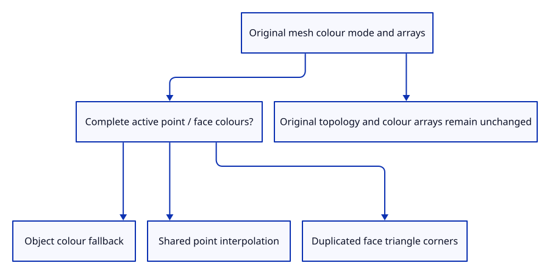

# 40 · Carry the original mesh colour mode into display data

**Typing: 9–18 minutes.** [Estimate](typing-load.md).

Use the kernel’s current colour policy rather than duplicate its interpretation in the viewer. A complete active point-colour array shares interpolated display vertices; active face colours duplicate triangle corners.

## Type

Continue from [Share surface depth across all ink lanes](39a-depth.md). [Save or recover your work](recovery.md).

### 1. `src/colour.rs`

Build original colour-mode specimens while retaining shared kernel topology.

Create the file and type:

```rust
--8<-- "journey/code/40-colour-01.rs"
```

### 2. `src/lib.rs`

Register original colour specimens and extraction checks.

<details>
<summary>Locate the existing block</summary>

```rust
pub mod mesh;
```

</details>

Replace that block with:

```rust
--8<-- "journey/code/40-colour-02.rs"
```

### 3. `src/colour_tests.rs`

Copy active mode, exact topology/arrays, shared interpolation, face duplication and fallback checks.

Copy this check file:

```rust
--8<-- "journey/code/40-colour-03.rs"
```

## Run and check

In your project:

```sh
cd workspace/journey
REGEN_PROTO=0 cargo build --lib --locked --target wasm32-unknown-unknown -j4
REGEN_PROTO=0 CARGO_BUILD_JOBS=4 trunk serve --port 8780
```

Open `http://127.0.0.1:8780/`. Keep an existing Trunk server running; saving rebuilds it.

Run source colour checks for object, point and face modes. Display duplication follows the kernel rules while original topology and colour arrays remain intact.

**Verified checkpoint in Chrome.**


[Verification scope](release.md).

Run the state checks on your computer from your project folder:

```sh
REGEN_PROTO=0 cargo test --lib --locked --target host-tuple -j4
```

<details>
<summary>Code explanation and diagram</summary>

Keep the original mesh and colour arrays intact. Object mode and incomplete arrays fall back to object colour. This is the existing opaque RGB presentation; alpha handling remains a later subject.

original mesh colour mode and arrays → authoritative kernel extraction → checked display vertices → actual colour pixels.



Why does a face-coloured mesh duplicate a shared corner?

A single GPU vertex has one colour. Two adjacent faces with different colours need separate display vertices at their shared corner while the original mesh topology stays unchanged.

Study estimate, including typing and experiments: 0.75–1.25 hours.

</details>

<details>
<summary>Optional experiment</summary>

Supply incomplete point or face colour arrays. The active mode falls back to object colour, following the kernel adapter rather than inventing partial display rules.

</details>

<details>
<summary>Check and save your work</summary>

Restore experimental edits, then run from `session_viewer`:

```sh
npm --prefix ../session_tests run course -- check 40-colour
npm --prefix ../session_tests run course -- save 40-colour
```

Source comparison leaves your project untouched. [Save and recovery instructions](recovery.md).

</details>

<details>
<summary>Viewer coverage and verification</summary>

The existing kernel adapter already preserves colour modes. This checkpoint adds original colour specimens and verifies their actual mapping and pixels; real input follows next. Opacity belongs to chapter 93.

Native checks prove colour-mode gating, exact source preservation, shared point interpolation, duplicated face boundaries and object-colour fallback. Actual renderer pixels distinguish red/blue faces, green shared point colours and uniform object colour.

Actual Chrome draws a sampled quadratic arch and its three original curve control markers.

[Full validation scope](release.md).

To reproduce the scripted acceptance of the reference checkpoint, run from `session_viewer` with the [course bundle server](release.md#reproduce) running on port 8781:

```sh
npm --prefix ../session_tests run course -- capture 40-colour
```

This uses the verified reference bundle; it does not check or change your typed project.

</details>
