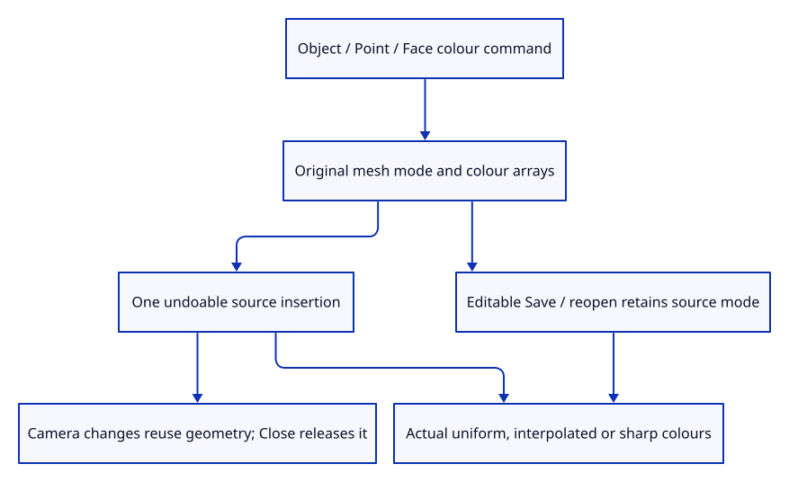

# 40a · Compare original colour modes through actual input

**Typing: 14–28 minutes.** [Estimate](typing-load.md).

Add three real dock commands that insert original colour-mode specimens. Each commits one prepared mesh in the existing history.

## Type

Continue from [Carry the original mesh colour mode into display data](40-colour.md). [Save or recover your work](recovery.md).

### 1. `src/editor.rs`

Expose original mesh colour specimens as editor actions.

<details>
<summary>Locate the existing block</summary>

```rust
    AddCurve,
```

</details>

Replace that block with:

```rust
--8<-- "journey/code/40a-input-01.rs"
```

### 2. `src/editor.rs`

Insert one original colour-mode mesh in a single history transaction.

<details>
<summary>Locate the existing block</summary>

```rust
            Action::AddCurve => {
```

</details>

Replace that block with:

```rust
--8<-- "journey/code/40a-input-02.rs"
```

### 3. `src/browser.rs`

Expose original colour comparisons in dock completion and Help.

<details>
<summary>Locate the existing block</summary>

```rust
            "Example Curve",
```

</details>

Replace that block with:

```rust
--8<-- "journey/code/40a-input-03.rs"
```

### 4. `src/browser.rs`

Dispatch actual colour input through the existing editor.

<details>
<summary>Locate the existing block</summary>

```rust
                    "example curve" => Action::AddCurve,
```

</details>

Replace that block with:

```rust
--8<-- "journey/code/40a-input-04.rs"
```

### 5. `src/lib.rs`

Register original colour history and editable roundtrip checks.

<details>
<summary>Locate the existing block</summary>

```rust
pub mod colour;
```

</details>

Replace that block with:

```rust
--8<-- "journey/code/40a-input-05.rs"
```

### 6. `src/colour_input_tests.rs`

Copy original mode/array roundtrip, stable row identity, one-step Undo/Redo and Close checks.

Copy this check file:

```rust
--8<-- "journey/code/40a-input-06.rs"
```

### 7. `src/document.rs`

Accept known source colour modes and preserve only complete finite packed colour records.

<details>
<summary>Locate the existing block</summary>

```rust
    if mesh.color_mode != 0 { return Err("Per-face and per-vertex colours arrive later"); }
```

</details>

Replace that block with:

```rust
--8<-- "journey/code/40a-input-07.rs"
```

### 8. `src/document_tests.rs`

Copy unknown-mode refusal while accepting the newly implemented colour modes.

<details>
<summary>Locate the existing block</summary>

```rust
meshes[0].color_mode = 1;
```

</details>

Replace that block with:

```rust
--8<-- "journey/code/40a-input-08.rs"
```

### 9. `src/document_phase_tests.rs`

Copy the invalid-mode phase fixture with an actually unsupported mode.

<details>
<summary>Locate the existing block</summary>

```rust
message.objects.as_mut().unwrap().meshes[0].color_mode = 1;
```

</details>

Replace that block with:

```rust
--8<-- "journey/code/40a-input-09.rs"
```

## Run and check

In your project:

```sh
cd workspace/journey
REGEN_PROTO=0 cargo build --lib --locked --target wasm32-unknown-unknown -j4
REGEN_PROTO=0 CARGO_BUILD_JOBS=4 trunk serve --port 8780
```

Open `http://127.0.0.1:8780/`. Keep an existing Trunk server running; saving rebuilds it.

Close, type Example Face Colors. Compare Example Point Colors and Example Object Color in separate empty documents.

**Verified checkpoint in Chrome.**


[Verification scope](release.md).

Run the state checks on your computer from your project folder:

```sh
REGEN_PROTO=0 cargo test --lib --locked --target host-tuple -j4
```

<details>
<summary>Code explanation and diagram</summary>

Extend the original file validator to accept known colour modes and bounded, complete finite packed RGBA records. Incomplete colour counts keep the kernel object-colour fallback; incomplete RGBA records are refused.

Chrome compares object uniformity, interpolated point colours and sharp red/blue face boundaries. Save/reopen must reconstruct those pixels from retained original modes and arrays.

actual colour example command → original source mode → one mesh history insertion → real pixels → editable download/reopen.



What should survive when a coloured mesh is saved and reopened?

Its original topology, active colour mode and stored arrays must survive. Display vertices can be recreated from that source without baking an interpolated pixel colour into the geometry.

Study estimate, including typing and experiments: 0.75–1.25 hours.

</details>

<details>
<summary>Optional experiment</summary>

Save each colour specimen and reopen the downloaded file. The same view must show the same source colour pixels; Undo/Redo still follows the original insertion.

</details>

<details>
<summary>Check and save your work</summary>

Restore experimental edits, then run from `session_viewer`:

```sh
npm --prefix ../session_tests run course -- check 40a-input
npm --prefix ../session_tests run course -- save 40a-input
```

Source comparison leaves your project untouched. [Save and recovery instructions](recovery.md).

</details>

<details>
<summary>Viewer coverage and verification</summary>

Original colour-mode input, drawing and editable roundtrips are complete. Inherited tree colour overrides remain in52/53, and alpha handling remains in93.

Native command and protobuf checks prove original colour mode, topology, arrays, one-step history and roundtrip preservation. Chrome verifies actual colours, camera buffer reuse, Undo/Redo, downloaded-file reopening and Close at DPR1/2.

Actual Chrome draws two adjacent source faces with separate red and blue colours.

[Full validation scope](release.md).

To reproduce the scripted acceptance of the reference checkpoint, run from `session_viewer` with the [course bundle server](release.md#reproduce) running on port 8781:

```sh
npm --prefix ../session_tests run course -- capture 40a-input
```

This uses the verified reference bundle; it does not check or change your typed project.

</details>
