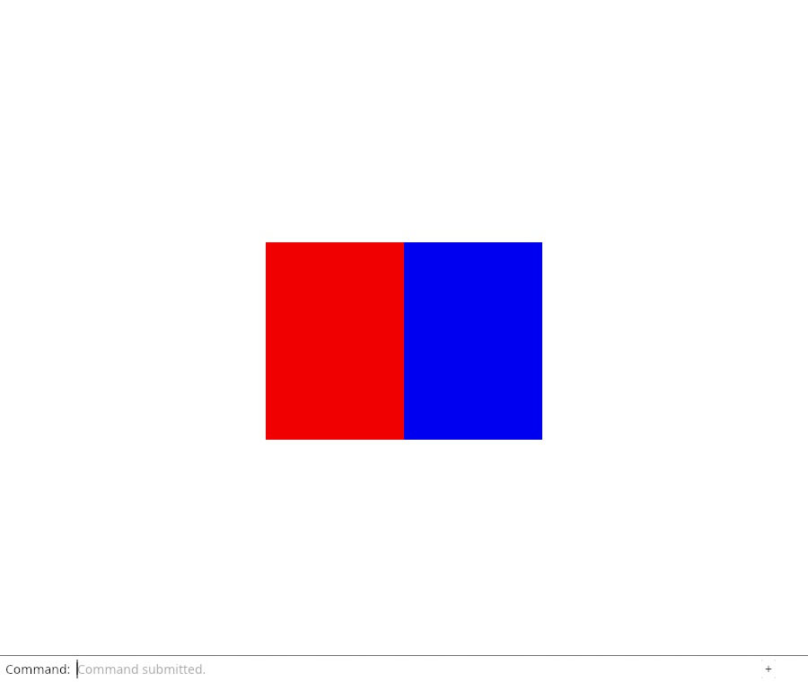
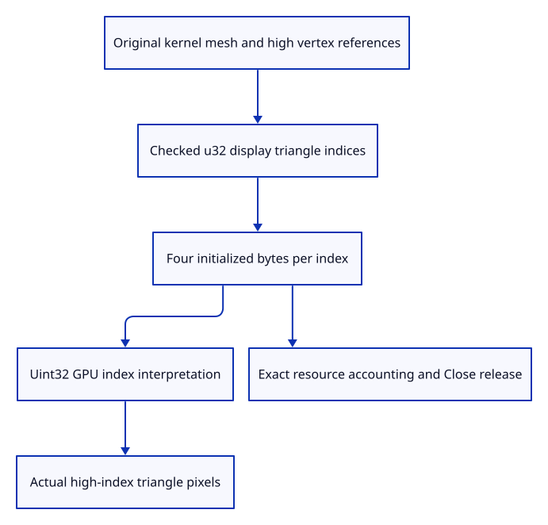

# 40b · Draw meshes beyond the sixteen-bit index limit

**Typing: 3–5 minutes.** [Estimate](typing-load.md).

Keep the kernel’s u32 indices through the display adapter and GPU draw call. Do not truncate high vertex references to fit an earlier demonstration layout.

## Type

Continue from [Compare original colour modes through actual input](40a-input.md). [Save or recover your work](recovery.md).

### 1. `src/mesh.rs`

Keep kernel index precision in retained display topology.

<details>
<summary>Locate the existing block</summary>

```rust
    indices: Vec<u16>,
```

</details>

Replace that block with:

```rust
--8<-- "journey/code/40b-indices-01.rs"
```

### 2. `src/mesh.rs`

Accept complete thirty-two-bit triangle references.

<details>
<summary>Locate the existing block</summary>

```rust
indices: Vec<u16>)
```

</details>

Replace that block with:

```rust
--8<-- "journey/code/40b-indices-02.rs"
```

### 3. `src/mesh.rs`

Retain the authoritative kernel indices without narrowing them.

<details>
<summary>Locate the existing block</summary>

```rust
        let indices: Result<Vec<u16>, _> = render.indices.into_iter().map(u16::try_from).collect();
        Self::new(vertices, indices.map_err(|_| "Mesh exceeds this lesson's 16-bit index capacity")?)
```

</details>

Replace that block with:

```rust
--8<-- "journey/code/40b-indices-03.rs"
```

### 4. `src/mesh.rs`

Count actual retained index capacity.

<details>
<summary>Locate the existing block</summary>

```rust
std::mem::size_of::<u16>()
```

</details>

Replace that block with:

```rust
--8<-- "journey/code/40b-indices-04.rs"
```

### 5. `src/mesh.rs`

Expose the actual display index type to drawing and picking.

<details>
<summary>Locate the existing block</summary>

```rust
pub fn indices(&self) -> &[u16]
```

</details>

Replace that block with:

```rust
--8<-- "journey/code/40b-indices-05.rs"
```

### 6. `src/gpu_geometry.rs`

Interpret uploaded index bytes with their exact GPU format.

<details>
<summary>Locate the existing block</summary>

```rust
wgpu::IndexFormat::Uint16
```

</details>

Replace that block with:

```rust
--8<-- "journey/code/40b-indices-06.rs"
```

### 7. `src/geometry_cache.rs`

Count initialized index payload bytes independently of driver allocation.

<details>
<summary>Locate the existing block</summary>

```rust
source.indices().len() * 2
```

</details>

Replace that block with:

```rust
--8<-- "journey/code/40b-indices-07.rs"
```

### 8. `src/memory.rs`

Copy the updated spare-capacity oracle for the real index layout.

<details>
<summary>Locate the existing block</summary>

```rust
baseline[4] + 16 * 24 + 16 * 2
```

</details>

Replace that block with:

```rust
--8<-- "journey/code/40b-indices-08.rs"
```

### 9. `src/lib.rs`

Register actual original high-index checks.

<details>
<summary>Locate the existing block</summary>

```rust
pub mod mesh;
```

</details>

Replace that block with:

```rust
--8<-- "journey/code/40b-indices-09.rs"
```

### 10. `src/index_width_tests.rs`

Copy original high-index topology, correct displayed corners and missing-vertex refusal checks.

Copy this check file:

```rust
--8<-- "journey/code/40b-indices-10.rs"
```

## Run and check

In your project:

```sh
cd workspace/journey
REGEN_PROTO=0 cargo build --lib --locked --target wasm32-unknown-unknown -j4
REGEN_PROTO=0 CARGO_BUILD_JOBS=4 trunk serve --port 8780
```

Open `http://127.0.0.1:8780/`. Keep an existing Trunk server running; saving rebuilds it.

Run a real source mesh with 65,537 vertices and a triangle referencing the highest vertex. The rendered triangle must appear correctly.

**Verified checkpoint in Chrome.**



[Verification scope](release.md).

Run the state checks on your computer from your project folder:

```sh
REGEN_PROTO=0 cargo test --lib --locked --target host-tuple -j4
```

<details>
<summary>Code explanation and diagram</summary>

Update both CPU capacity and initialized GPU-byte accounting. Actual readback draws a source triangle referencing vertex65,536; complete Close still releases its source and display allocation.

original large mesh → checked u32 display indices → Uint32 GPU draw → exact byte counters → real high-index pixels.



Why can a small triangle need a thirty-two-bit index buffer?

Its corners may refer to vertices beyond 65,535 in a larger shared vertex table. Truncating those indices draws the wrong corners or produces a degenerate triangle.

Study estimate, including typing and experiments: 0.75–1.25 hours.

</details>

<details>
<summary>Optional experiment</summary>

Check both initialized index bytes and actual buffer sizes. Thirty-two-bit indices use four bytes each; source geometry and vertex sharing remain unchanged.

</details>

<details>
<summary>Check and save your work</summary>

Restore experimental edits, then run from `session_viewer`:

```sh
npm --prefix ../session_tests run course -- check 40b-indices
npm --prefix ../session_tests run course -- save 40b-indices
```

Source comparison leaves your project untouched. [Save and recovery instructions](recovery.md).

</details>

<details>
<summary>Viewer coverage and verification</summary>

The display index limit is removed while draw count and missing-index checks remain. Large-file budgets, full mixed loading and streaming follow in64–68.

Native original-source checks retain high indices and exact original topology. Actual GPU readback verifies the high-index triangle, allocated/initialized bytes, shared geometry accounting and Close release.

Actual Chrome draws two adjacent source faces with separate red and blue colours.

[Full validation scope](release.md).

To reproduce the scripted acceptance of the reference checkpoint, run from `session_viewer` with the [course bundle server](release.md#reproduce) running on port 8781:

```sh
npm --prefix ../session_tests run course -- capture 40b-indices
```

This uses the verified reference bundle; it does not check or change your typed project.

</details>
