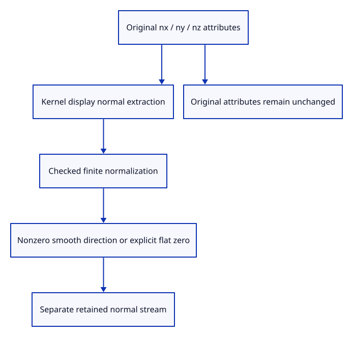

# 41 · Retain checked source normals beside display positions

**Typing: 13–26 minutes.** [Estimate](typing-load.md).

Keep normals in a separate checked stream beside existing display positions and colours. Use the kernel adapter’s source normals; normalize finite nonzero vectors without overflow.

## Type

Continue from [Draw meshes beyond the sixteen-bit index limit](40b-indices.md). [Save or recover your work](recovery.md).

### 1. `src/normals.rs`

Normalize bounded display directions safely while preserving an explicit flat fallback.

Create the file and type:

```rust
--8<-- "journey/code/41-normals-01.rs"
```

### 2. `src/lib.rs`

Register normal preparation and its source checks.

<details>
<summary>Locate the existing block</summary>

```rust
pub mod mesh;
```

</details>

Replace that block with:

```rust
--8<-- "journey/code/41-normals-02.rs"
```

### 3. `src/mesh.rs`

Retain normal data independently of the established position/colour stream.

<details>
<summary>Locate the existing block</summary>

```rust
    vertices: Vec<[f32; 6]>,
```

</details>

Replace that block with:

```rust
--8<-- "journey/code/41-normals-03.rs"
```

### 4. `src/mesh.rs`

Give manually created display meshes explicit flat normals by default.

<details>
<summary>Locate the existing block</summary>

```rust
        Ok(Self { vertices, indices })
```

</details>

Replace that block with:

```rust
--8<-- "journey/code/41-normals-04.rs"
```

### 5. `src/mesh.rs`

Carry kernel-extracted normal directions into checked display preparation.

<details>
<summary>Locate the existing block</summary>

```rust
        Self::new(vertices, render.indices)
```

</details>

Replace that block with:

```rust
--8<-- "journey/code/41-normals-05.rs"
```

### 6. `src/mesh.rs`

Require one finite checked normal per display vertex without touching original geometry.

<details>
<summary>Locate the existing block</summary>

```rust
    pub fn payload_bytes(&self) -> usize {
```

</details>

Replace that block with:

```rust
--8<-- "journey/code/41-normals-06.rs"
```

### 7. `src/mesh.rs`

Count actual retained normal capacity in CPU display bytes.

<details>
<summary>Locate the existing block</summary>

```rust
            + self.indices.capacity() * std::mem::size_of::<u32>()
```

</details>

Replace that block with:

```rust
--8<-- "journey/code/41-normals-07.rs"
```

### 8. `src/memory.rs`

Copy the normal-capacity oracle for a display mesh retaining three normals.

<details>
<summary>Locate the existing block</summary>

```rust
baseline[4] + 16 * 24 + 16 * 4
```

</details>

Replace that block with:

```rust
--8<-- "journey/code/41-normals-08.rs"
```

### 9. `src/normal_source_tests.rs`

Copy exact original attributes, normalized directions, flat zeros, malformed data and overflow-safe checks.

Copy this check file:

```rust
--8<-- "journey/code/41-normals-09.rs"
```

## Run and check

In your project:

```sh
cd workspace/journey
REGEN_PROTO=0 cargo build --lib --locked --target wasm32-unknown-unknown -j4
REGEN_PROTO=0 CARGO_BUILD_JOBS=4 trunk serve --port 8780
```

Open `http://127.0.0.1:8780/`. Keep an existing Trunk server running; saving rebuilds it.

Run normal-stream checks. Original attributes remain exact, valid nonzero normals become bounded unit vectors, and missing normals retain the flat fallback.

**Verified checkpoint in Chrome.**


[Verification scope](release.md).

Run the state checks on your computer from your project folder:

```sh
REGEN_PROTO=0 cargo test --lib --locked --target host-tuple -j4
```

<details>
<summary>Code explanation and diagram</summary>

Zero normals keep the existing flat fallback. Retain original attributes untouched and include normal capacity in CPU display accounting before adding its GPU stream.

original vertex normal attributes → kernel normal extraction → finite normalized display stream → retained payload accounting.



Why does an absent normal remain a zero vector rather than inventing a smooth normal?

Zero explicitly requests the existing flat derivative normal. A present kernel normal is the source’s smoothing choice; preserving that distinction keeps sharp surfaces sharp.

Study estimate, including typing and experiments: 0.75–1.25 hours.

</details>

<details>
<summary>Optional experiment</summary>

Prepare a source normal of length five. Its display direction is unit length while its original nx/ny/nz attributes remain unchanged.

</details>

<details>
<summary>Check and save your work</summary>

Restore experimental edits, then run from `session_viewer`:

```sh
npm --prefix ../session_tests run course -- check 41-normals
npm --prefix ../session_tests run course -- save 41-normals
```

Source comparison leaves your project untouched. [Save and recovery instructions](recovery.md).

</details>

<details>
<summary>Viewer coverage and verification</summary>

Normal data and CPU accounting are complete. Correct placement transforms and actual smooth/flat shader drawing follow in the next endpoints.

Native checks prove original attribute preservation, finite normalized normals, explicit flat zeros, mismatch/NaN refusal and true CPU retained capacity. Existing actual colour drawing remains the browser baseline.

Actual Chrome draws two adjacent source faces with separate red and blue colours.

[Full validation scope](release.md).

To reproduce the scripted acceptance of the reference checkpoint, run from `session_viewer` with the [course bundle server](release.md#reproduce) running on port 8781:

```sh
npm --prefix ../session_tests run course -- capture 41-normals
```

This uses the verified reference bundle; it does not check or change your typed project.

</details>
